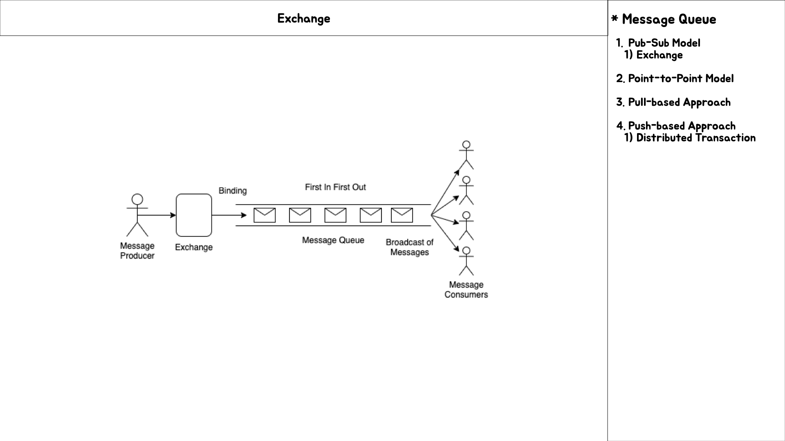
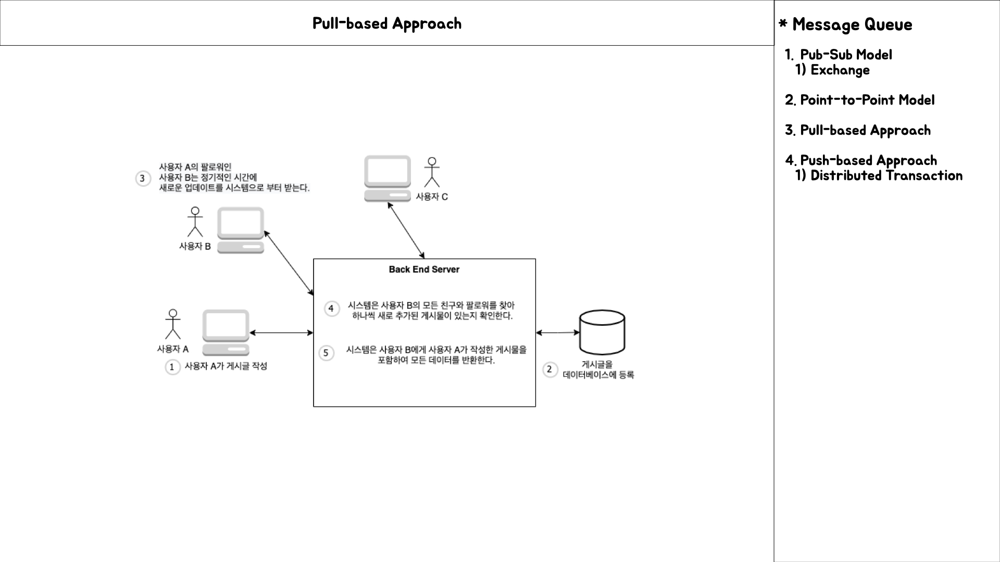

# Message Queue

## Intro

- 비동기 메시징 기능을 구현하기 위한 아키텍처

## Message Queue

---

- 메시지 큐는 비동기 동작을 수행하도록 한다.
- 비동기식 동작은 모듈의 기본 작업을 방해하지 않고 백그라운드에서 서로 통신하도록 해준다.

- Message Queue는 서비스 지향 마이크로서비스 아키텍처의 `핵심`인 **모듈 간의 통신(cross-module communication)** 을 용이하게 한다.
- 또한 이기종 환경에서 통신이 가능토록 하고, `consumer`가 메시지를 처리하고 사용할 때까지 메시지를 저장하기 위한 임시 저장소를 제공한다.

### Message Queue Real-world

---

- 이메일 서비스에 대한 예시를 들어보면 이메일을 보낸 사람과 받는 사람이 서로 통신하기 위해서 두 사람 모두가 온라인일 필요가 없다.
- 보낸 사람이 이메일을 보내고, 받는 사람이 온라인 상태가 되어 메시지를 읽을 때까지 메시지는 메시지 서버에 임시로 저장된다.

- Message Queue를 사용하면 백그라운드 프로세스 및 배치 작업을 실행할 수 있다.

- 백그라운드 프로세스의 사례
	- 가입 프로세스에 이메일 인증이 있는 경우, 시스템은 사용자의 등록된 이메일 ID로 확인 이메일을 보내야 한다.
	- 그 후 사용자는 가입 이벤트의 확인을 위해 확인 이메일을 클릭해야 한다.
	- 이러한 과정동안 웹 사이트는 사용자에게 이메일을 보낼 때까지 클라이언트를 대기시킬 필요가 없다.
	- 이러한 작업은 Message Queue에 비동기 백그라운드 프로세스로 할당 되어, 클라이언트는 응답에 대기하지 않고 웹 사이트를 계속 탐색할 수 있도록 한다.

## Publish-Subscribe Model 이란?

---

- **Publish-Subscribe Model**은 다수의 소비자가 단일 또는 다수의 생산자로부터 전송된 동일한 메시지를 받는 모델이다.
- 소비자는 서비스를 구독하고 서비스는 매일 여러 소비자에게 메시지를 전달한다.

> **Exchange**

- Message Queue에는 다양한 타입의 Exchange가 있으며 그 중 일부는 direct, topic, headers 및 fanout 등등이 있다.
- 모든 메시지 대기열이 동일한 Exchange Type을 가질 이유는 없다.

- **Message Queue Process**
	- Queue에서 메시지를 브로드캐스트하기 위해 **fanout Exchange 타입**을 선택한다.
	- Exchange는 Message를 Queue로 Push 하고 Consumers는 Message를 받는다.
	- Exchange과 Queue간의 관계를 **Binding**이라 한다.

## Point-to-Point Model

---

> **Point-to-Point Model**은 뭘까?

- 진짜 단순한 통신 방식으로 **producer**의 메시지가 오직 하나의 **consumer**에게 소비되는 것이다.
- pub-sub model이 일대다 관계와는 다르게 일대일 관계인 것이다.

## Messaging Protocol

---

- 메시지 대기열 작업에 대한 프로토콜
	- [Advanced Message Queuing Protocol](https://en.wikipedia.org/wiki/Advanced_Message_Queuing_Protocol)
	- [Streaming Text Oriented Messaging Protocol](https://en.wikipedia.org/wiki/Streaming_Text_Oriented_Messaging_Protocol)

- 메시징 프로토콜을 구현하기 위한 기술
	- RabbitMQ
	- ActiveMQ
	- Apache Kafka

## Real-Time Feeds with Message Queue

---

- **메시지 큐를 구현하기 위한 상황**
	- 알림 시스템 또는 피드를 구현하기 위한 기술로 애플리케이션에 비동기 동작을 추가하기 위해서 메시지 큐를 설계한다는 가정으로 시작해본다.
	- SNS의 사용자들은 친구와 팔로워를 가질 수 있고, 이런 구조를 위해서는 사용자 간에 다대다 관계를 가져야 한다.
	- 사용자가 웹 사이트에 게시물을 작성하면 데이터베이스에 등록이 되고, 이는 User 테이블과 Post 테이블간에 일대다 관계를 갖게 된다.

- 이런 상황에서 사용자가 작성한 게시물을 친구 또는 팔로워에게 알림 또는 표시하기 위해서 어떻게 구현을 해야 할까?

- 구현에 대해 생각하면서 두 가지 기술에 대해 인지하도록 한다.
	- **Pull-based Approach**
	- **Push-based Approach**

### Pull-based Approach

- Message Queue 없이 구현하는 방법 중 하나는 웹 사이트의 `모든 사용자`가 **정기적**으로 짧은 간격으로 새 업데이트가 있는 연결이 있는 경우 데이터베이스를 **폴링**하는 것이다.
- 이 작업을 위해 모든 사용자의 연결을 찾고 사용자가 만든 새 게시물에 대해 모든 연결을 하나씩 확인해야 한다.
- 이를 위해 모든 사용자의 연결을 찾고 사용자가 만든 새 게시물에 대해 모든 연결을 하나씩 확인해야 한다.

- 사용자의 연결에 의해 생성된 새 게시물이 있는 경우 쿼리는 해당 게시물을 모두 가져와서 해당 게시물을 홈 페이지에 표시한다.
- 사용자 테이블의 알람 카운터 열을 사용하여 알람 수를 추적하고 새 알림에 대해 Ajax poll query를 추가하여 알림 수를 추적하는 새 게시물에 대한 알림을 사용자에게 보낸다.

> **해당 방식의 두 가지 단점**

1. **데이터베이스에 대한 빈번한 폴링**
	- 데이터베이스를 자주 폴링하게 되면 데이터베이스에 접근하기 위한 비용과 불필요한 부하를 가하게 된다.
	- 또 네트워크에 대한 대역폭을 소비하게 된다.

2. **홈페이지에 표시되는 사용자의 게시물이 실시간으로 표시되지 않는다는 점**
	- 게시물은 데이터베이스가 폴링 될 때까지 표시되지 않는다.
	- 실시간으로 보일 수 있지만 실제로는 실시간이 아니다.

### Push-based Approach

- 시스템의 성능을 향상시키기 위해 데이터베이스를 폴링하는 대신에 **Message Queue**를 사용하는 방법

> **Message Queue**를 도입하여 **Pull 기반 메커니즘**을 **Push 기반 메커니즘**으로 전환

- **상황**
	- 사용자가 새 게시물을 작성하면 분산 트랜잭션이 발생하게 된다.
		- 한 트랜잭션은 데이터베이스를 업데이트하고, 다른 트랜잭션은 **Post Payload**를 메시지 큐로 보낸다.
		- **Payload**는 사용자가 게시한 메시지의 내용을 의미한다.

	- 메시지를 수신하면 Message Queue는 비동기식으로 즉시 게시물을 온라인 상태의 사용자에게 push하게 된다.
	- 사용자가 게시물을 작성했는지 확인하기 위해 정기적으로 데이터베이스를 폴링할 필요가 없다.
	- 또한 TTL과 함께 Message Queue 임시 저장소를 사용하여 사용자의 연결이 온라인 상태가 된 다음 업데이트를 푸시할 수도 있다.
	- 연결 ID 및 항목과 같이 연결에 알림을 푸시하는데 필요한 사용자의 세부 정보를 저장하기 위해 별도의 key-value 데이터베이스를 가질 수 있다.
	- 이는 사용자의 연결을 얻기 위해 데이터베이스를 폴링할 필요가 없다.

> **분산 트랜잭션을 처리하는 방식**

- 트랜잭션은 분산되지만 단일 트랜잭션과 같이 작동할 수 있다.
	- 데이터베이스의 지속성(Durability)이 실패하면 전체 트랜잭션을 롤백해야 하고, Message Queue에 대한 메시지 푸시도 없도록 해야한다.
	- 메시지 푸시가 실패하는 경우에 대해서는 트랜잭션을 롤백할 지 아니면 지속할 지에 대해서는 시스템의 목표따라 선택할 수 있다.

- 보통은 Message Queue의 Push가 실패하더라도 메시지는 손실되지 않고 데이터베이스에 계속 유지될 수 있기 때문에 위의 두 가지 옵션이 존재할 수 있는 것이다.

- 그리고 기본적으로 사용자가 홈페이지를 리플레시할 때 데이터를 갱신하기 위해 데이터베이스를 폴링할 수 있어야 한다.
- 그렇지 않으면 데이터베이스 지속성 트랜잭션이 성공하고 Message Queue의 Push 트랜잭션이 실패하더라도 트랜잭션을 완전히 롤백할 수 있다.
