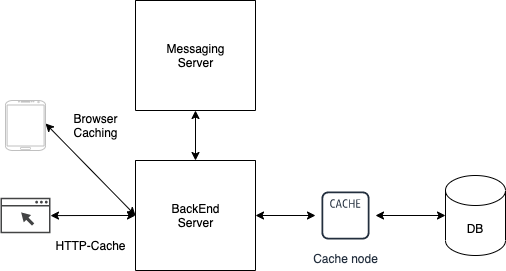

# Cache

- 캐시에 대한 생각을 정리해보는 내용으로 매우 주관적입니다.
- 맞지 않는 부분이 있으면 피드백 부탁드리겠습니다.

## Intro

- 개발하면서 데이터를 저장하고 조회하기 위해서는 일반적으로 데이터베이스를 통해 저장하고 다양한 방식으로 데이터를 조회한다.
- 시간이 지나면서 데이터의 양은 많아지고, 조회하는 방법도 다양해 지는 상황에서 도입할 수 있는 기술이 `Cache`이다.

## Cache

- 웹 애플리케이션은 데부분 관계형 데이터베이스를 두고 운영되곤 한다.
- 규모가 커질 수록 성능적인 부분에서 이점을 보기 위해 애플리케이션 서버나 데이터베이스 서버를 이중화하게 된다.
- 그게 되지 않으면 사용자가 많은 애플리케이션의 기능에 병목현상이 발생하게 되고 그 근원지는 데이터베이스이게 될 것이다.

- 데이터베이스의 성능을 향상 시키는 방법은 여러 가지가 있지만, 근본적인 방법은 데이터베이스의 **질의**를 줄이는 것이다.
- 데이터베이스의 질의를 줄이기 위해서는 애플리케이션에서 조회 빈도가 높은 데이터를 메모리에 올려 놓고 있다가 필요할 때 조회할 수 있도록 제공하는 것이다.
- **캐시**에 들어갈 데이터는 **조회** 빈도가 높지만 **변경**이 자주 일어나지 않는 데이터, 또 **데이터의 양이 너무 크지 않은 것**을 선택하는 것이 좋다.

- 변경이 자주일어나게 되면 캐시와 데이터베이스의 데이터의 정합성을 유지하기 위해서 드는 비용이 더 들기 때문이다.

## 데이터베이스의 데이터를 캐싱하는 방법

- 시스템 구조와 데이터 사용 방식에따라 로컬 캐시와 글로벌 캐시를 구분하여 사용해야 하는 상황이 있을 수 있다.

> **Local Caching**

- 로컬 캐시는 웹 서버 기준으로 서버 내에 메모리를 사용하여 캐시 데이터를 저장하는 것으로 데이터를 조회하는 속도가 빠르다.
- 하지만 단일 서버의 메모리에 저장하는 방식으로 멀티 서버를 사용해야 하는 상황에서는 서버간의 공유가 불가능 하다는 단점이 있다.
- 그리고 멀티 서버로 구성되어 있는 경우 서버 간의 캐시 데이터의 정합성 문제를 야기 시킬 수 있다.
- 또한 각각의 서버가 동일한 캐시 데이터를 갖고 있는 경우 자원 낭비가 될 수 있다.

> **Global Caching**

- 로컬 캐싱의 문제를 해결하는 방법으로 글로벌 캐싱 방법을 사용할 수 있다.
- 각각의 서버의 메모리 내에 저장하는 것이 아니라 별도의 인 메모리 기반의 캐시 서버를 두고 캐시 데이터를 참조하는 방법이다.
- 글로벌 캐싱을 사용하여 멀티 서버 간의 캐시 데이터를 공유할 수 있다.
- 이러한 장점으로 로컬 캐싱에서 문제가 됐던 데이터 정합성의 문제, 자원 낭비에 대한 문제점을 해결할 수 있다.
- 다만, 글로벌 캐싱을 사용하는 경우 캐시 데이터를 얻으려 할 때 마다 네트워크 트래픽이 발생한다.
- 그렇기 때문에 로컬 캐싱보다는 속도와 비용면에서 증가가 되는 것은 감안해야 한다.

## 캐시 전략

- 특정 사용 사례를 지원하는 다양한 종류의 캐싱 전략이 존재한다.

> **Cache aside**

- 일반적인 캐시 전략, 캐시는 데이터베이스와 함께 작용하여 가능한 히트율을 줄이기 위한 방식이다.
- 데이터는 캐시에 Lazy Loading되어 사용자가 특정 데이터에 대한 요청을 보내면 시스템은 먼저 캐시에서 데이터를 찾는다.
- 데이터가 캐시에 존재하면 그 값을 반환한다.
- 그렇지 않은 경우 데이터베이스에서 데이터를 가져오고 캐시가 업데이트되어 사용자에게 반환된다.

- 적용 가능한 상황
	- 읽기가 많은 워크로드에서 적합한 방식이다.

- 이 전의 데이터는 데이터베이스에 직접 기록되며, 캐시와 데이터베이스에 있는 데이터의 정합성에 문제가 발생할 수 있다.
- 이를 피하기 위해 캐시 데이터에 TTL을 적용하여 지정된 기간이 지나면 캐시에서 데이터가 무효화된다.

> **Read-through**

- 이 방식은 Cache aside 전략과 비슷하나 차이점은 캐시가 데이터베이스와의 일관성을 유지한다는 것이다.
- 캐시 라이브러리 또는 프레임워크는 백엔드와의 일관성을 유지하는 책임을 갖고 있다.
- read-through 방식은 사용자가 요청할 때만 캐시에 지연로드 되는 방식이다.
- 처음 요청이 올 때 Cache Miss가 발생한 뒤에 사용자에게 응답을 반환하면서 캐시를 업데이트 하게 된다.

- 적용 가능한 상황
	- 사용자가 가장 많이 요청할 것으로 예상되는 정보의 캐시 데이터를 미리 로드하여 사용하는 경우 이 방식을 사용할 수 있다.

> **Write-through**

- 이 방식은 데이터베이스에 기록된 모든 정보가 캐시를 거친다.
- 데이터가 DB에 기록되기 전에 캐시가 업데이트 된다.
- 이런 방식은 데이터가 캐시에서 별도로 업데이트되기 때문에 쓰기 작업 중에 약간의 대기 시간이 추가되지만 캐시와 데이터베이스 간에 높은 일관성을 유지할 수 있다.

- 적용 가능한 상황
	- 온라인 대규모 멀티플레이어 게임과 같은 쓰기 작업이 많은 워크로드에 적합하다.

- 일반적으로 최적화된 성능을 달성하기 위해서 다른 캐싱 전략과 함께 사용된다.

> **Write-back**

- 이 방식은 비용을 크게 최적화하기 위해 사용된다.
- Write-back 캐싱 전략에서는 데이터를 직접 데이터베이스에 데이터를 기록하지 않고 캐시에 먼저 쓴다.
- 그리고 캐시는 비즈니스 로직에 따라 약간의 지연 후에 데이터베이스에 데이터를 기록한다.

- 적용 가능한 상황
	- 애플리케이션에 쓰기 기능에 대한 요청이 많은 경우, 데이터베이스 쓰기 빈도를 줄여 부하와 관련 비용을 줄일 수 있다.

- 주의사항
	- DB가 업데이트 되기 전에 캐시가 실패하는 경우 데이터 손실이 일어날 수 있다는 주의사항이 있다.
	- 그렇기 때문에 이 전략을 사용하기 위해서는 다른 캐싱 전략과 함께 사용된다.

## 읽어본 글

- [Memcached의 확장성 개선](https://d2.naver.com/helloworld/151047)
	- 캐시 데이터의 라이프 사이클
	- 캐싱 알고리즘

- [배달의민족 최전방 시스템! ‘가게노출 시스템’을 소개합니다.](https://techblog.woowahan.com/2667/)
	- 캐시 정책
	- 웹 플럭스 기반 캐싱 구현

- [Redis5 설계하기 총정리](https://waspro.tistory.com/697)
	- Cache & DataStorage 배치 전략