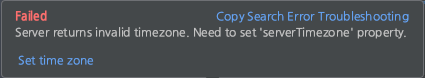

# Batch

## Intro

- 로컬부터 시작하는 배치 프로세스
- Database 설치 및 배치 프로젝트 실행 테스트

## Docker

- MySQL 설치 docker-compose 설정

```yml
version: "3.7"
services:
  db:
    image: mysql:5.7
    restart: always
    container_name: batch_schema_db # 컨테이너 이름 설정
    ports:
      - "3308:3306" # MySQL 포트

    environment: # -e 옵션
      - MYSQL_ROOT_PASSWORD=1234
      - TZ=Asia/Seoul

    command: # 명령어 실행
      - --lower_case_table_names=1
      - --character-set-server=utf8mb4
      - --collation-server=utf8mb4_unicode_ci
      - --explicit_defaults_for_timestamp=1

    volumes:
      - /Users/seok/docker/mysql/batch:/var/lib/mysql # -v 옵션 (디렉토리 마운트 설정)
```

## Container bash 접근

- 컨테이너 접근 명령어

```shell
docker exec -it batch_schema_db bash
```

- 컨테이너 내에 데이터베이스 접속

```shell
root@641babb69412:/# mysql -u root -p
Enter password: 
Welcome to the MySQL monitor.  Commands end with ; or \g.
Your MySQL connection id is 2
Server version: 5.7.33 MySQL Community Server (GPL)

Copyright (c) 2000, 2021, Oracle and/or its affiliates.

Oracle is a registered trademark of Oracle Corporation and/or its
affiliates. Other names may be trademarks of their respective
owners.

Type 'help;' or '\h' for help. Type '\c' to clear the current input statement.

mysql>
```

- 신규 계정 생성 및 권한 부여

```shell
CREATE USER 'ADMIN'@'%' IDENTIFIED BY '1234';
GRANT ALL PRIVILEGES ON *.* TO 'ADMIN'@'%';
flush privileges;
quit 
```

- 배치용 데이터베이스 생성

```shell
mysql> CREATE DATABASE batch_sample;
Query OK, 1 row affected (0.02 sec)
```

## Intellij Database

- 인텔리제이 database 설정
	- set time zone 이슈



- [How do I set the time zone of MySQL?](https://stackoverflow.com/questions/930900/how-do-i-set-the-time-zone-of-mysql)

```shell
jdbc:mysql://localhost:3308/batch_sample?serverTimezone=UTC
```
