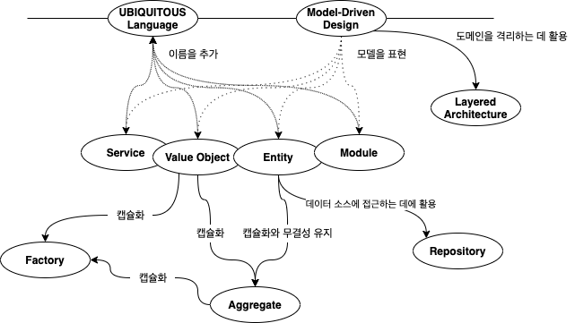

# Domain-Driven Design

> 참고 - [도메인 주도 설계 - 에릭 에반스](http://www.kyobobook.co.kr/product/detailViewKor.laf?mallGb=KOR&ejkGb=KOR&barcode=9788992939850)

## Intro

> **도메인 주도 개발을 왜 공부해야 할까?**

`도메인 주도 개발`을 해야 하는 이유를 정의할 수 있을 정도로 깊이있는 지식을 갖고 있지만 책을 읽기 전에 먼저 생각해 본다.

현재 알고있는 수준에서 이해해 보기 위해서 정리하면, `도메인 주도 개발`과 비교할 수 있는 방식의 개발 방식을 `데이터 중심의 개발`이라고 할 수 있을 것 같다.

내가 알고 있는 `데이터 중심 개발`은 데이터에 대한 `DB 스키마가 정의`되어 있고, DB를 조회하기 위한 `쿼리에 비즈니스 로직`이 녹아있기 때문에 쿼리에 많은 시간을 투자하게 된다.
따라서 해당 쿼리에 대한 데이터베이스로부터 조회하는 DAO 메서드를 호출하고, 기능에 따라서 적절하게 트랜잭션으로 묶어 ACID를 보장하는 서비스 레이어를 작성하고
최종적으로는 사용자의 요청에 따라 적절한 데이터를 응답할 수 있는 프레젠테이션 레이어를 구성한다.

`도메인 주도 개발`은 `데이터 중심 개발`의 최종적인 목표는 같으나 출발점이 되는 도메인을 구성하는 방식에 초점을 두어, 서비스 레이어의 비즈니스 로직을 도메인에서 처리하여 보다 객체지향적인 설계가 가능한 것으로 알고 있다.
책을 읽어보면서 잘못된 개념이 있다면 바로 잡고, 개념을 확립할 수 있는 기회를 위해 정리해보도록 한다.

> **옮긴이의 글 정리**

- **먼저 소프트웨어의 존재 가치에 대해 이야기 한다.**

`소프트웨어의 가치`는 `특정 업무 분야의 문제`를 **해결**하는데 있다고 한다.
당면한 문제를 해결하지 못하는 소프트웨어는 실패한 소프트웨어에 지나지 않기 때문에, 
개발자는 문제를 해결하기 위해 기술적으로 해결하는 방법을 찾게된다.

- **도메인 주도 설계는 무엇을 이야기 하고 해결하기 위한 설계 방법인가?**

책에는 위에서 이야기 하는 소프트웨어의 핵심에 놓인 복잡성을 다루는 패턴과 기법, 원칙에 대해 기술되어 있다.
복잡성의 출발점이 되는 도메인에 초점을 맞추고, 도메인을 표현하는 모델, 모델이 구현하는 설계 간의 간극을 좁히는데 집중한다고 한다.

이는 소프트웨어에서 데이터를 관리하는 부분인 서비스 레이어의 복잡성을 도메인으로 이동시켜 도메인 주도 설계의 통찰력을 제공하는 것으로 보인다.

- **그래서 무엇을 얻어가야 할 것인가?**

도메인 주도 설계는 단순한 설계에서 머무는 것이 아니라 통찰력을 제시하고, 소프트웨어 개발에 임하는 자세를 고칠 수 있도록 한다.

## 책에서 제공하는 컨셉

`유비쿼터스 언어`와 `모델 기반 디자인`이라는 키워드를 기준으로 그 내용을 구성하는 기본 요소에 대한 내용과 그 관계성에 대해서 이해하는 것이 목표이다.

- **기본 요소**
  - Entity
  - Value Object
  - Service
  - Module
  - Aggregate
- **도메인을 구성하기 위한 데이터 접근 요소**
  - Repository
- **도메인 객체 생성을 관리하는 요소**
  - Factory

## Contents

1. **동작하는 도메인 모델 만들기**

    **1.1 지식 탐구**

    **1.2 의사소통과 언어 사용**

   **1.3 모델과 구현의 연계**

2. **모델 주도 설계의 기본 요소**

    **2.4 도메인의 격리**

    **2.5 소프트웨어에서 표현되는 모델**

    **2.6 도메인 객체의 생명 주기**

    **2.7 언어의 사용**

3. **더 심층적인 통찰력을 향한 리펙토링**

    **3.8 도약**

    **3.9 암시적인 개념을 명확하게**

    **3.10 유연한 설계**

    **3.11 분석 패턴의 적용**

    **3.12 모델과 디자인 패턴의 연결**

    **3.13 더 심층적인 통찰력을 향한 리펙터링**

4. **전략적 설계**

    **4.14 모델의 무결성 유지**

    **4.15 디스틸레이션**

    **4.16 대규모 구조**

    **4.17 전략의 종합**

**결론**