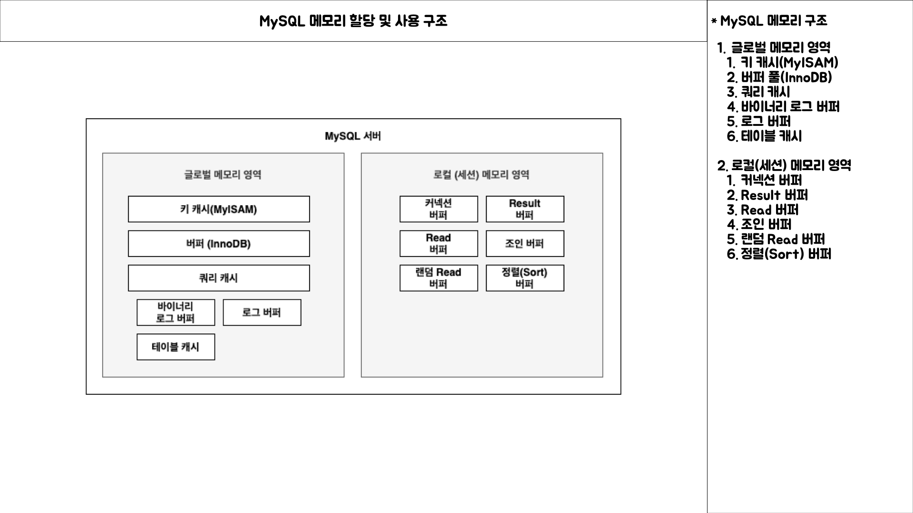
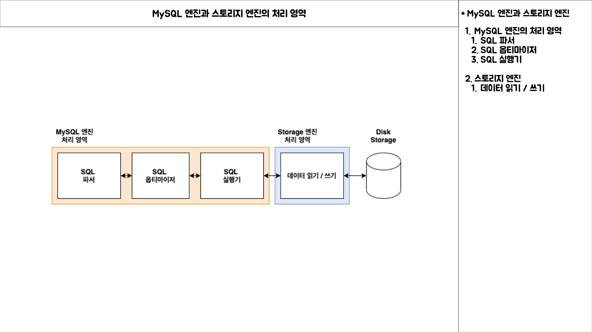

# MySQL

## Intro

- 학습 프로세스가 MySQL 아키텍처에서 적용되는 부분 확인하기

## MySQL Architecture

- MySQL의 쿼리를 작성하고 튜닝할 때 필요한 기본적인 MySQL의 구조를 훑어보기

- MySQL 서버는 크게 **MySQL 엔진**과 **스토리지 엔진**으로 구분해서 볼 수 있다.

> **MySQL 엔진**

- 요청된 SQL 문장을 분석하거나 최적화하는 처리를 수행

- **MySQL 엔진의 구성요소**
    - 클라이언트로부터의 접속 및 쿼리 요청을 처리하는 **커넥션 핸들러**
	- **SQL 파서** 및 **전처리기**
	- 쿼리의 최적화된 실행을 위한 **옵티마이저**
	
- MySQL 엔진의 성능 향상을 위한 **보조 저장소 기능**
	- **MyISAM**의 **키 캐시**
	- **InnoDB**의 **버퍼 풀**

> **스토리지 엔진**

- 실제 데이터를 디스크 스토리지에 저장하거나 디스크 스토리지로부터 데이터를 읽어오는 부분을 처리

- 스토리지 엔진은 여러 개를 동시에 사용할 수 있기 때문에 테이블이 사용할 스토리지 엔진을 지정하면 해당 테이블의 모든 읽기 작업이나 변경 작업은 정의된 스토리지 엔진이 처리 한다.

> **핸들러 API**

- MySQL 엔진의 쿼리 실행기에서 데이터를 쓰거나 읽어야 할 때는 각 스토리지 엔진에게 쓰기 또는 읽기를 요청하는데, 이러한 요청을 **핸들러(Handler)요청**이라고 하고, 여기서 사용되는 API를 **핸들러 API**라고 한다.

## MySQL Memory

- 글로벌 메모리 영역의 모든 메모리 공간은 MySQL 서버가 시작되면서 무조건 운영체제로부터 할당된다.
	- 운영체제에 따라 100% 할당해 줄 수도 있고, 그 공간 만큼 예약해두고 필요할 때 조금씩 할당해주는 경우도 있다.
	
- 각 운영체제의 메모리 할당 방식은 복잡하기 때문에 MySQL 서버가 사용하고 있는 정확한 메모리 양을 측정하는 것은 쉽지 않다.
- 그냥 단순하게 MySQL의 파라미터로 설정해 둔 만큼 운영체제로부터 메모리를 할당받는다고 생각하는 것이 좋다.

> **글로벌 메모리 영역**

- 일반적으로 클라이언트 스레드의 수와 무관하게 일반적으로는 하나의 메모리 공간만 할당된다.
- 필요에 따라 2개 이상의 메모리 공간을 할당 받을 수도 있지만 클라이언트의 스레드 수와는 무관하며, 생성된 글로벌 영역이 N개라 하더라도 모든 스레드에 의해 공유된다.

> **로컬 메모리 영역**

- 세션 메모리 영역이라고도 표현하며, MySQL 서버 상에 존재하는 클라이언트 스레드가 쿼리를 처리하는 데 사용하는 메모리 영역
- 대표적으로 커넥션 버퍼와 정렬 버퍼등이 있다.
- 클라이언트가 MySQL 서버에 접속하면 클라이언트 커넥션으로부터의 요청을 처리하기 위해 스레드를 하나씩 할당하게 되는데 클라이언트 스레드가 사용하는 메모리 공간이라고 해서 클라이언트 메모리 영역이라고도 한다.
- 클라이언트와 MySQL 서버와의 커넥션을 세션이라고도 하기 때문에 로컬 메로리 영역을 세션 메모리 영역이라고도 한다.

## MySQL Engine & Storage Engine

- 하나의 쿼리 작업은 여러 하위 작업으로 나뉘는데, 각 하위 작업이 MySQL 엔진 영역에서 처리되는지 아니면 스토리지 엔진 영역에서 처리 되는지 구분하기
  
- **MySQL 엔진의 처리 영역**
	- **SQL 파서**
	    - 쿼리 문장을 토큰(MySQL이 인식할 수 있는 최소 단위)로 분리
		- 토큰을 트리 형태의 구조로 작성
		- 쿼리 문장의 기본 문법 오류를 반환
		
	- **SQL 옵티마이저**
	    - 사용자의 요청으로 들어온 쿼리 문장을 저렴한 비용으로 빠르게 처리할 지 결정

	- **SQL 실행기(실행 엔진)**
		- 옵티마이저가 택한 실행 계획을 각 핸들러에게 요청
		- 요청에 따른 결과를 받아 또 다른 핸들러 요청의 입력으로 연결하는 역할을 수행
	
- **스토리지 엔진의 처리 영역**
	- 데이터 읽기 / 쓰기
		- MySQL 실행 엔진의 요청에 따라 데이터를 디스크로 저장 및 읽어오는 역할
		- MyISAM 테이블을 조작해야 하는 경우 MyISAM 스토리지 엔진이 되고, InnoDB 테이블을 조작하는 경우 핸들러가 InnoDB 스토리지 엔진이 된다.
