# Join Tune

## Intro

## Join

---

- **조인**이란 2개 이상의 테이블에서 특정 조건에 의해 데이터를 검색하는 방법을 말한다.
- 오라클에서 제공하는 **조인 방식**은 크게 3가지 이다.
    - **중첩 루프 조인(Nested Loop Join)**
    - **해시 조인(Hash Join)**
    - **소트 머지 조인(Sort Merge Join)**

- 이 중 널리 사용하는 방식은 **중첩 루프 조인**과 **해시 조인**이며 **소트 머지 조인**은 거의 사용하지 않는다.

- 추가적인 조인 방식
    - **세미 조인(Semi Join)**
    - **아우터 조인(Outer Join)**
    
## 중첩 루프 조인(Nested Loop Join)

---

> **중첩 루프 조인이란**

- 프로그래밍의 **중첩 반복문**과 같은 방식으로 동작하는 기법

- **중첩 루프 조인의 동작 방식**
	- A라는 집합을 한건 한건 읽어가면서 해당 결과를 바탕으로 B 집합에서 데이터를 찾아가는 방식
	- 데이터를 한건 한건씩 찾아가는 방식은 대용량 테이블을 **중첩 루프 조인**한다면 성능에 부하를 주게된다.
	- **인덱스 스캔**을 하여 대용량 테이블에서 성능적인 이점을 취해야 한다.
	  (테이블 랜덤 액세스 부하의 발생 -> 부분 범위 처리)

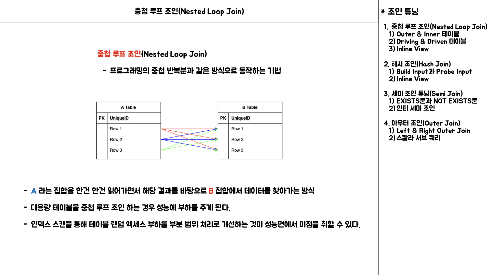

> **Outer 테이블과 Inner 테이블**

- **Outer 테이블**
	- 중첩 루프 조인에서 **가장 먼저 스캔**하는 테이블을 말한다.
	- 다른 용어로 **Driving** 테이블이라 한다.
	- **스캔 건수가 적을수록** 중첩 루프 조인에 유리하다.

- **Inner 테이블**
	- **중첩 루프 조인**에서 **두 번째로 스캔**하는 테이블을 말한다.
	- 다른 용어로 **Driven** 테이블이라 한다.
	- `Inner 테이블`은 `Outer 테이블` 보다 **결과 건수가 많아야** 중첩 루프 조인 시 유리하다.

> **인라인 뷰**

- FROM 절 내에 소괄호 '()'로 감싸져 있는 SELECT문
- 인라인 뷰 내에 있는 SELECT 문의 결과는 마치 하나의 테이블과 같은 개념

- **인라인 뷰**를 사용하는 경우 **옵티마이저**가 처리하는 2가지 방식
	- 인라인 뷰의 집합을 메인 쿼리 테이블과 같은 레벨로 올라가도록 병합하는 것을 **'View Merging'** 이라 부른다.
	- 인라인 뷰가 메인 쿼리로 올라가지 못하도록 막는 것을 **'View No Merging'** 이라 한다.

- **비용기반 옵티마이저** 는 일반적으로 인라인 뷰를 **'View Merging'** 하여 메인 쿼리와 같은 레벨로 취급하는 특성이 있다.
	- 이를 **쿼리 변환**이라 한다.
	- 두 개의 테이블이 논리적으로 같은 레벨에 존재하면 옵티마이저는 더 많은 **'접근 경로(Access Path)'** 를 통해 다양한 실행 계획들을 비교하교 평가하게 되므로 최적의 실행 계획을 도출해 낼 수 있다.

> **중첩 루프 조인의 특징**

- **중첩 루프 조인 튜닝의 조건**
	- **Outer 테이블의 결과 집합이 작아야 한다.**
	- **Inner 테이블 스캔 시 반드시 효율적인 인덱스 스캔이 이루어져야 한다.**

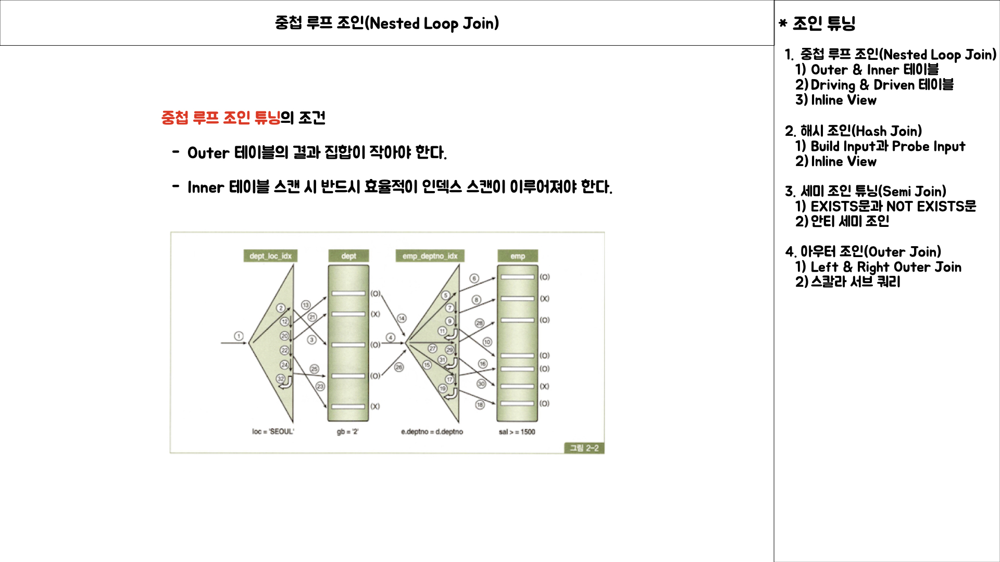

> **중첩 루프 조인 관련 힌트**

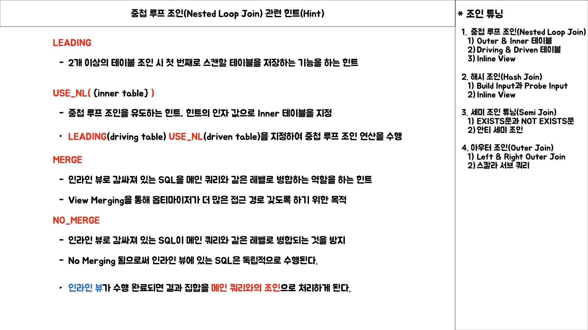

## 중첩 루프 조인 튜닝(Nested Loop Join)

---

> **중첩 루프 조인 튜닝 전**

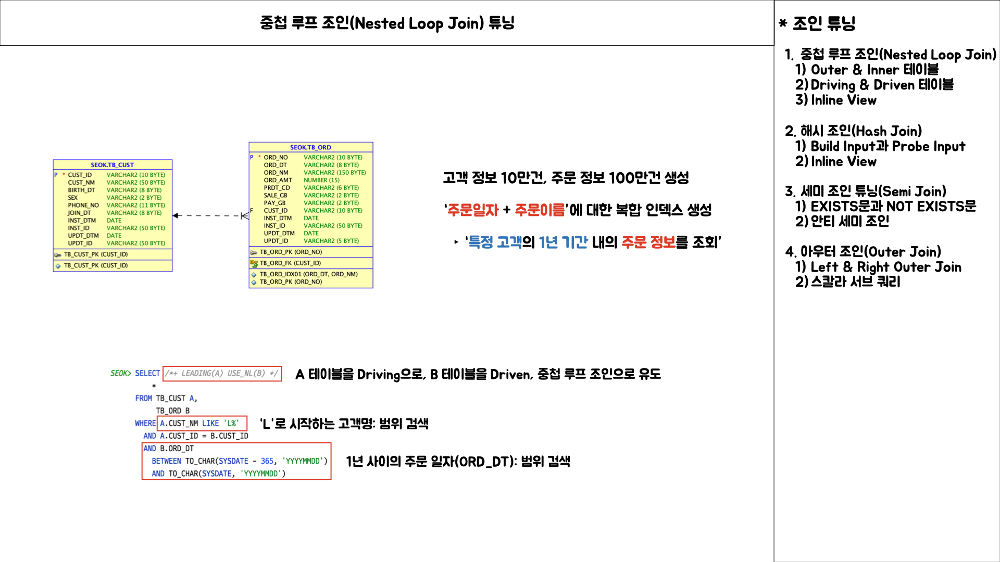

- **SQL 분석**
	- LEADING 힌트를 사용하여 고객 테이블을 Outer 테이블로 설정
	- USE_NL 힌트를 사용하여 주문정보 테이블과 중첩 루프 조인이 이루어지도록 설정
	- 고객테이블과 주문정보 테이블을 고객아이디 컬럼을 기준으로 '=' 조인
	- 주문정보 테이블은 고객아이디를 선두 컬럼으로 한 인덱스가 존재하지 않으므로 주문정보 테이블은 테이블 풀 스캔으로 처리된다.

- **SQL의 문제점**
	- 주문정보 테이블에 고객 아이디를 선두 컬럼으로 구성된 인덱스가 존재하지 않는다.
	- 고객 정보 테이블의 결과 집합의 건수만큼 주문정보 테이블에 테이블 풀 스캔을 하게 된다.

> **중첩 루프 조인 튜닝 전 실행 계획**

> **중첩 루프 조인 튜닝 후**

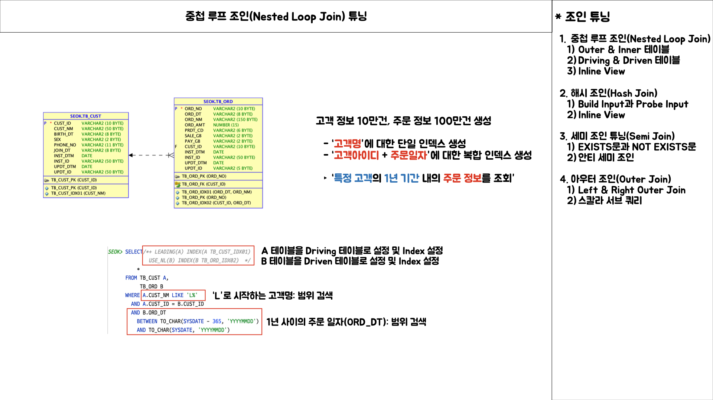

- **SQL 분석**
	- **LEADING 힌트**를 사용하여 `고객 테이블`을 **Outer 테이블**로 지정
	- **INDEX 힌트**를 사용하여 `고객 명에 대한 인덱스`를 스캔하도록 지정
	- **USE_NL 힌트**를 이용하여 **중첩 루프 조인**을 유도, `주문 테이블`을 **Inner 테이블**로 지정
	- **INDEX 힌트**를 사용하여 `고객아이디 + 주문일자 인덱스`를 스캔
	- `고객 테이블`의 스캔 건수만큼 **Inner 테이블**인 `주문정보 테이블`을 스캔 시 효율적인 **인덱스 스캔**으로 성능 향상을 예상할 수 있다.

> **중첩 루프 조인 튜닝 후 실행 계획**

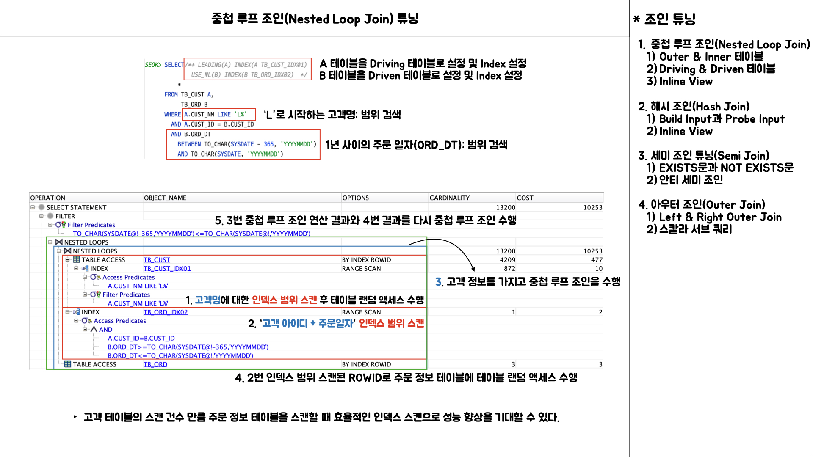

## 해시 조인(Hash Join)

---

> **해시 조인이란**

- 두 개의 테이블을 조인한다고 가정할 때 작은 집합을 빠르게 읽어 **해시 테이블(Hash Table)** 을 생성하여 **해시 영역(Hash Area)** 에 저장
- 큰 테이블을 순차적으로 읽으면서 **해시 함수(Hash Function)** 에 입력 값을 주어 **해시 영역**에 있는 **해시 테이블** 내에 해당 값이 존재하면 조인 집합에 저장
- 원하는 조인 결과를 도출하는 방식

- 일반적으로 **대용량 테이블의 조인 연산**의 효율성 비교
	- **해시 조인 방식** > **중첩 루프 조인** or **소트 머지 조인**

- **작은 집합**과 **큰 집합**이 있는 상황에서 오라클의 **해시 조인**은 극적인 성능 향상을 이루어 낸다.
- 하지만 해시 조인은 **대용량 테이블 조인 시**에 **메모리가 많이 필요**하기때문에 메모리 관리도 신경써야 한다.

- **해시 조인의 특성**
	- **두 개의 테이블** 중 한 테이블이 **작은 집합**이어야 성능 극대화가 가능하다.
	- 조인 조건이 반드시 **equijoin('=')** 방식이어야 한다.

- 일반적인 업무에서 두 개의 테이블이 1:M 관계에 놓였을 경우 1쪽의 집합이 훨씬 작은 용량의 테이블인 경우가 많다.
- 이러한 상황에서 1쪽 집합을 Build Input으로 하여 해시 조인을 수행한다면 극적인 상황을 이룰 수 있다.

> **Build Input과 Probe Input**

- **Build Input**은 해시 조인 시 **해시 영역에 저장하는 집합**을 뜻한다.
	- **중첩 루프 조인** 기준으로 **Outer 테이블**이라고 이해하면 된다.
- **Build Input**은 **반드시 작은 집합**이어야 해시 영역에 메모리 공간을 초과하지 않고 들어갈 수 있다.
- Build Input이 지나치게 큰 테이블이 된다면 오히려 메모리 영역과 디스크 영역 사이에 페이징이 발생하게 되어 성능이 떨어질 위험이 있다.

- **Probe Input**은 해시 조인 시 **해시 영역**에 저장된 Build Input의 데이터가 해시 방식 접근으로 조인을 수행하는 집합을 뜻한다.
- 해시 영역에 생성된 해시 테이블이 구성되면 Probe Input을 순차적으로 스캔하면서 해시 함수를 통한 해시 테이블 검색을 하게 된다.
- 이때 **Probe Input**은 큰 용량의 테이블을 지정해야 한다.

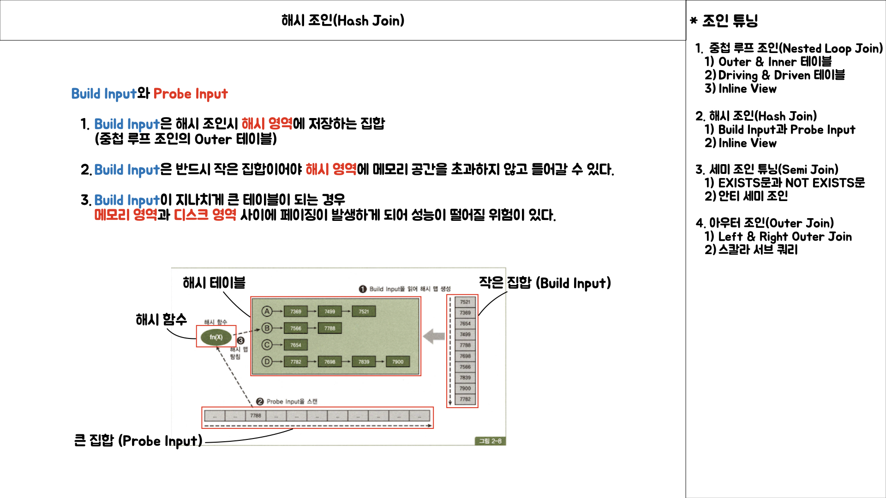

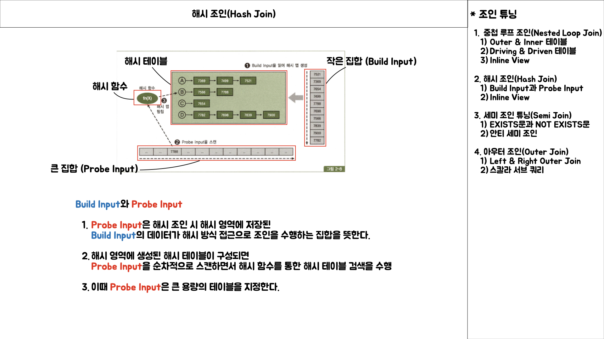

> **해시 조인을 위한 메모리 관리 (Oracle)**

- 오라클의 **PGA(Private Global Area)** 영역은 해시 조인 시 사용하게 되는 메모리 영역이다.
- 해시 조인 시 Build Input이 PGA 영역에 모두 담길 정도로 작다면 최적 연산이 일어나면서 극적인 성능을 발휘한다.
- 하지만 **Build Input**이 너무 커서 PGA 영역에 모두 담지 못하게 되면 임시 공간 영역을 이용하게 되면서 디스크 I/O가 발생하게 된다.
	- 즉, **멀티 패스(Multi Pass)**연산이 일어나게 된다.
	- -이러한 경우 PGA_AGGREGATE_TARGET 파라미터의 메모리 크기를 확장하여 성능 향상을 꾀할 수 있다.

> **해시 조인 관련 힌트**

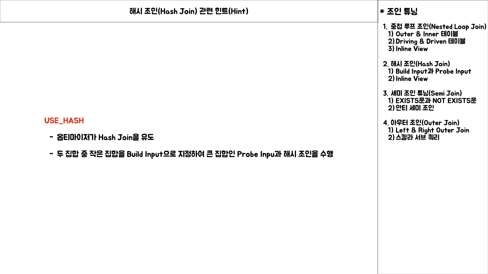

## 해시 조인 튜닝(Hash Join)

---

> **해시 조인 튜닝 전**

> **해시 조인 튜닝 전 실행 계획**

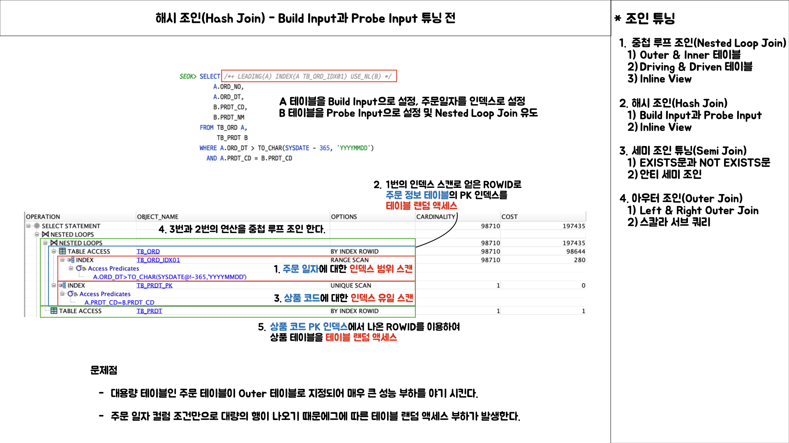

- **SQL 분석**
	- **LEADING 힌트**를 이용하여 `주문 정보 테이블`을 **Outer 테이블**로 지정
	- **Outer 테이블**을 스캔 시 `TB_ORD_IDX01 인덱스`를 이용
	- **USE_NL 힌트**를 이용하여 `상품정보 테이블`을 **Inner 테이블**로 지정하여 **중첩 루프 조인**을 수행하도록 유도한다.

- **SQL의 문제점**
	- 대용량 테이블인 주문정보 테이블이 outer 테이블로 지정되어 매우 큰 성능 부하가 예상된다.
	- 주문일자 컬럼 조건만으로는 대량의 행이 나오기 때문에 그에 따른 테이블 랜덤 액세스 부하가 발생한다.

> **해시 조인 튜닝 후 실행 계획**

- **SQL 분석**
	- LEADING 힌트를 이용하여 작은 집합인 상품 테이블을 Build Input으로 지정
	- FULL 힌트를 이용하여 Build Input을 테이블 풀 스캔으로 유도
	- USE_HASH 힌트를 이용하여 주문 테이블을 Probe Input으로 지정하고 해시 조인을 수행

> **인라인 뷰를 이용한 해시 조인**

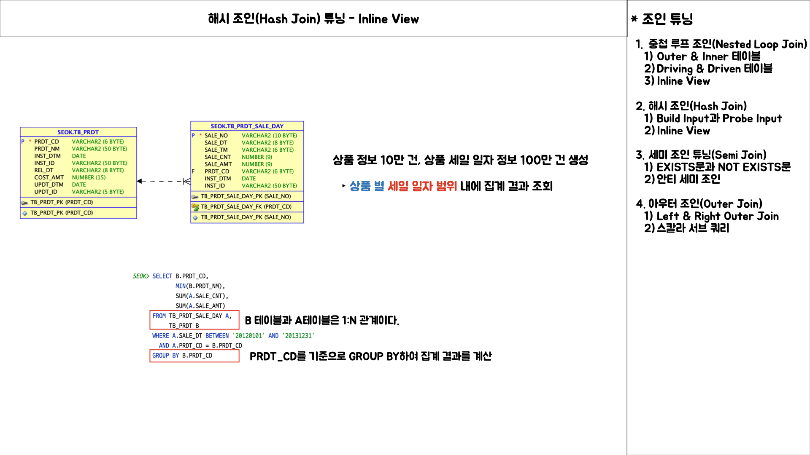

> **인라인 뷰를 이용한 해시 조인으로 성능 극대화 튜닝 전**

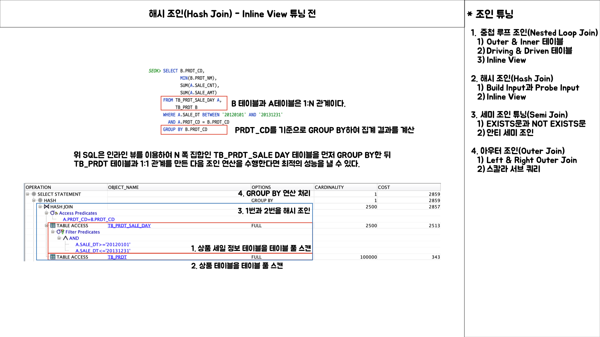

- **SQL 분석**
	- TB_PRDT_SALE_DAY 테이블과 TB_PRDT 테이블을 조인
	- 조인 방식은 옵티마이저의 선택에 따른다.

- **SQL의 문제점**
	- TB_PRDT 테이블과 TB_PRDT_SALE_DAY 테이블은 1:M 관계
	- 1쪽 집합인 TB_PRDT 테이블의 PRDT_CD를 기준으로 GROUP BY하여 집계 결과를 계산한다.
	- SQL은 인라인 뷰를 이용하여 M 쪽의 집합인 TB_PRDT_SALE_DAY 테이블을 먼저 GROUP BY한 후 TB_PRDT 테이블과 1:1 관계를 만든 다음 다음 조인 연산을 수행한다면 최적의 성능을 낼 수 있다.

> **인라인 뷰를 이용한 해시 조인 성능 극대화 튜닝 후**

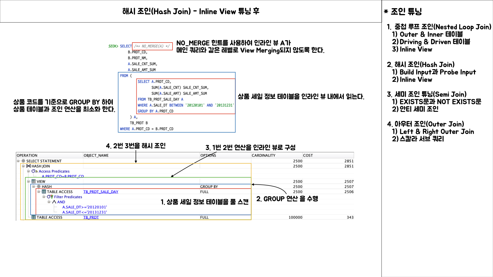

- **SQL 분석**
	- NO_MERGE 힌트를 사용하여 인라인 뷰 A가 메인 쿼리와 같은 레벨로 View Merging되지 않도록 한다.
	- TB_PRDT_SALE_DAY 테이블을 인라인 뷰 내에서 읽는다.
	- PRDT_CD를 기준으로 GROUP BY하여 TB_PRDT 테이블과 조인 연산을 최소화한다.
