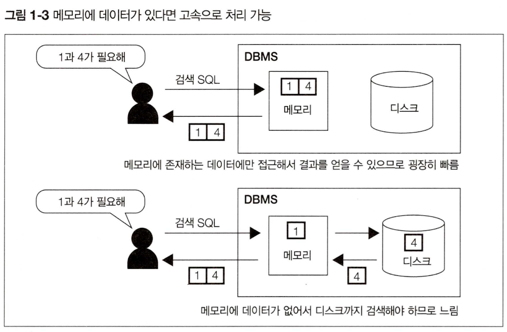
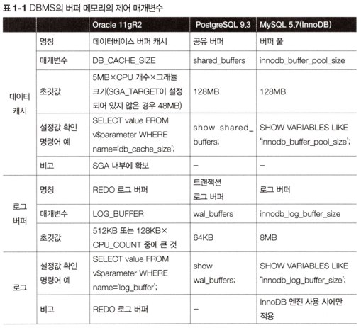
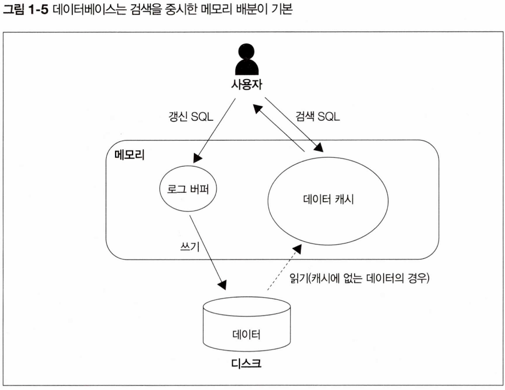
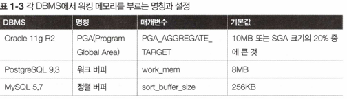
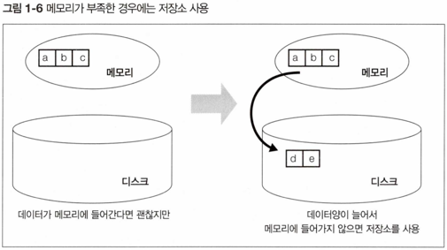

# 1강 DBMS와 버퍼

## Intro

- DBMS의 버퍼 매니저가 어떤 기능을 수행할까?

## 기억장치

- 일반적으로 기억장치는 기억 비용(cost)에 따라 1차부터 3차까지의 계층으로 분류된다.
	- 기억 비용이란 `데이터를 저장하는데 소모되는 비용`을 나타낸다.

- 하드 디스크가 다량의 데이터를 영속적으로 저장하는데는 메모리보다 좋지만, 데이터 접근 속도는 메모리보다 떨어진다.
- 많은 데이터를 영속적으로 저장하기 위해서는 빠른 조회가 불가능하고, 빠른 조회를 위해서는 많은 데이터를 영속적으로 저장하기 힘들다.
	- 데이터의 양 vs 데이터 조회 속도 라는 **트레이드 오프**

## DBMS와 기억장치의 관계

- DBMS는 데이터 저장을 목적으로 하는 미들웨어이다.

### 하드 디스크(HDD)

- DBMS가 데이터를 저장하는 매체(저장소)는 대부분 HDD이다.
- 하드디스크는 기억장치 계층에서 한 가운데 있는 2차 기억장치로 분류된다.

### 메모리(Memory)

- 메모리는 디스크에 비해 기억 비용이 굉장히 비싸다.
- 규모 있는 상용 시스템의 데이터베이스 내부 데이터를 모두 메모리에 올리는 것은 불가능하다.

### 버퍼를 활용한 속도 향상

- DBMS가 일부 데이터를 메모리에 올리는 것은 성능 향상 때문이다.
	- SQL 구문의 실행 속도를 빠르게 하기 위함이다.

- 메모리는 가장 빠른 1차 기억장치이다.
- 자주 접근하는 데이터를 메모리 위에 올려둔다면, 같은 SQL 구문을 실행한다고 해도 디스크에서 데이터를 가져올 필요 없이 곧바로 메모리에서 읽어 빠르게 데이터를 검색할 수 있다.

- 디스크의 접근을 줄이면 성능 향상을 기대할 수 있다.
	- 일반적인 SQL 구문의 실행 시간 대부분을 저장소 I/O(입출력)에 사용하기 때문이다.
	
- 성능 향상을 목적으로 데이터를 저장하는 메모리
	- 버퍼(buffer) 또는 캐시(cache)
	
- 고속 접근이 가능한 **버퍼**에 데이터를 `어떻게 어느 정도의 기간 동안 올릴지를 관리하는 것`이 **DBMS의 버퍼 매니저**이다.

## 메모리 위에 있는 두 개의 버퍼

- DBMS가 데이터를 유지하기 위해 사용하는 메모리
	- 데이터 캐시
	- 로그 버퍼

### 데이터 캐시

- 디스크에 있는 데이터의 일부를 메모리에 유지하기 위해 사용하는 메모리 영역
- 버퍼에서 데이터를 찾을 수 없는 경우 디스크에서 데이터를 조회하여 응답 속도가 느리다.

### 로그 버퍼

- 갱신 처리(INSERT, DELETE, UPDATE, MERGE)와 관련이 있다.
- DBMS는 갱신과 관련된 SQL 구문을 사용자로부터 받으면, 곧바로 저장소에 있는 데이터를 변경하지 않는다.
- 일단 로그 버퍼 위에 변경 정보를 보내고 이후 디스크에 변경을 수행한다.
- 이처럼 데이터베이스의 갱신 처리는 SQL 구문의 실행 시점과 저장소에 갱신하는 시점에 차이가 있는 비동기 처리이다.

- 저장소는 검색 뿐만 아니라 갱신하는 경우에도 상당한 시간이 소모하게 된다.
	- 저장소 변경이 끝날 때까지 기다리면 사용자는 장시간 대기하게 되기 때문에 메모리에 갱신 정보를 받은 시점에 사용자에게 SQL 구문이 끝났다. 라고 통지 후 내부적으로 처리를 계속 수행한다.
	

## 메모리의 성질이초래하는 트레이드 오프

> 휘발성

- 메모리는 데이터의 영속성이 불가능하다.
- 데이터 캐시의 경우 장애로 인해 메모리 위의 데이터가 사라져도, 원본 데이터는 디스크 위에 남아 있으므로 문제가 없다.
- 로그 버퍼의 경우에는 데이터가 디스크 위의 로그 파일에 반영되기 전에 장애가 발생하게 되면 데이터가 완전히 사라져서 복구가 불가능하다.
	- 따라서 이를 회피하고자 DBMS는 커밋 시점에 반드시 갱신 정보를 로그 파일에 쓰게 된다.
	- 장애가 발생해도 정합성을 유지할 수 있다.
	
- 커밋(Commit)이란 갱신 처리를 확정하는 기능이다.
	- DBMS는 커밋된 데이터를 영속화 한다.
	
- Commit이 수행되면 반드시 디스크에 동기 접근이 일어난다.
	- 여기서 지연이 발생할 가능성이 있다.
	- 이는 또 다시 트레이드오프가 있게 된다.
	- 디스크에 동기 처리하게 되는 경우 데이터의 정합성은 높아지지만 성능이 낮아진다.
	- 성능을 높이려면 데이터 정합성이 낮아진다.

## 시스템 특성에 따른 트레이드 오프

> 데이터 캐시와 로그 버퍼의 크기

- 데이터 캐시와 로그 버퍼를 비교해보면 3개의 DBMS에서 공통으로 데이터 캐시에 비해 로그 버퍼의 초깃값이 굉장히 작다는 것을 알 수 있다.
- 이는 데이터베이스가 기본적으로 검색을 메인으로 처리한다고 가정하기 때문이다.

- **검색 처리**를 할 때는 검색 대상 레코드가 수백만에서 수천만 건에 달하는 경우가 많다.
- **갱신 처리**를 하는 경우 갱신 대상이 많아 봤자 트랜잭션 마다 한건에서 수만 건 정도 밖에 안된다.
- 따라서 갱신 처리를 값비싼 메모리를 사용용하는 것보다, 자주 검색하는 데이터를 캐시에 올려놓는 것이 좋다.

- DBMS의 물리 메모리에 여유가 있다면, 데이터 캐시를 되도록 많이 할당할 것을 추천한다.

- 시스템이 검색에 비해 **갱신이 많은 경우**, 초기 설정을 그대로 사용해서는 성능이 제대로 나오지 않을 수 있다.
	- 이때 **로그 버퍼**의 크기를 늘려주는 튜닝이 필요하다.
	
> 검색과 갱신 중에 중요한 것?

- 메모리라는 비싼 희소 자원으로 모든 것을 커버하기에는 부족하다.
- 따라서 어떤 것을 우선하여 지킬 것인지, 어떤 것을 버릴 지 판단해야 한다.

- 적절한 판단을 하기 위해서는 데이터베이스가 어떠한 생각에 기반을 둬서 리소스를 배분하고 있늕지를 이해하는 것이 중요하다.
	- **로그 버퍼**가 크게 잡혀있다면, **갱신 처리**와 관련되어 큰 부하가 걸린다.
	- **데이터 캐시**가 크게 잡혀 있다면, **검색 처리**와 관련된 처리가 중심이라는 것을 알 수 있다.

## 추가적인 메모리 영역 **`워킹 메모리`**

> 언제 사용되는건가?

- DBMS는 앞에서 설명했던 2개 버퍼 이외에도, **정렬** 또는 **해시** 관련 처리에 사용되는 작업용 영역으로 워킹 메모리(working memory)가 있다.
	- **정렬**은 order by 구, 집합 연산, 윈도우 함수 등의 기능을 사용할 때 실행된다.
	- 반면 **해시**는 주로 테이블 등의 결합에서 해시 결합이 사용되는 때 실행된다.

- 메모리 영역의 이름과 관리 방법은 DBMS에 따라 다르다.

- 워킹 메모리 영역은 SQL에서 정렬 또는 해시가 필요할 때 사용되고, 종료되면 해제 되는 임시 영역이다.
	- 일반적으로는 데이터 캐시와 로그 버퍼와는 다른 영역으로 관리되는 경우가 많다.

- 워킹 메모리 영역이 다루려는 데이터 양보다 작아 부족해지는 경우가 발생하면 대부분의 DBMS가 저장소를 사용한다.
	- 이는 성능에 영향을 줄 수 있기 때문에 중요하다.
	- OS의 swap과 같은 것이다.

- DBMS 별 워킹 메모리가 부족할 때 사용하는 임시 영역 명칭
	- Oracle: 임시 테이블 스페이스(TEMP Tablespace)
	- Microsoft SQL Server: TEMPDB
	- PostgreSQL: 일시 영역(pgsql_tmp)
	
> 부족하게 되면 일어나는 일

- 메모리가 부족해지는 순간 저장소를 사용하기 때문에 느려진다.
- 이 영역은 여러 개의 SQL 구문들이 공유해서 사용하므로, 하나의 SQL 구문을 실행하고 있을 때는 메모리에 잘 들어가지만 여러 개의 SQL 구문을 동시에 실행하면 메모리가 넘치는 경우가 있다.
- 따라서 그러한 상황을 재현하는 검사(부하 검사)를 실시하지 않으면 메모리 부족 현상이 일어날지 판별하기 힘들다.
- 하나가 있을 때의 성질뿐만 아니라, 여러 개가 있을 때의 성질도 주의해야 한다는 것은 컨트롤 하기 힘든 성능문제이다.

- DBMS는 메모리가 부족하다는 이유로 SQL 구문에 오류를 절대 발생시키지 않는다.
	- 비록 느려지는 상황이 발생하더라도 끝까지 처리하려 한다.
	- DBMS가 중요한 데이터를 보관하고 처리할 떄, 운영체제 정도의 급으로 처리 계속성을 담보하려 한다.
