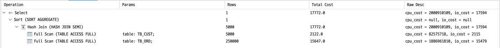

# 4강 실행 계획이 SQL 구문의 성능을 결정

> [SQL 레벨업 - DB 성능 최적화를 위한 SQL 실전 가이드](http://www.kyobobook.co.kr/product/detailViewKor.laf?mallGb=KOR&ejkGb=KOR&barcode=9788968482519) 내용을 정리한 내용입니다.

## Intro

- 실행 계획이 만들어지면 DBMS는 데이터 접근을 수행한다.
- 데이터 양이 많은 테이블에 접근한다거나 복잡한 SQL 구문을 실행하면서 **반응 지연**이 발생하는 경우가 있다.

- **반응 지연**에 대한 원인
	- **통계 정보의 부족**으로 인해 최적의 실행계획을 세우지 못함
	- **SQL 구문이 복잡**하여 최적의 실행계획을 세우지 못함

## 실행 계획 확인 방법

- 모든 DBMS는 실행 계획을 조사하는 수단을 제공한다.

- 실행 계획을 확인하는 명령어

|이름|명령어|
|:---:|:---:|
|Oracle|set autotrace traceonly|
|Microsoft SQL Server|SET SHOWPLAN_TEXT ON|
|DB2|EXPLAIN ALL WITH SNAPSHOT FOR SQL 구문|
|PostgreSQL|EXPLAIN SQL 구문|
|MySQL|EXPLAIN EXTENDED SQL 구문|

## 실행 계획의 종류

- 테이블 풀 스캔(Full Scan)의 실행 계획
- 인덱스 스캔의 실행 계획
- 간단한 테이블 결합의 실행 계획

### 1. 테이블 풀 스캔(Full Scan)의 실행 계획

- 실행 계획을 분석할 때 확인해야 하는 요소
	- 조작 대상 객체
	- 객체에 대한 조작의 종류
	- 조작 대상이 되는 레코드 수

- 조작 대상 객체
	- 여러 개의 테이블을 사용하는 SQL 구문에서 어떤 객체를 조작하는지 확인이 가능한 요소
	- 인덱스, 파티션, 시퀀스 등등 올 수 있다.

- 객체에 대한 조작의 종류
	- 객체에 대한 접근 방법을 나타내는 요소

- 조작 대상이 되는 레코드 수
	- 얼마만큼의 레코드가 처리되는지 출력되어 SQL 구문 전체의 실행 비용을 파악할 수 있는 요소

### 2. 인덱스 스캔의 실행 계획

- 조작 대상이 되는 레코드 수
	- WHERE 구에서 기본 키로 조회하는 경우 index unique scan을 하게 된다.

- 접근 대상 객체와 조작
	- 인덱스를 사용해 스캔하는 경우 인덱스에 대한 정보를 확인할 수 있다.
	- 일반적으로 스캔하는 모집합 레코드 수에서 선택되는 레코드 수가 적다면 테이블 풀 스캔 보다 빠르게 접근을 수행한다.
		- 풀 스캔이 모집합의 데이터 양에 비례해서 처리 비용이 늘어나는 것에 반해, 인덱스를 사용할 때 활용되는 B-tree가 모집합의 데이터 양에 따라 대수 함수적으로 처리 비용이 늘어나기 때문이다.
		- 간단하게 말해 인덱스의 처리 비용이 완만하게 증가한다는 뜻으로, 특정 데이터 양(N)을 손익 분기점으로 인덱스 스캔이 풀 스캔보다도 효율적인 접근을 하게 된다.

### 3. 간단한 테이블 결합의 실행 계획

- 결합을 수행하는 쿼리의 실행 계획
	- SQL에서 지연이 일어나는 경우는 대부분 **결합**과 관련된 것이다.

- 결합을 사용하면 실행 계획이 상당히 복잡해지므로, 옵티마이저도 최적의 실행 계획을 세우기 어렵다.
- 따라서 결합 시점의 실행 계획 특성에 대한 이해하는 것이 필요하다.

> 결합을 할 때 DBMS가 사용하는 세 가지 알고리즘

- 중첩 반복(Nested Loops)
	- 한쪽 테이블을 읽으면서 레코드 하나마다 결합 조건에 맞는 레코드를 다른 쪽 테이블에서 찾는 방식

- Sort Merge
	- 결합 키로 레코드를 정렬한 뒤, 순차적으로 두 개의 테이블을 결합하는 방법
	- 결합 전에 전처리로 정렬을 수행하는데, 이때 작업용 메모리로 워킹 메모리를 사용한다.

- Hash
	- 결합 키 값을 해시 값으로 매핑하는 방법
	- 해시 테이블을 만들기 위해 작업용 메모리 영역을 필요로 한다.

- 결합의 경우 어떤 테이블에 먼저 접근하는지가 굉장히 중요한 의미를 갖는다.
