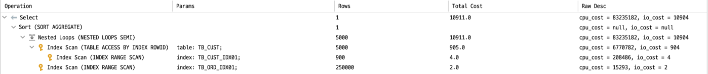
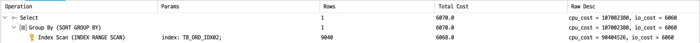

# SQL 튜닝의 기본

> [개발자를 위한 오라클 SQL 튜닝](https://www.hanbit.co.kr/store/books/look.php?p_code=E9267570814) 내용에서 참고한 내용입니다.

## 인덱스를 최대한 활용하여 원하는 결과 검색하기

- 소비자 테이블, 주문 테이블 생성
- 기본키, 외래키 생성(참조 무결성 제약 조건)

- 테이블 관계
	- 두 테이블의 관계는 1:N 관계
	- 한 명의 고객은 여러 건을 주문할 수 있고, 한 건도 주문하지 않을 수 있다.
	- 한 개의 주문은 반드시 한 명의 고객을 가져야 한다.

- 통계정보 생성
	- 인덱스와 테이블에 대한 통계 정보 생성

---

### 1. 테이블 풀 스캔 해보기

```sql
SELECT /*+ FULL(A) */ -- FULL 힌트를 사용하여 테이블의 스캔 방법을 테이블 풀 스캔으로 유도
   COUNT(*)
FROM TB_CUST A -- driving table
WHERE
  A.CUST_NM LIKE 'AB%' AND -- Like 문을 이용하여 CUST_NM 컬럼 값이 'AB'로 시작하는 행을 찾는다.
  EXISTS -- EXISTS문을 이용하여 TB_ORD 테이블에 PRDT_CD 컬럼의 값이 'AB'로 시작하는 행을 검색한다.
    (
        SELECT '1'
         FROM TB_ORD C -- driven table
         WHERE
       C.CUST_ID = A.CUST_ID AND
       C.PRDT_CD LIKE 'AB%'
     ) ;
```

- 문제점
	- TB_CUST 테이블의 CUST_NM 컬럼이 변별력 있는 컬럼임에도 인덱스를 생성하지 않음
	- TB_ORD 테이블의 CUST_ID 컬럼이 변별력 있는 컬럼임에도 인덱스를 생성하지 않음
	- OLTP(Online Transaction Processing)환경에서 빈번하게 사용되는 SQL문이라면 반복적인 테이블 풀 스캔은 전체 시스템에 큰 부하를 주게 된다.

- **Execute Plan**
	- TB_CUST 테이블 풀 스캔 -> TB_ORD 테이블 풀 스캔
	- TB_CUST 테이블과 TB_ORD 테이블을 해시 세미 조인을 한다.
	- 해시 세미 조인은 옵티마이저가 판단한 조인 방식
		- 조인 방법에 대한 힌트를 지정하지 않을 경우 조인 방식은 옵티마이저의 판단에 따른다.
	- COUNT 함수 연산을 수행
	- SELECT 절의 연산을 수행


---

### 2. 인덱스 생성 (튜닝)

- TB_CUST 테이블에 CUST_NM 컬럼으로 구성된 인덱스를 생성

```sql
CREATE INDEX TB_CUST_IDX01 ON TB_CUST(CUST_NM);
CREATE INDEX TB_ORD_IDX01 ON TB_ORD(CUST_ID, PRDT_CD);
```

- 통계 정보 생성

```sql
ANALYZE INDEX TB_CUST_IDX01 COMPUTE STATISTICS ;
ANALYZE INDEX TB_ORD_IDX01 COMPUTE STATISTICS ;
```

---

- 튜닝 후 SQL문

```sql
SELECT /*+ INDEX(A TB_CUST_IDX01) */ -- TB_CUST 테이블에 생성한 TB_CUST_IDX01 인덱스를 사용하도록 INDEX 힌트를 사용
    COUNT(*)
FROM TB_CUST A
WHERE A.CUST_NM LIKE 'AB%'
  AND EXISTS
    (
        SELECT /*+ INDEX(C TB_ORD_IDX01) NL_SJ */ -- TB_ORD 테이블의 TB_ORD_IDX01 인덱스를 사용하도록 INDEX 힌트를 사용, 중첩 루프 세미 조인을 위한 NL_SJ 힌트를 사용
            '1'
        FROM TB_ORD C
        WHERE C.CUST_ID = A.CUST_ID
          AND C.PRDT_CD LIKE 'AB%'
    );
```

- 중첩 루프 세미 조인(Nested Loop Semi Join)
	- 조건 만족 시 해당 조인 대상 행은 더 이상 스캔을 수행하지 않고 다음 행으로 넘어가는 조인 방식

- **Execute Plan**
	- TB_CUST 테이블의 TB_CUST_IDX01 인덱스를 인덱스 범위 스캔(INDEX RANGE SCAN)합니다.
		- '인덱스 범위 스캔'이란 수직적 탐색을 통해 인덱스 리프 블록의 특정 위치로 이동한 후 지정된 범위를 스캔하는 방식
		- 인덱스의 스캔 방식 중 가장 일반적인 방식
	- TB_CUST 테이블의 TB_CUST_IDX01 인덱스는 CUST_NM으로 이루어진 인덱스
		- 해당 인덱스 스캔 후 CUST_ID를 가져오기 위해 테이블 랜덤 액세스(TABLE ACCESS BY INDEX ROWID)합니다.
		- TB_CUST 테이블의 기본키가 CUST_ID긴 하지만, 여기서는 CUST_NM 컬럼으로 이루어진 인덱스를 스캔하였기 때문에 테이블 랜덤 액세스는 불가피하다.
		- TB_CUST_IDX01 인덱스의 구성을 'CUST_NM + CUST_ID' 컬럼으로 한다면 해당 테이블 랜덤 액세스 부하를 줄일 수 있다.
	- TB_CUST 테이블의 CUST_ID 컬럼을 바탕으로 TB_ORD 테이블의 TB_ORD_IDX01 인덱스를 인덱스 범위 스캔(INDEX RANGE SCAN)을 하였다.
		- TB_ORD_IDX01 인덱스는 'CUST_ID + PRDT_CD'로 구성되어서 별도로 테이블 랜덤 액세스하지 않았다.
	- TB_CUST 테이블을 기준으로 TB_ORD 테이블과 중첩 세비 조인(NESTED LOOPS SEMI)를 한다.
		- TB_CUST 테이블을 기준으로 TB_ORD 테이블과의 조인 조건이 성립되면 해당 조인 대상 행에 대해 더는 스캔하지 않고 멈추게 된다.
	- COUNT 함수 연산을 수행한다.
	- SELECT절의 연산을 수행한다.



--- 

## 추가 튜닝

- 인덱스 컬럼을 추가하여 테이블 랜덤 엑세스를 없애고 인덱스 스캔만으로 데이터를 조회하는 기법
	- 인덱스를 재생성하고 통계 정보를 생성
	- TB_CUST_IDX01의 인덱스를 CUST_NM, CUST_ID로 재생성
	- 별도의 테이블 랜덤 액세스를 하지 않고 TB_CUST_IDX01 인덱스 만을 스캔하게 된다.

```sql
DROP INDEX TB_CUST_IDX01;
CREATE INDEX TB_CUST_IDX01 ON TB_CUST(CUST_NM, CUST_ID);
ANALYZE INDEX TB_CUST_IDX01 COMPUTE STATISTICS;
```

- **Execute Plan**
	- TB_CUST 테이블의 TB_CUST_IDX01 인덱스를 인덱스 범위 스캔(INDEX RANGE SCAN)을 한다.
	- TB_ORD 테이블의 TB_ORD_IDX01 인덱스를 인덱스 범위 스캔(INDEX RANGE SCAN)을 한다.
	- TB_CUST_IDX01 인덱스를 기준으로 TB_ORD_IDX01 인덱스와 중첩 루프 세미 조인(NESTED LOOPS SEMI) 한다.
	- COUNT 함수 연산을 수행한다.
	- SELECT절의 연산을 수행한다.


### 인덱스 구성 컬럼을 추가하여 테이블 랜덤 액세스 제거하기

- 실습을 위한 테이블 생성

```sql
CREATE TABLE TB_ORD
(
    ORD_NO VARCHAR2(10), --주문번호
    ORD_DT VARCHAR2(8), --주문일자
    ORD_NM VARCHAR2(150), --주문이름
    ORD_AMT NUMBER(15), --주문금액
    PRDT_CD VARCHAR2(6), --상품코드
    SALE_GB VARCHAR2(2), --판매구분
    PAY_GB VARCHAR2(2), --결제구분
    CUST_ID VARCHAR2(10), --고객ID
    INST_DTM DATE, --입력시간
    INST_ID VARCHAR2(50), --입력자ID
    UPDT_DTM DATE, --수정시간
    UPDT_ID VARCHAR2(5) --수정자ID
);
```

---

- 데이터 입력

```sql
CREATE TABLE DUAL_5
(
    DUMMY VARCHAR2(1)
);

INSERT INTO DUAL_5
SELECT DUMMY
FROM DUAL CONNECT BY LEVEL <= 5;

COMMIT ;

ALTER TABLE TB_ORD NOLOGGING;

-- 500 만건
INSERT /*+ APPEND */  INTO TB_ORD --APPEND 힌트 사용
SELECT
    LPAD(TO_CHAR(ROWNUM), 10, '0'),
    TO_CHAR(SYSDATE-TRUNC(DBMS_RANDOM.VALUE(1,3650)), 'YYYYMMDD'),
    DBMS_RANDOM.STRING('U', 150),
    TRUNC(DBMS_RANDOM.VALUE(1000, 100000)),
    LPAD(TO_CHAR(MOD(TRUNC(DBMS_RANDOM.VALUE(1, 1000)), 50)), 6, '0'),
    LPAD(TO_CHAR(MOD(TRUNC(DBMS_RANDOM.VALUE(1, 1000)), 10)), 2, '0'),
    LPAD(TO_CHAR(MOD(TRUNC(DBMS_RANDOM.VALUE(1, 1000)), 10)), 2, '0'),
    LPAD(TO_CHAR(TRUNC(DBMS_RANDOM.VALUE(1, 100000))), 10, '0'),
    SYSDATE,
    'DBMSEXPERT',
    NULL,
    NULL
FROM DUAL_5, (SELECT LEVEL LV FROM DUAL CONNECT BY LEVEL <= 500000);

COMMIT;

[2021-07-10 20:14:13] 2,500,000 rows affected in 10 m 33 s 125 ms
```

- 기본키 생성

```sql
ALTER TABLE TB_ORD
    ADD CONSTRAINT TB_ORD_PK
        PRIMARY KEY (ORD_NO);
```

- 인덱스 생성

```sql
CREATE INDEX TB_ORD_IDX01 ON TB_ORD(ORD_DT, ORD_NM, ORD_AMT);
```

- 통계 정보 생성

```sql
ANALYZE TABLE TB_ORD COMPUTE STATISTICS
FOR TABLE FOR ALL INDEXES FOR ALL INDEXED COLUMNS SIZE 254;
```

---

> 쿼리 비교를 통한 분석

```sql
SELECT
    ORD_DT,
    SALE_GB,
    PAY_GB,
    COUNT(*) AS 주문건수,
    SUM(ORD_AMT) AS 총주문금액,
    ROUND(AVG(ORD_AMT), 2) AS 평균주문금액
FROM TB_ORD
WHERE
    ORD_DT BETWEEN '20150101' AND '20151231'AND
        ORD_NM LIKE 'A%'AND 
        ORD_AMT >= 1000
GROUP BY
    ORD_DT, SALE_GB, PAY_GB
ORDER BY
    ORD_DT, SALE_GB, PAY_GB;
```

- SQL 분석
    - ORD_DT 컬럼을 조건으로 주어 2015년의 주문 건을 검색
	- ORD_DT + ORD_NM + ORD_AMT로 구성된 TB_ORD_IDX01 인덱스를 이용

- 위 쿼리의 문제점
	- TB_ORD_IDX01 인덱스를 사용한 효율적인 인덱스 스캔을 하고 있다.
	- 하지만 SELECT 절에 인덱스 컬럼이 아닌 다른 컬럼도 조회하고 있으므로 인덱스 스캔에 이은 테이블 랜덤 액세스 부하가 발생한다.
	- 넓은 범위를 주로 조회하고 결과 건수가 많아진다면 DBMS에 큰 부하를 주게 된다.

- **Execute Plan**
	- TB_ORD 테이블의 TB_ORD_IDX01 인덱스를 인덱스 범위 스캔(INDEX RANGE SCAN)한다.
	- TB_ORD_IDX01 인덱스의 리프 블록에 저장된 ROWID를 이용하여 테이블 랜덤 액세스(TABLE ACCESS BY INDEX ROWID)를 수행
		- 인덱스 스캔에서 조건에 만족하는 ROWID가 많다면 자연스레 테이블 랜덤 액세스 부하가 발생한다.
	- ORDER BY와 GROUP BY 연산을 수행한다.
	- SELECT 절의 연산을 수행한다.


> 튜닝

- 인덱스 추가

```sql
CREATE INDEX TB_ORD_IDX02 ON TB_ORD(ORD_DT, ORD_NM, ORD_AMT, SALE_GB, PAY_GB);
ANALYZE INDEX TB_ORD_IDX02 COMPUTE STATISTICS;
```

- **튜닝 후 SQL 문**
	- TB_ORD 테이블의 TB_ORD_IDX02 인덱스를 사용하도록 INDEX 힌트를 사용
	- 해당 인덱스는 SALE_GB 컬럼과 PAY_GB 컬럼이 존재하기 때문에 테이블 랜덤 액세스를 생략할 수 있다.
	- 테이블 랜덤 액세스가 사라졌다는 것은 인덱스 구성 컬럼만으로 SQL문의 요청 내용을 검색한 것을 뜻한다.

```sql
SELECT /*+ INDEX(TB_ORD TB_ORD_IDX02) */ 
    ORD_DT,
    SALE_GB,
    PAY_GB,
    COUNT(*) AS 주문건수,
    SUM(ORD_AMT) AS 총주문금액 ,
    ROUND(AVG(ORD_AMT), 2) AS 평균주문금액
FROM TB_ORD
WHERE ORD_DT BETWEEN '20150101' AND '20151231'
AND ORD_NM LIKE 'A%'
AND ORD_AMT >= 1000
GROUP BY ORD_DT, SALE_GB, PAY_GB
ORDER BY ORD_DT, SALE_GB, PAY_GB;
```

- **Execute Plan**
	- TB_ORD 테이블의 TB_ORD_IDX02 인덱스를 인덱스 범위 스캔(INDEX RANGE SCAN)을 한다.
	- ORDER BY와 GROUP BY 연간을 수행한다.
	- SELECT 절의 연산을 수행한다.


