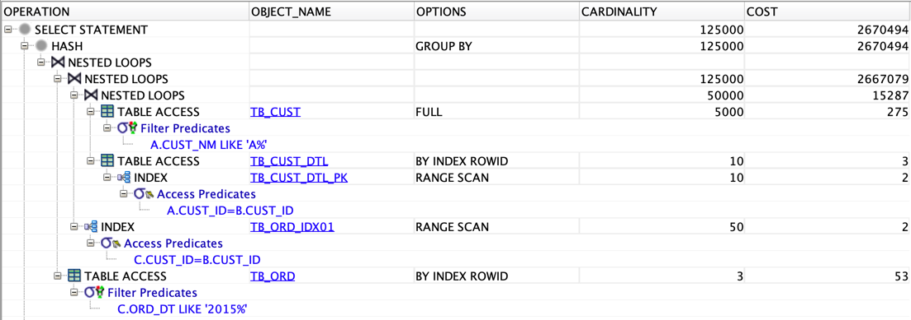
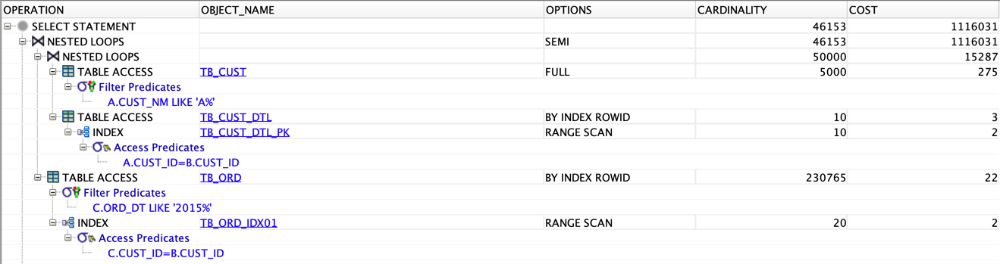
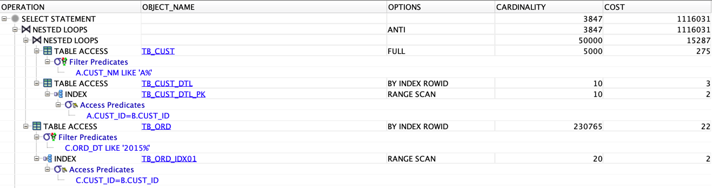

# 실습

> [개발자를 위한 오라클 SQL 튜닝](https://www.hanbit.co.kr/store/books/look.php?p_code=E9267570814) 내용에서 참고한 내용입니다.

## Intro

## 세미 조인(Semi Join) 기법을 이용한 성능 극대화

```oracle
CREATE TABLE TB_CUST
(
    CUST_ID VARCHAR2(10), -- 고객ID
    CUST_NM VARCHAR2(50) -- 고객명
);

CREATE TABLE TB_CUST_DTL
(
    CUST_ID VARCHAR2(10), -- 고객ID
    SEQ    NUMBER(3), -- 시퀀스
    CUST_INFO VARCHAR2(150) -- 고객정보
);

CREATE TABLE TB_ORD
(
    ORD_NO VARCHAR2(10), -- 주문번호
    ORD_DT VARCHAR2(8), -- 주문일자
    CUST_ID VARCHAR2(10) -- 고객ID
);
```

- **회원 정보 및 상세 정보 생성**

```oracle
INSERT INTO TB_CUST
SELECT
    LPAD(TO_CHAR(ROWNUM), 10, '0'),
    DBMS_RANDOM.STRING('U', 50)
FROM DUAL CONNECT BY LEVEL <= 100000;

-- [2021-07-29 16:49:09] 100,000 rows affected in 6 s 361 ms
COMMIT;

INSERT INTO TB_CUST_DTL
SELECT
    CUST_ID,
    ROW_NUMBER() OVER (PARTITION BY CUST_ID ORDER BY CUST_ID),
    DBMS_RANDOM.STRING('U', 50)
FROM TB_CUST, ( SELECT LEVEL LV FROM DUAL CONNECT BY LEVEL <= 10);

-- [2021-07-29 16:50:10] 1,000,000 rows affected in 1 m 1 s 354 ms
COMMIT;
```

- **주문 정보 생성**

```oracle
ALTER TABLE TB_ORD NOLOGGING;

INSERT /*+ APPEND */ INTO TB_ORD --APPEND 힌트 사용
SELECT
    LPAD(TO_CHAR(ROWNUM), 10, '0'),
    TO_CHAR(SYSDATE - TRUNC(DBMS_RANDOM.VALUE(1, 3650)), 'YYYYMMDD'),
    CUST_ID
FROM TB_CUST, ( SELECT LEVEL LV FROM DUAL CONNECT BY LEVEL <= 50);

-- [2021-07-29 16:52:24] 5,000,000 rows affected in 2 m 13 s 267 ms
COMMIT;
```

- **제약 조건 생성**

```oracle
ALTER TABLE TB_CUST
    ADD CONSTRAINT TB_CUST_PK
        PRIMARY KEY (CUST_ID);

ALTER TABLE TB_CUST_DTL
    ADD CONSTRAINT TB_CUST_DTL_PK
        PRIMARY KEY (CUST_ID, SEQ);

ALTER TABLE TB_ORD
    ADD CONSTRAINT TB_ORD_PK
        PRIMARY KEY (ORD_NO);
```

- 인덱스 생성 및 통계 정보 갱신

```oracle
CREATE INDEX TB_ORD_IDX01 ON TB_ORD (CUST_ID);

ANALYZE TABLE TB_CUST COMPUTE STATISTICS
FOR TABLE FOR ALL INDEXES FOR ALL INDEXED COLUMNS SIZE 254;

ANALYZE TABLE TB_CUST_DTL COMPUTE STATISTICS
FOR TABLE FOR ALL INDEXES FOR ALL INDEXED COLUMNS SIZE 254;

ANALYZE TABLE TB_ORD COMPUTE STATISTICS
FOR TABLE FOR ALL INDEXES FOR ALL INDEXED COLUMNS SIZE 254;
```

> **튜닝 전 쿼리**

```oracle
SELECT /*+ LEADING(A) FULL(A) USE_NL(B) USE_NL(C) */
    A.CUST_ID,
    A.CUST_NM,
    B.CUST_ID,
    B.SEQ,
    B.CUST_INFO
FROM TB_CUST A,
     TB_CUST_DTL B,
     TB_ORD C
WHERE A.CUST_NM LIKE 'A%'
  AND A.CUST_ID = B.CUST_ID
  AND C.CUST_ID = B.CUST_ID
  AND C.ORD_DT LIKE '2015%'
GROUP BY A.CUST_ID,
         A.CUST_NM,
         B.CUST_ID,
         B.SEQ,
         B.CUST_INFO;

-- [2021-07-29 16:55:53] 38,990 rows retrieved starting from 1 in 5 s 227 ms (execution: 3 s 428 ms, fetching: 1 s 799 ms)
```

- **SQL 분석**
	- LEADING 힌트를 사용하여 TB_CUST 테이블을 가장 먼저 스캔 하여 테이블 풀스캔으로 유도
	- USE_NL 힌트를 이용하여 TB_CUST_DTL 테이블과 중첩 루프 조인 연산 후 TB_ORD 테이블과 중첩 루프 조인을 유도

- **SQL의 문제점**
	- TB_ORD 테이블이 가지고 있는 컬럼은 SELECT 절에 존재하지 않는다.
	- TB_ORD 테이블은 EXISTS 유무만 판단해도 결과 집합에 영향을 주지 않는다.
	- 즉, 해당 테이블은 세미 조인으로 튜닝할 수 있다.

- **Execute Plan**
	- TB_CUST 테이블을 테이블 풀 스캔 한다.
	- TB_CUST_DTL_PK를 인덱스 범위 스캔(INDEX RANGE SCAN)한다.
	- 6번에서 찾은 ROWID를 이용하여 TB_CUST_DTL 테이블을 테이블 랜덤 액세스(TABLE ACCESS BY INDEX ROWID)한다.
	- 5번과 6번의 연산을 중첩 루프 조인(NESTED LOOPS)한다.
	- TB_ORD_IDX01 인덱스를 인덱스 범위 스캔(INDEX RANGE SCAN)한다.
	- 4번과 8번의 연산을 중첩 루프 조인(NESTED LOOPS)한다.
	- 3번과 나온 TB_ORD_IDX01의 ROWID 값으로 TB_ORD 테이블에 테이블 랜덤 액세스(TABLE ACCESS BY INDEX ROWID) 한다.
	- 3번과 9번의 연산을 중첩 루프 조인(NESTED LOOPS)한다.
	- GROUP BY 연산을 수행한다.
	- SELECT 절의 연산을 수행한다.



> **튜닝**

```oracle
SELECT /*+ LEADING(A) FULL(A) USE_NL(B) */
    A.CUST_ID,
    A.CUST_NM,
    B.CUST_ID,
    B.SEQ,
    B.CUST_INFO
FROM TB_CUST A,
     TB_CUST_DTL B
WHERE A.CUST_NM LIKE 'A%'
  AND A.CUST_ID = B.CUST_ID
  AND EXISTS
    (
        SELECT /*+ UNNEST NL_SJ INDEX(C TB_ORD_IDX01) */
            '1'
        FROM TB_ORD C
        WHERE C.CUST_ID = B.CUST_ID
          AND C.ORD_DT LIKE '2015%'
    );

-- [2021-07-29 16:59:29] 38,990 rows retrieved starting from 1 in 2 s 125 ms (execution: 13 ms, fetching: 2 s 112 ms)
```

- **SQL 분석**
	- LEADING 힌트를 이용하여 가장 작은 테이블인 TB_CUST 테이블을 Outer 테이블로 지정하고 FULL 힌트로 Outer 테이블을 테이블 풀 스캔한다.
	- USE_NL 힌트를 사용하여 TB_CUST_DTL을 Inner 테이블로 지정하고 중첩 루프 조인을 수행한다.
	- EXISTS문을 이용하여 TB_ORD 테이블의 존재 여부를 확인한다.
	- NL_SJ 힌트를 이용하여 중첩 루프 세미 조인으로 유도한다.
	- INDEX 힌트를 이용하여 TB_ORD_IDX01 인덱스를 사용하도록 한다.

- **Execute Plan**
	- TB_CUST 테이블을 테이블 풀 스캔(Table access full)한다.
	- TB_CUST_DTL_PK 인덱스를 인덱스 범위 스캔(INDEX RANGE SCAN)한다.
	- 5번에서 나온 ROWID를 이용하여 TB_CUST_DTL 테이블을 테이블 랜덤 액세스(TABLE ACCESS BY INDEX ROWID)한다.
	- 3번과 4번의 연산을 중첩 루프 조인(NESTED LOOPS)한다.
	- TB_ORD_IDX01 인덱스를 인덱스 범위 스캔(INDEX RANGE SCAN)한다.
	- 7번에서 나온 ROWID를 이용하여 TB_ORD 테이블을 테이블 랜덤 액세스(Table access by index ROWID)한다.
	- 2번과 6번의 연산을 중첩 루프 세미 조인(Nested Loops Semi) 한다.
	- SELECT 절의 연산을 수행한다.



> **안티 세미 조인**

```oracle
SELECT /*+ LEADING(A) FULL(A) USE_NL(B) */
    A.CUST_ID,
    A.CUST_NM,
    B.CUST_ID,
    B.SEQ,
    B.CUST_INFO
FROM TB_CUST A,
     TB_CUST_DTL B
WHERE A.CUST_NM LIKE 'A%'
  AND A.CUST_ID = B.CUST_ID
  AND NOT EXISTS
    (
        SELECT /*+ UNNEST NL_SJ INDEX(C TB_ORD_IDX01) */
            '1'
        FROM TB_ORD C
        WHERE C.CUST_ID = B.CUST_ID
          AND C.ORD_DT LIKE '2015%'
    );

-- [2021-07-29 17:02:17] 160 rows retrieved starting from 1 in 174 ms (execution: 67 ms, fetching: 107 ms)
```

- EXISTS문을 NOT EXISTS로 바꾸면 안티 세미 조인이 성립된다.

- **SQL 분석**
	- NOT EXISTS문을 이용하여 TB_CUST 테이블과 TB_CUST_DTL 테이블의 조인 결과 중 CUST_ID 컬럼을 기준으로 TB_ORD 테이블 내에 존재하지 않는 행을 검색
	- NL_AJ 힌트를 이용하여 중첩 루프 안티 세미 조인으로 유도한다.
	- INDEX 힌트를 이용하여 TB_ORD_IDX01 인덱스를 사용하도록 한다.

- **Execute Plan**
	- TB_CUST 테이블을 테이블 풀 스캔(TABLE ACCESS FULL)한다.
	- TB_CUST_DTL_PK 인덱스를 인덱스 범위 스캔(INDEX RANGE SCAN)한다.
	- 5번에서 나온 ROWID를 바탕으로 TB_CUST_DTL 테이블을 테이블 랜덤 액세스(TABLE ACCESS BY INDEX ROWID)한다.
	- 3번과 4번의 연산을 중첩 루프 조인(NESTED LOOPS)한다.
	- TB_ORD_IDX01 인덱스를 인덱스 범위 스캔(INDEX RANGE SCAN)한다.
	- 7번에서 나온 ROWID를 이용하여 TB_ORD 테이블을 테이블 랜덤 액세스(TABLE ACCESS BY INDEX ROWID) 한다.
	- 2번과 6번의 연산을 중첩 루프 안티 세미 조인(NESTED LOOPS ANTI)한다.
	- SELECT 절의 연산을 수행한다.


