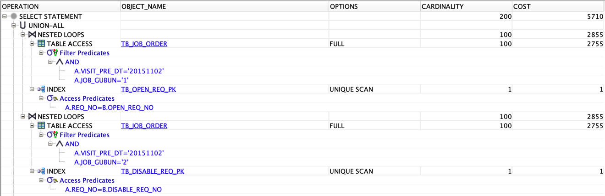
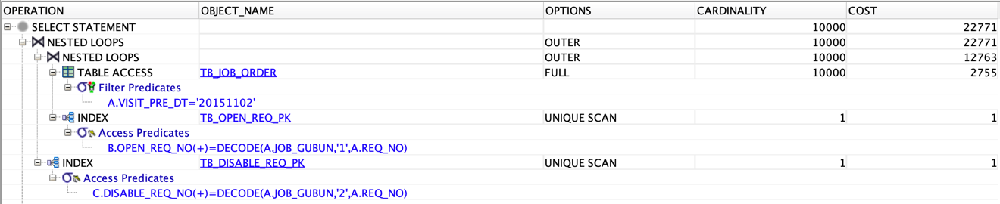
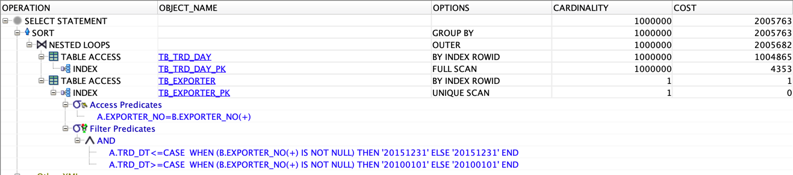
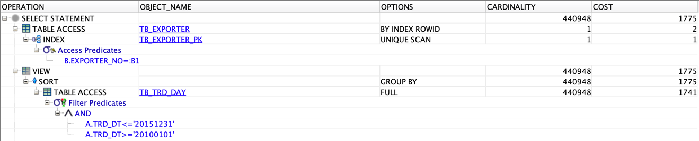

# 이론

> [개발자를 위한 오라클 SQL 튜닝](https://www.hanbit.co.kr/store/books/look.php?p_code=E9267570814) 내용에서 참고한 내용입니다.

## Intro

## 아우터 조인

> **아우터 조인**

- 테이블 A와 B가 있을 때 A 테이블을 기준으로 B 테이블이 조인에 성공하면 B 테이블의 테이터를 보여주고, 조인에 실패하면 B 테이블의 데이터를 보여주지 않는 조인 방식이다.
- A 테이블의 내용은 조인 성공 여부와는 상관없이 모두 보여주고, B 테이블은 조인 성공 시에만 보여주는 조인 방식이다.

> **아우터 조인의 2가지 방식**

- Left Outer Join
	- 왼쪽에 명시한 테이블을 기준이 되는 Outer 조인 방식
	- 오른쪽에 명시한 테이블은 조인에 성공한 데이터만 보여주는 방식
- Right Outer Join
	- 오른쪽에 명시한 테이블이 기준이 되는 Outer 조인 방식
	- 왼쪽에 명시한 테이블은 조인에 성공한 데이터만 보여주는 방식

## 아우터 조인 튜닝

- Outer 조인으로 구현된 SQL문의 성능을 극대화하는 일련의 모든 활동을 의미한다.

> **아우터 조인을 이용하여 테이블 스캔 최소화**

- 테이블 A, B, C이 있다고 가정
- A = B + C의 관계가 성립하는 경우 테이블 B와 C는 테이블 A에 대하여 배타적 관계에 있다고 할 수 있다.
- 테이블 A를 기준으로 테이블 B와 C를 각각 조인할 때 UNION ALL문을 사용하여 두 개의 SELECT 문의 합집합을 구하게 된다.
- 이러한 경우 UNION ALL 문을 아우터 조인으로 변환하여 성능을 개선할 수 있다. <br/> (가장 큰 테이블인 A를 단 한번만 스캔하는 것이 핵심)

> **아우터 조인을 스칼라 서브쿼리로 변환**

- 아우터 조인으로 구현된 SQL 문은 스칼라 서브쿼리로 변환할 수 있다.
- 오라클에서는 스칼라 서브쿼리로 한 번 이상 호출된 Input/Ouput 값을 멀티 버퍼에 저장해 둔 후 동일한 Input으로 호출되면 기존에 가지고 있던 Output 값을 바로 리턴하는 스칼라 서브쿼리 캐싱 기능이 있다.
- 이러한 오라클의 기능을 잘 활용하여 아우터 조인을 스칼라 서브쿼리로 변환하면 성능을 극대화할 수 있다.

### 아우터 조인으로 테이블 스캔을 최소화하여 성능 개선하기

> **튜닝 전**

```oracle
SELECT A.JOB_NO, A.WORKER_ID, A.JOB_STATUS_CD, A.REQ_NO
FROM TB_JOB_ORDER A,
     TB_OPEN_REQ B
WHERE A.VISIT_PRE_DT = '20151102'
  AND A.JOB_GUBUN = '1'
  AND A.REQ_NO = B.OPEN_REQ_NO
UNION ALL
SELECT A.JOB_NO, A.WORKER_ID, A.JOB_STATUS_CD, A.REQ_NO
FROM TB_JOB_ORDER A,
     TB_DISABLE_REQ B
WHERE A.VISIT_PRE_DT = '20151102'
  AND A.JOB_GUBUN = '2'
  AND A.REQ_NO = B.DISABLE_REQ_NO;

-- [2021-07-29 17:39:05] 239 rows retrieved starting from 1 in 173 ms (execution: 30 ms, fetching: 143 ms)
```

- **SQL 분석**
	- TB_JOB_ORDER 테이블과 TB_OPEN_REQ 테이블을 조인
	- TB_JOB_ORDER 테이블과 TB_DISABLE_REQ 테이블을 조인
	- 각각의 SELECT 문을 UNION ALL 하여 결과 집합을 도출
- **SQL 문제점**
	- 가장 큰 용량의 테이블인 TB_JOB_ORDER 테이블을 두 번이나 스캔하는 문제
	- 해당 테이블을 단 한 번만 스캔하여 결과 집합을 도출해야함

- **실행 계획**
	- TB_JOB_ORDER 테이블을 풀 스캔(TABLE ACCESS FULL)
	- TB_OPEN_REQ_PK 인덱스를 인덱스 유일 스캔(INDEX UNIQUE SCAN)
	- 위 동작을 중첩 루프 조인(NESTED LOOPS)
	- TB_JOB_ORDER 테이블을 풀 스캔(TABLE ACCESS FULL)
	- TB_DISABLE_REQ_PK 인덱스를 인덱스 유일 스캔(INDEX UNIQUE SCAN)
	- 바로 위 작업을 중첩 루프 조인(NESTED LOOPS)
	- UNION ALL
	- SELECT문을 종료



> **튜닝 후**

```oracle
SELECT
    /*+ LEADING(A) USE_NL(B) USE_NL(C) */
    A.JOB_NO,
    A.WORKER_ID,
    A.JOB_STATUS_CD,
    A.REQ_NO
FROM TB_JOB_ORDER A,
     TB_OPEN_REQ B,
     TB_DISABLE_REQ C
WHERE A.VISIT_PRE_DT = '20151102'
  AND DECODE(A.JOB_GUBUN, '1', A.REQ_NO) = B.OPEN_REQ_NO(+)
  AND DECODE(A.JOB_GUBUN, '2', A.REQ_NO) = C.DISABLE_REQ_NO(+);

-- [2021-07-29 17:39:24] 239 rows retrieved starting from 1 in 122 ms (execution: 49 ms, fetching: 73 ms) 
```

- **SQL 분석**
	- LEADING 힌트를 사용하여 TB_JOB_ORDER 테이블을 Outer테이블로 지정, USE_NL 힌트를 이용하여 TB_OPEN_REQ 테이블을 Inner 테이블로 지정
	- TB_ORD_ORDER 테이블과 TB_OPEN_REQ 테이블의 중첩 루프 조인 결과가 나오념 해당 결과를 Outer 테이블로 하고, TB_DISABLE_REQ 테이블을 Inner 테이블로 하여 중첩 루프 조인
	- TB_ORD_ORDER 테이블의 JOB_GUBUN의 값이 '1'인 경우 TB_OPEN_REQ 테이블과 LEFT OUTER JOIN
	- TB_ORD_ORDER 테이블의 JOB_GUBUN의 값이 '2'인 경우 TB_DISABLE_REQ 테이블과 LEFT OUTER JOIN

- **실행 계획**
	- TB_JOB_ORDER 테이블을 풀 스캔(TABLE ACCESS FULL)
	- TB_OPEN_REQ_PK 인덱스를 인덱스 유일 스캔(INDEX UNIQUE SCAN)
	- 위 두 작업을 중첩 루프 아우터 조인(NESTED LOOPS OUTER)
	- TB_DISABLE_REQ_PK 인덱스를 인덱스 유일 스캔(INDEX UNIQUE SCAN)
	- 바로 위 두 작업을 중첩 루프 아우터 조인(NESTED LOOPS OUTER)
	- SELECT 절의 연산 수행



### 아우터 조인을 스칼라 서브쿼리 방식으로 변환하여 성능 극대화하기

> **튜닝 전**

```oracle
SELECT /*+ LEADING(A) USE_NL(B) INDEX(A TB_TRD_DAY_PK) */
    A.EXPORTER_NO,
    B.EXPORTER_NM,
    SUM(A.TRD_CNT - A.CNCL_CNT) TOT_CNT
FROM TB_TRD_DAY A
         LEFT OUTER JOIN
     TB_EXPORTER B
     ON (A.EXPORTER_NO = B.EXPORTER_NO)
         AND A.TRD_DT BETWEEN '20100101' AND '20151231'
GROUP BY A.EXPORTER_NO, B.EXPORTER_NM
ORDER BY A.EXPORTER_NO;

-- [2021-07-29 18:18:15] 199,678 rows retrieved starting from 1 in 12 s 522 ms (execution: 7 s 29 ms, fetching: 5 s 493 ms)
```

- **SQL 분석**
	- LEADING 힌트를 이용하여 TB_TRD_DAY 테이블 Outer 테이블로 지정, USE_NL 힌트를 이용하여 TB_EXPORTER 테이블을 Inner 테이블로 지정하고 중첩 루프 조인 처리가 되도록 유도
	- INDEX 힌트를 이용하여 TB_DRD_DAY_PK 인덱스를 사용
	- TB_TRD_DAY 테이블을 기준으로 LEFT 아우터 조인 처리
	- TB_EXPORTER 테이블은 Outer 테이블로 설정

- **SQL 문제점**
	- Outer 테이블인 TB_EXPORTER 테이블 내에 EXPORTER_NM 컬럼만 SELECT절에 있다.
	- 이런 경우 TB_EXPORTER 테이블을 반드시 아우터 조인할 필요가 없으므로 스칼라 서브쿼리로 변환하면 성능 향상을 기대할 수 있다.

- **실행 계획**
	- TB_TRD_DAY_PK 인덱스를 인덱스 풀 스캔(TABLE ACCESS FULL)
	- 위 작업을 통해 나온 ROWID를 이용하여 TB_TRD_DAY 테이블을 테이블 랜덤 액세스(TABLE ACCESS BY INDEX ROWID)
	- TB_EXPORTER_PK 인덱스를 인덱스 유일 스캔(INDEX UNIQUE SCAN)
	- 위 작업의 ROWID를 이용하여 TB_EXPORTER 테이블을 테이블 랜덤 액세스(TABLE ACCESS BY INDEX ROWID)
	- 테이블 랜덤 액세스한 두 작업을 중첩 루프 아우터 조인(NESTED LOOPS OUTER)
	- SORT와 GROUP BY 연산을 수행
	- SELECT 연산을 수행



> **튜닝 후**

```oracle
SELECT X.EXPORTER_NO,
       (SELECT B.EXPORTER_NM
        FROM TB_EXPORTER B
        WHERE B.EXPORTER_NO = X.EXPORTER_NO),
       TOT_CNT
FROM (SELECT A.EXPORTER_NO,
             SUM(A.TRD_CNT - A.CNCL_CNT) TOT_CNT
      FROM TB_TRD_DAY A
      WHERE A.TRD_DT BETWEEN '20100101' AND '20151231'
      GROUP BY A.EXPORTER_NO
      ORDER BY A.EXPORTER_NO
     ) X;
-- [2021-07-29 18:17:43] 99,704 rows retrieved starting from 1 in 4 s 313 ms (execution: 392 ms, fetching: 3 s 921 ms)
```

- **SQL 분석**
	- TB_TRD_DAY 테이블을 인라인 뷰를 이용하여 원하는 데이터를 조회
	- 스칼라 서브쿼리를 이용하여 TB_EXPORTER 테이블을 스캔하여 EXPORTER_NM을 조회, 스칼라 서브쿼리의 캐싱 효과로 인하여 성능 향상

- **실행 계획**
	- TB_TRD_DAY 테이블을 테이블 풀 스캔(옵티마이저의 판단)
	- SORT와 GROUP BY 연산을 수행
	- 해당 결과를 인라인 뷰(View)로 생성
	- TB_EXPORTER_PK 인덱스를 인덱스 유일 스캔(INDEX UNIQUE SCAN)
	- EXPORTER_NM 컬럼의 값을 가져오기 위해 테이블 랜덤 액세스(TABLE ACCESS BY INDEX ROWID) 수행
	- SELECT 연산 수행


