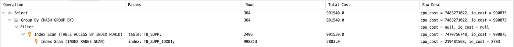
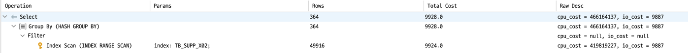

# SQL 튜닝의 기본

> [개발자를 위한 오라클 SQL 튜닝](https://www.hanbit.co.kr/store/books/look.php?p_code=E9267570814) 내용에서 참고한 내용입니다.

## 인덱스 풀 스캔

- 인덱스도 하나의 객체이다.
- 인덱스 스캔 후 인덱스 구성 컬럼만으로 결과 집합을 도출할 수 없는 경우 항상 테이블 랜덤 액세스가 일어나게 된다.
- 테이블 랜덤 액세스는 DBMS 성능의 큰 장애물이다.

- 결국 
	- 테이블 랜덤 액세스를 최소화한다.
	- **Table Sequential Access**를 최대화 해야 한다.

- **인덱스 풀 스캔(Index Full Scan)** 은 인덱스라는 객체만을 풀 스캔하여 원하는 데이터를 가져오는 것이다.

## 인덱스 풀 스캔의 종류

- **인덱스 풀 스캔의 종류 2가지**
	- **인덱스 풀 스캔**
	- **인덱스 패스트 풀 스캔**
	
- 오라클의 데이터 조회 방법
	- 오라클은 데이터를 가져올 때(Fetching) 항상 블록(block) 단위로 가져오게 된다.
	- 단 한 건의 행만 가져온다고 해도 행이 속해 있는 블록 전체를 가져오게 된다.
		- 오라클은 한 블록당 8KB의 디스크 공간을 차지한다.
	- 이를 **블록 단위 I/O**라 한다
	
### 블록 단위 I/O 유형 두 가지

- **싱글 블록 I/O 읽기(Single Block I/O Read)**
	- 한 번의 읽기를 통해 한 개의 블록을 읽는 방식으로, 일반적인 인덱스 스캔 시 사용한다.
	- 사용자가 요청한 데이터 집합을 출력하기 위해 읽어야 하는 블록이 64개라면 64번의 I/O 읽기가 발생한다.
	- 또한 한 번 읽은 블록들은 데이터 버퍼 캐시의 맨 앞쪽에 위치하여 비교적 긴 시간동안 데이터 버퍼 캐시에 해당 결과가 남게 된다.
	- 그래서 일정 시간동안은 동일한 SQL문 호출 시 빠른 속도로 사용자에게 데이터를 전달한다.
	- 자주 수행되는 SQL문에 매우 유리하다.


- **멀티 블록 I/O 읽기(Multi Block I/O Read)**
	- 한 번의 읽기를 통해 여러 개의 블록을 읽는 방식으로, 일반적으로 테이블 풀 스캔 시 사용한다.
	- 한 번의 읽기로 읽는 블록의 개수가 64개라면 단 한 번의 I/O 읽기로 64개의 블록을 모두 읽게 된다.
	- 효율적인 인덱스 스캔이 아니라면 오히려 테이블 풀 스캔이 성능이 좋을 수가 있는 이유가 바로 여기에 있다.
	- 또한, 한 번 읽은 블록들은 데이터 버퍼 캐시의 맨 뒤쪽에 위치하여 잠시 후면 데이터 버퍼 캐시에서 사라져 동일한 SQL문 호출 시 같은 연산을 반복한다.
	- 즉, 빈번한 호출되는 SQL문에는 부적합한 방법이 된다.


- **중간 정리**
	- `인덱스 스캔` 시 `싱글 블록 I/O 읽기`가 발생하고, `테이블 풀 스캔` 시 `멀티 블록 I/O`가 발생한다.
	- `인덱스 스캔에서 멀티 블록 I/O` 읽을 수 있는데, 이를 `인덱스 패스트 풀 스캔`이라 한다.

- **인덱스 패스트 풀 스캔(Index Fast Full Scan)**
	- 인덱스는 정렬된 상태를 유지하는 객체이지만, `인덱스 패스트 풀 스캔`을 통한 결과 집합은 인덱스에 기정렬되어 있는 **데이터의 정렬을 보장하지 못한다.**(별도의 소트 연산 발생)
	- `기정렬된 데이터를 검색하는 부분 범위 처리 방식` 등에는 **부적합**하다.
	- `통계`나 `집계`를 도출할 경우에는 매우 유용하다.
	
|**비교대상**|**인덱스 풀 스캔**|**인덱스 패스트 풀 스캔**|
|:---:|:---|:---|
|**I/O발생 횟수**|많음|적음|
|**정렬된 순서**|보장|보장하지 않음|
|**데이터 버퍼 캐싱**|데이터 버퍼 앞쪽에 위치 <br/> 빈번한 SQL 호출에 유리|데이터 버퍼 뒤쪽에 위치 <br/>|
|**스캔 속도**|느림|빠름|
|**용도**|부분 범위 처리|집계성 결과|

### 인덱스 풀 스캔 튜닝

- **인덱스 풀 스캔 튜닝**은 인덱스를 풀 스캔하여 원하는 결과를 빠르게 가져오는 튜닝 기법

- 적용가능한 상황
	- 인덱스 구성 컬럼만으로 결과를 도출할 수 있는 경우
	- 인덱스 구성 컬럼을 추가하여 결과를 도출할 수 있는 경우 인덱스 컬럼 추가
	- 부분 범위 처리 시 인덱스만 부분적으로 읽어서 성능 극대화
	
> **멀티 블록 I/O 읽기 사용 시 `주의점`**

- 싱글 블록 I/O 읽기로 읽은 블록은 데이터 버퍼 캐시의 LRU(Least Recently Used) 리스트 상 MRU(Most Recently Used)쪽 End 위치에 존재하게 된다.
	- 데이터 버퍼 캐시의 맨 앞쪽에 위치하므로 데이터 버퍼 캐시에 머무르는 시간이 길다.
	- 이런 방식은 실시간으로 반복적인 요청이 많을 경우 유리하다.
	
- 멀티 블록 I/O로 읽기로 읽은 블록은 데이터 버퍼 캐시의 LRU 리스트상 LRU End에 위치하게 된다.
	- 즉, 데이터 버퍼 캐시의 맨 뒤쪽에 위치하므로 얼마 지나지 않아 데이터 버퍼 캐시에서 밀려난다.
	- 따라서 멀티 블록 I/O 읽기 방식은 실시간으로 반복적인 요청이 있을 경우 실글 블록 I/O 읽기보다 훨씬 많은 부하를 주게된다.
	
- 결론
	- 멀티 블록 I/O 읽기 기반인 인덱스 패스트 풀 스캔은 집계 또는 통계성 쿼리에 적합하며 OLTP 환경에는 부적합하다.
	- OLTP 란?
		- On-Line Transaction Processing
		- 네트워크 상의 여러 이용자가 실시간으로 데이터베이스의 데이터를 갱신하거나 조회하는 등의 단위작업을 처리하는 방식을 말한다.

### 인덱스 풀 스캔 튜닝 관련 힌트

> **INDEX_FFS**

- 테이블 풀 스캔 대신 인덱스 패스트 풀 스캔을 유도하는 힌트

- 인덱스 패스트 풀 스캔을 유도하는 쿼리

```sql
SELECT /*+ INDEX_FFS(테이블 인덱스) */
```

### 인덱스 패스트 풀 스캔을 활용하여 집계결과 검색하기

- 테이블 생성

```sql
CREATE TABLE TB_SUPP
(
	SUPP_NO VARCHAR2(10), -- 공급업체번호
	SUPP_NM VARCHAR2(50), -- 공급업체명
	INST_DT VARCHAR2(8), -- 가입일자
	INST_TM VARCHAR2(6), -- 가입시간
	INST_ID VARCHAR2(50) -- 입력자ID
);
```

- 데이터 복제

```sql
CREATE TABLE DUAL_1000 (
	DUMMY CHAR(1)
);

INSERT INTO DUAL_1000
SELECT DUMMY FROM DUAL CONNECT BY LEVEL <= 1000;

COMMIT;
```

- 데이터 입력

```sql
ALTER TABLE TB_SUPP NOLOGGING;

INSERT /*+ APPEND */ INTO TB_SUPP --APPEND 힌트 사용
SELECT
	LPAD(TO_CHAR(ROWNUM), 10, '0'),
	DBMS_RANDOM.STRING('U', 50),
	TO_CHAR(SYSDATE - DBMS_RANDOM.VALUE(1, 3650), 'YYYYMMDD'),
	TO_CHAR(SYSDATE - DBMS_RANDOM.VALUE(1, 86400)/24/60/60, 'HH24MISS'),
	'DBMSEXPERT'
FROM DUAL_1000, (SELECT LEVEL LV FROM DUAL CONNECT BY LEVEL <= 10000);
```

- 기본 키 생성

```sql
ALTER TABLE TB_SUPP
ADD CONSTRAINT TB_SUPP_PK
PRIMARY KEY (SUPP_NO);
```

- 인덱스 생성

```sql
CREATE INDEX TB_SUPP_IDX01 ON TB_SUPP(INST_DT);
```

- 통계정보 생성

```sql
ANALYZE TABLE TB_SUPP COMPUTE STATISTICS
FOR TABLE FOR ALL INDEXES FOR ALL INDEXED COLUMNS SIZE 254;
```

> **튜닝 전**

```sql
SELECT 
/*+ INDEX(TB_SUPP TB_SUPP_IDX01) */
    SUBSTR(INST_DT, 1, 6),
    COUNT(*)
FROM TB_SUPP
WHERE INST_DT 
    BETWEEN TO_CHAR(SYSDATE - 365, 'YYYYMMDD')
    AND TO_CHAR(SYSDATE, 'YYYYMMDD')
AND SUPP_NM LIKE '%A%'
GROUP BY SUBSTR(INST_DT, 1, 6);

# [2021-07-13 00:54:06] 13 rows retrieved starting from 1 in 30 s 317 ms (execution: 30 s 279 ms, fetching: 38 ms)
```

- **SQL 분석**
	- **INDEX 힌트**를 사용하여 **TB_SUPP_IDX01 인덱스 스캔**을 한다.
	- INST_DT 조건을 주어 최근 1년간 가입된 공급업체를 검색한다.
	- SUPP_NM 컬럼에 'A'라는 문자가 포함된 모든 공급업체를 검색한다.

- **SQL의 문제점**
	- SQL은 인덱스 범위 스캔을 통한 테이블 랜덤 액세스 부하가 존재한다.
	
- **Execute Plan**
	- TB_SUPP_IDX01 인덱스를 인덱스 범위 스캔(INDEX RANGE SCAN)한다.
	- TB_SUPP_IDX01 인덱스의 리프 블록에 있는 ROWID를 이용하여 테이블 랜덤 액세스(TABLE ACCESS BY INDEX ROWID)를 수행한다.
	- 해당 테이블에서 SUPP_NM 컬럼 조건에 대해서 필터링한다.
	- GROUP BY 연산을 수행한다.
	- SELECT 절의 연산을 수행한다.



> **튜닝 후**

- 인덱스 추가

```sql
CREATE INDEX TB_SUPP_X02 ON TB_SUPP(INST_DT, SUPP_NM);
```

- 통계정보 생성

```sql
ANALYZE INDEX TB_SUPP_X02 COMPUTE STATISTICS;
```

- 튜닝 후 SQL

```sql
SELECT /*+ INDEX_FFS(TB_SUPP TB_SUPP_IDX02) */
    SUBSTR(INST_DT, 1, 6),
    COUNT(*)
FROM TB_SUPP
WHERE INST_DT 
    BETWEEN TO_CHAR(SYSDATE - 365, 'YYYYMMDD')
	AND TO_CHAR(SYSDATE, 'YYYYMMDD')
AND INSTR(SUPP_NM, 'A') > 0
GROUP BY SUBSTR(INST_DT, 1, 6);

# [2021-07-13 01:07:20] 13 rows retrieved starting from 1 in 937 ms (execution: 912 ms, fetching: 25 ms)
```

- **SQL 분석**
    - INDEX_FFS 힌트를 이용하여 TB_SUPP_IDX02 인덱스를 인덱스 패스트 풀 스캔합니다.
	- 즉, TB_SUPP_IDX02 인덱스만 멀티 블록 I/O 읽기로 빠르게 스캔한다.
	- 결국, DBMS 성능 부하의 주범인 테이블 랜덤 액세스가 사라졌다.
	

- **Execute Plan**
	- TB_ORD_IDX02 인덱스를 이용하여 **인덱스 패스트 풀 스캔(INDEX FAST FULL SCAN)** 을 합니다.
	- TB_ORD_IDX02 인덱스에서 **SUPP_NM** 컬럼 조건에 대한 조건 값을 필터링합니다.
	- **GROUP BY** 연산을 수행한다.
	- **SELECT** 절의 연산을 수행한다.


