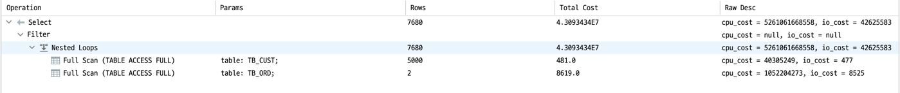
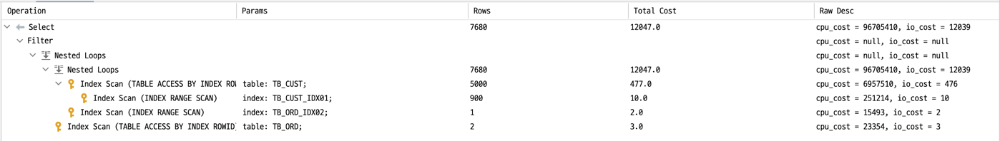

# 실습하기

> [개발자를 위한 오라클 SQL 튜닝](https://www.hanbit.co.kr/store/books/look.php?p_code=E9267570814) 내용에서 참고한 내용입니다.

## Intro

- 기반 데이터
	- 고객 정보 10만건 생성
	- 주문 정보가 100만건 생성

- 주문일자 + 주문이름에 대한 복합 인덱스를 생성

- **쿼리 테스트**
	- LEADING 힌트로 고객 테이블을 Driving 테이블로 설정
	- USE_NL 힌트로 주문정보 테이블을 Driven 테이블로 설정
	- 조인 조건에 대한 **인덱스가 없는 경우**에 대한 **테이블 풀 스캔** 동작 테스트

- 튜닝 쿼리 테스트
	- Outer 테이블에 CUST_NM 컬럼으로 구성된 인덱스 추가
		- LEADING 힌트를 통해 고객 정보 테이블을 Driving 테이블로 설정
		- INDEX 힌트를 통해 고객이름에 대한 인덱스 스캔하도록 설정
	- Inner 테이블에 CUST_ID + ORD_DT 컬럼으로 구성된 복합 인덱스 생성
		- USE_NL 힌트를 통해 중첩 루프 조인을 유도, 주문정보 테이블을 Inner 테이블로 지정
		- INDEX 힌트를 통해 고객 ID + 주문일자 인덱스를 스캔하도록 설정
	- Outer 테이블인 고객정보 테이블의 스캔 건수만큼 Inner 테이블의 주문정보 테이블을 스캔 시 효율적인 인덱스 스캔을 하도록 유도하여 성능 향상을 확인

## 실습 테이블 생성 및 데이터 등록

```sql
CREATE TABLE TB_CUST
(
    CUST_ID VARCHAR2 (10),  -- 고객ID
    CUST_NM VARCHAR2 (50),  -- 고객명
    BIRTH_DT VARCHAR2 (8),  -- 생일
    SEX VARCHAR2 (2),       -- 성별
    PHONE_NO VARCHAR2 (11), -- 폰번호
    JOIN_DT VARCHAR2 (8),   -- 가입일자
    INST_DTM DATE, -
    -
    입력일시
    INST_ID
    VARCHAR2
(
    50
), -- 입력자ID
    UPDT_DTM DATE, -- 수정일시
    UPDT_ID VARCHAR2 (50) -- 수정자ID
    );

CREATE TABLE TB_ORD
(
    ORD_NO VARCHAR2 (10),  -- 주문번호
    ORD_DT VARCHAR2 (8),   -- 주문일자
    ORD_NM VARCHAR2 (150), -- 주문이름
    ORD_AMT NUMBER (15),   -- 주문금액
    PRDT_CD VARCHAR2 (6),  -- 상품코드
    SALE_GB VARCHAR2 (2),  -- 판매구분
    PAY_GB VARCHAR2 (2),   -- 결제구분
    CUST_ID VARCHAR2 (10), -- 고객ID
    INST_DTM DATE,         -- 입력시간
    INST_ID VARCHAR2 (50), -- 입력자ID
    UPDT_DTM DATE,         -- 수정시간
    UPDT_ID VARCHAR2 (5)   -- 수정자ID
);

INSERT INTO TB_CUST
SELECT LPAD(TO_CHAR(ROWNUM), 10, '0'),
       DBMS_RANDOM.STRING('U', 50),
       TO_CHAR(SYSDATE - TRUNC(DBMS_RANDOM.VALUE(3650, 36500)), 'YYYYMMDD'),
       LPAD(MOD(ROWNUM, 2), 2, '0'),
       LPAD(TO_CHAR(TRUNC(DBMS_RANDOM.VALUE(3650, 36500))), 11, '0'),
       TO_CHAR(SYSDATE - TRUNC(DBMS_RANDOM.VALUE(1, 365 * 3)), 'YYYYMMDD'),
       SYSDATE,
       'DBMSEXPERT',
       NULL,
       NULL
FROM DUAL CONNECT BY LEVEL <= 100000;

# [2021-07-13 16:14:10] 100,000 rows affected in 14 s 249 ms

COMMIT;

CREATE TABLE DUAL_10
(
    DUMMY VARCHAR2 (1)
)
;
INSERT INTO DUAL_10
SELECT DUMMY
FROM DUAL CONNECT BY LEVEL <= 10;

COMMIT;

ALTER TABLE TB_ORD NOLOGGING;

INSERT /*+ APPEND */ INTO TB_ORD --APPEND 힌트 사용
SELECT LPAD(TO_CHAR(ROWNUM), 10, '0'),
       TO_CHAR(SYSDATE - TRUNC(DBMS_RANDOM.VALUE(1, 3650)), 'YYYYMMDD'),
       DBMS_RANDOM.STRING('U', 150),
       TRUNC(DBMS_RANDOM.VALUE(1000, 100000)),
       LPAD(TO_CHAR(MOD(TRUNC(DBMS_RANDOM.VALUE(1, 1000)), 50)), 6, '0'),
       LPAD(TO_CHAR(MOD(TRUNC(DBMS_RANDOM.VALUE(1, 1000)), 3)), 2, '0'),
       LPAD(TO_CHAR(MOD(TRUNC(DBMS_RANDOM.VALUE(1, 1000)), 10)), 2, '0'),
       CUST_ID,
       SYSDATE,
       'DBMSEXPERT',
       NULL,
       NULL
FROM TB_CUST,
     DUAL_10;

# [2021-07-13 16:24:15] 1,000,000 rows affected in 4 m 18 s 672 ms

COMMIT;

ALTER TABLE TB_ORD
    ADD CONSTRAINT TB_ORD_PK
        PRIMARY KEY (ORD_NO);

ALTER TABLE TB_CUST
    ADD CONSTRAINT TB_CUST_PK
        PRIMARY KEY (CUST_ID);

ALTER TABLE TB_ORD
    ADD CONSTRAINT TB_ORD_FK
        FOREIGN KEY (CUST_ID) REFERENCES TB_CUST (CUST_ID);

```

- 인덱스 구성
	- 주문 정보 테이블에 **'주문일자 + 주문이름'**으로 구성된 복합 인덱스를 생성

```sql
CREATE INDEX TB_ORD_IDX01 ON TB_ORD (ORD_DT, ORD_NM);
```

- 통계 정보

```sql
ANALYZE TABLE TB_CUST COMPUTE STATISTICS
FOR TABLE FOR ALL INDEXES FOR ALL INDEXED COLUMNS SIZE 254;

ANALYZE TABLE TB_ORD COMPUTE STATISTICS
FOR TABLE FOR ALL INDEXES FOR ALL INDEXED COLUMNS SIZE 254;
```

## 중첩 루프 조인 (테이블 풀 스캔)

```sql
SELECT /*+ LEADING(A) USE_NL(B) */
    *
FROM TB_CUST A,
     TB_ORD B
WHERE A.CUST_NM LIKE 'L%'
  AND A.CUST_ID = B.CUST_ID
  AND B.ORD_DT
    BETWEEN TO_CHAR(SYSDATE - 365, 'YYYYMMDD')
    AND TO_CHAR(SYSDATE, 'YYYYMMDD');

# [2021-07-13 16:29:38] 500 rows retrieved starting from 1 in 1 m 34 s 548 ms (execution: 22 s 702 ms, fetching: 1 m 11 s 846 ms)
```

- SQL 분석
	- LEADING 힌트를 사용하여 고객 테이블을 Outer 테이블로 설정
	- USE_NL 힌트를 사용하여 주문정보 테이블과 중첩 루프 조인이 이루어지도록 설정
	- 고객테이블과 주문정보 테이블을 고객아이디 컬럼을 기준으로 '=' 조인
	- 주문정보 테이블은 고객아이디를 선두 컬럼으로 한 인덱스가 존재하지 않으므로 주문정보 테이블은 테이블 풀 스캔으로 처리된다.

- SQL의 문제점
	- 주문정보 테이블에 고객 아이디를 선두 컬럼으로 구성된 인덱스가 존재하지 않는다.
	- 고객 정보 테이블의 결과 집합의 건수만큼 주문정보 테이블에 테이블 풀 스캔을 하게 된다.

- **Execute plan**
	- TB_CUST 테이블을 테이블 풀 스캔한다.
	- TB_ORD 테이블을 테이블 풀 스캔한다.
	- TB_CUST 테이블과 TB_ORD 테이블을 중첩 루프 조인(NESTED LOOPS)한다.
		- 즉, TB_CUST 결과 집합의 건수만큼 TB_ORD 테이블을 테이블 풀 스캔하게 된다.
	- 조건 절에 조건에 따른 필터링 처리를 한다.
	- SELECT 절의 연산을 수행



## 중첩 루프 조인 (인덱스 스캔 튜닝)

```sql
CREATE INDEX TB_CUST_IDX01 ON TB_CUST (CUST_NM);
CREATE INDEX TB_ORD_IDX02 ON TB_ORD (CUST_ID, ORD_DT);

ANALYZE
INDEX TB_CUST_IDX01 COMPUTE STATISTICS;
ANALYZE
INDEX TB_ORD_IDX02 COMPUTE STATISTICS;

SELECT/*+ LEADING(A) INDEX(A TB_CUST_IDX01) 
        USE_NL(B) INDEX(B TB_ORD_IDX02)  */
    *
FROM TB_CUST A,
     TB_ORD B
WHERE A.CUST_NM LIKE 'L%'
  AND A.CUST_ID = B.CUST_ID
  AND B.ORD_DT
    BETWEEN TO_CHAR(SYSDATE - 365, 'YYYYMMDD')
    AND TO_CHAR(SYSDATE, 'YYYYMMDD');

# [2021-07-13 16:41:20] 500 rows retrieved starting from 1 in 221 ms (execution: 19 ms, fetching: 202 ms)
```

- **SQL 분석**
	- LEADING 힌트를 사용하여 고객 테이블을 Outer테이블로 지정
	- INDEX 힌트를 사용하여 고객명에 대한 인덱스를 스캔하도록 지정
	- USE_NL 힌트를 이용하여 중첩 루프 조인을 유도, 주문 테이블을 Inner 테이블로 지정
	- INDEX 힌트를 사용하여 고객아이디 + 주문일자 인덱스를 스캔
	- 고객 테이블의 스캔 건수만큼 Inner 테이블인 주문정보 테이블을 스캔 시 효율적인 인덱스 스캔으로 성능 향상을 예상할 수 있다.


