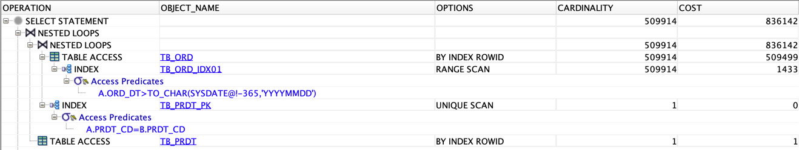

# 실습하기

> [개발자를 위한 오라클 SQL 튜닝](https://www.hanbit.co.kr/store/books/look.php?p_code=E9267570814) 내용에서 참고한 내용입니다.

## Intro

- 상품과 주문에 대한 모델링
- 상품 정보 10만건 생성, 주문정보 500만건 생성
- 하나의 제품은 0개 또는 1개 이상의 주문을 가질 수 있다.
- 하나의 주문은 반드시 한 개의 제품을 갖는다.

- Outer 테이블(주문 정보)과 Inner 테이블(상품 정보)을 설정하여 중첩 루프 조인으로 쿼리 실행 확인
	- 대용량 테이블인 주문 정보 테이블이 Outer 테이블로 지정되어 매우 큰 성능 부하 확인

- 튜닝 후 상품 테이블을 Build Input로 지정, FULL 힌트를 통해 Build Input을 테이블 풀 스캔으로 유도
	- USE_HASH 힌트로 주문정보 테이블을 Probe Input으로 지정하여 해시 조인을 수행

## 데이터 준비

---

- 상품, 주문 정보 테이블 생성

```oracle
CREATE TABLE TB_PRDT
(
    PRDT_CD VARCHAR2 (6), -- 상품코드
    PRDT_NM VARCHAR2 (50), -- 상품명
    REL_DT VARCHAR2(8), -- 출시일자
    COST_AMT NUMBER(15), -- 원가금액
    INST_DTM DATE, -- 입력시간
    INST_ID VARCHAR2(50), -- 입력자ID
    UPDT_DTM DATE, -- 수정시간
    UPDT_ID VARCHAR2(5) -- 수정자ID
);

CREATE TABLE TB_ORD
(
    ORD_NO VARCHAR2 (10), -- 주문번호
    ORD_DT VARCHAR2 (8), -- 주문일자
    ORD_NM VARCHAR2(150), -- 주문이름
    ORD_AMT NUMBER(15), -- 주문금액
    PRDT_CD VARCHAR2(6), -- 상품코드
    SALE_GB VARCHAR2(2), -- 판매구분
    PAY_GB VARCHAR2(2), -- 결제구분
    CUST_ID VARCHAR2(10), -- 고객ID
    INST_DTM DATE, -- 입력시간
    INST_ID VARCHAR2(50), -- 입력자ID
    UPDT_DTM DATE, -- 수정시간
    UPDT_ID VARCHAR2(5) -- 수정자ID
);
```

- 상품 정보 더미 데이터 생성

```oracle
INSERT INTO TB_PRDT
SELECT LPAD(TO_CHAR(ROWNUM), 6, '0'),
       DBMS_RANDOM.STRING('U', 50),
       TO_CHAR(SYSDATE - TRUNC(DBMS_RANDOM.VALUE(1, 3650)), 'YYYYMMDD'),
       TRUNC(DBMS_RANDOM.VALUE(100, 100000)),
       SYSDATE,
       'DBMSEXPERT',
       NULL,
       NULL
FROM DUAL CONNECT BY LEVEL <= 100000;

COMMIT;
```

- 상품 정보에 연관된 주문 정보 더미 데이터 생성

```oracle
CREATE TABLE DUAL_10
(
    DUMMY VARCHAR2 (1)
);

INSERT INTO DUAL_10
SELECT DUMMY
FROM DUAL CONNECT BY LEVEL <= 10;

COMMIT;

ALTER TABLE TB_ORD NOLOGGING;

INSERT /*+ APPEND */ INTO TB_ORD --APPEND 힌트 사용
SELECT LPAD(TO_CHAR(ROWNUM), 10, '0'),
       TO_CHAR(SYSDATE - TRUNC(DBMS_RANDOM.VALUE(1, 3650)), 'YYYYMMDD'),
       DBMS_RANDOM.STRING('U', 150),
       TRUNC(DBMS_RANDOM.VALUE(1000, 100000)),
       LPAD(TO_CHAR(TRUNC(DBMS_RANDOM.VALUE(1, 100000))), 6, '0'),
       LPAD(TO_CHAR(MOD(TRUNC(DBMS_RANDOM.VALUE(1, 1000)), 3)), 2, '0'),
       LPAD(TO_CHAR(MOD(TRUNC(DBMS_RANDOM.VALUE(1, 1000)), 10)), 2, '0'),
       LPAD(TO_CHAR(TRUNC(DBMS_RANDOM.VALUE(1, 10000))), 10, '0'),
       SYSDATE,
       'DBMSEXPERT',
       NULL,
       NULL
FROM DUAL_10,
     (SELECT LEVEL FROM DUAL CONNECT BY LEVEL <= 500000);

-- [2021-07-29 16:22:14] 5,000,000 rows affected in 21 m 34 s 644 ms
COMMIT;
```

- 제약 조건 생성

```shell
ALTER TABLE TB_PRDT
ADD CONSTRAINT TB_PRDT_PK
PRIMARY KEY (PRDT_CD);

ALTER TABLE TB_ORD
ADD CONSTRAINT TB_ORD_PK
PRIMARY KEY (ORD_NO);

ALTER TABLE TB_ORD
ADD CONSTRAINT TB_ORD_FK
FOREIGN KEY (PRDT_CD) REFERENCES TB_PRDT(PRDT_CD);

CREATE INDEX TB_ORD_IDX01 ON TB_ORD(ORD_DT);
```

- 통계 정보 생성

```shell
ANALYZE TABLE TB_PRDT COMPUTE STATISTICS
FOR TABLE FOR ALL INDEXES FOR ALL INDEXED COLUMNS SIZE 254;

ANALYZE TABLE TB_ORD COMPUTE STATISTICS
FOR TABLE FOR ALL INDEXES FOR ALL INDEXED COLUMNS SIZE 254;
```

## 해시 조인으로 성능 극대화

---

```oracle
SELECT /*+ LEADING(A) INDEX(A TB_ORD_IDX01) USE_NL(B) */
    A.ORD_NO,
    A.ORD_DT,
    B.PRDT_CD,
    B.PRDT_NM
FROM TB_ORD A,
     TB_PRDT B
WHERE A.ORD_DT > TO_CHAR(SYSDATE - 365, 'YYYYMMDD')
  AND A.PRDT_CD = B.PRDT_CD;

-- [2021-07-29 16:24:25] 499,510 rows retrieved starting from 1 in 30 s 110 ms (execution: 14 ms, fetching: 30 s 96 ms)
```

- SQL 분석
	- LEADING 힌트를 이용하여 주문 정보 테이블을 Outer 테이블로 지정
	- Outer 테이블을 스캔 시 TB_ORD_IDX01 인덱스를 이용
	- USE_NL 힌트를 이용하여 상품정보 테이블을 Inner 테이블로 지정하여 중첩 루프 조인을 수행하도록 유도한다.

- SQL의 문제점
	- 대용량 테이블인 주문정보 테이블이 outer 테이블로 지정되어 매우 큰 성능 부하가 예상된다.
	- 주문일자 컬럼 조건만으로는 대량의 행이 나오기 때문에 그에 따른 테이블 랜덤 액세스 부하가 발생한다.

- Execute Plan
	- TB_ORD_IDX01을 인덱스 범위 스캔(INDEX RANGE SCAN)한다.
	- TB_ORD_IDX01의 ROWID를 이용하여 TB_ORD 테이블을 테이블 랜덤 액세스(TABLE ACCESS BY INDEX ROWID)한다.
	- TB_ORD 테이블의 PRDT_CD 컬럼 값을 이용하여 TB_PRDT_PK 인덱스를 인덱스 유일 스캔(INDEX UNIQUE SCAN)한다.
	- 3번과 5번의 연산을 중첩 루프 조인(NESTED LOOPS)를 수행한다.
	- TB_PRDT_PK 에서 나온 ROWID를 이용하여 TB_PRDT 테이블을 테이블 랜덤 액세스(TABLE ACCESS BY INDEX ROWID)한다.
	- 중첩 루프 조인과 TB_PRDT 테이블을 테이블 랜덤 액세스(TABLE ACCESS BY INDEX ROWID)한다.
	- SELECT 절의 연산을 수행한다.



```oracle
SELECT /*+ LEADING(B) FULL(B) USE_HASH(A)  */
    A.ORD_NO,
    A.ORD_DT,
    B.PRDT_CD,
    B.PRDT_NM
FROM TB_ORD A,
     TB_PRDT B
WHERE A.ORD_DT > TO_CHAR(SYSDATE - 365, 'YYYYMMDD')
  AND A.PRDT_CD = B.PRDT_CD;

-- [2021-07-29 16:28:31] 499,510 rows retrieved starting from 1 in 16 s 429 ms (execution: 78 ms, fetching: 16 s 351 ms)
```

- **SQL 분석**
	- LEADING 힌트를 이용하여 작은 집합인 상품 테이블을 Build Input으로 지정
	- FULL 힌트를 이용하여 Build Input을 테이블 풀 스캔으로 유도
	- USE_HASH 힌트를 이용하여 주문 테이블을 Probe Input으로 지정하고 해시 조인을 수행

- **Execute Plan**
	- TB_PRDT 테이블을 테이블 풀 스캔(TABLE ACCESS FULL)을 수행
	- TB_ORD 테이블을 테이블 풀 스캔(TABLE ACCESS FULL)을 수행
	- TB_PRDT 테이블을 Build Input, TB_ORD 테이블을 Probe Input으로 하여 해시 조인(Hash Join)을 수행
	- TB_PRDT 테이블을 Build Input, TB_ORD 테이블을 Probe Input으로 하여 해시 조인(Hash Join)을 수행


## 인라인 뷰를 이용한 해시 조인으로 성능 극대화

---

```oracle
CREATE TABLE TB_PRDT
(
    PRDT_CD VARCHAR2(6), --상품코드
    PRDT_NM VARCHAR2(50), --상품명
    INST_DTM DATE, --입력일시
    INST_ID VARCHAR2(50) --입력자
);

CREATE TABLE TB_PRDT_SALE_DAY
(
    SALE_NO VARCHAR2(10), --판매번호
    SALE_DT VARCHAR2(8), --판매일자
    SALE_TM VARCHAR2(6), --판매시간
    SALE_CNT NUMBER(9), --판매수
    SALE_AMT NUMBER(9), --판매금액
    PRDT_CD VARCHAR2(6), --제품코드
    INST_DTM DATE, --입력일시
    INST_ID VARCHAR2(50) --입력자
);
```

- 상품 정보 생성하기

```oracle
INSERT INTO TB_PRDT
SELECT
    LPAD(TO_CHAR(ROWNUM), 6, '0'),
    DBMS_RANDOM.STRING('U', 50),
    SYSDATE,
    'DBMSEXPERT'
FROM DUAL CONNECT BY LEVEL <= 100000;

COMMIT;
-- [2021-07-29 16:32:25] 1,000,000 rows affected in 1 m 30 s 42 ms
```

- 더미 테이블 생성하기

```oracle
CREATE TABLE DUAL_10
(
    DUMMY VARCHAR2 (1)
);

INSERT INTO DUAL_10
SELECT DUMMY
FROM DUAL CONNECT BY LEVEL <= 10;

COMMIT;
```

- 주문정보 테이블 생성하기

```oracle
ALTER TABLE TB_PRDT_SALE_DAY NOLOGGING;

INSERT /*+ APPEND */  INTO TB_PRDT_SALE_DAY --APPEND 힌트 사용
SELECT
    LPAD(TO_CHAR(ROWNUM), 10, '0'),
    TO_CHAR(SYSDATE - DBMS_RANDOM.VALUE(1, 3650), 'YYYYMMDD'),
    TO_CHAR(SYSDATE - (DBMS_RANDOM.VALUE(1, 86400) / 24 / 60 / 60), 'HH24MISS'),
    TRUNC(DBMS_RANDOM.VALUE(1, 10)),
    TRUNC(DBMS_RANDOM.VALUE(1000, 100000), -3),
    PRDT_CD,
    SYSDATE,
    'DBMSEXPERT'
FROM TB_PRDT, (SELECT DUMMY FROM DUAL CONNECT BY LEVEL <= 10);

COMMIT;

```

- 제약 조건 생성하기

```oracle
ALTER TABLE TB_PRDT
    ADD CONSTRAINT TB_PRDT_PK
        PRIMARY KEY (PRDT_CD);

ALTER TABLE TB_PRDT_SALE_DAY
    ADD CONSTRAINT TB_PRDT_SALE_DAY_PK
        PRIMARY KEY (SALE_NO);

ALTER TABLE TB_PRDT_SALE_DAY
    ADD CONSTRAINT TB_PRDT_SALE_DAY_FK
        FOREIGN KEY (PRDT_CD) REFERENCES TB_PRDT (PRDT_CD);
```

- 인덱스 생성 및 통계 정보 생성하기

```oracle
ANALYZE TABLE TB_PRDT COMPUTE STATISTICS
    FOR TABLE FOR ALL INDEXES FOR ALL INDEXED COLUMNS SIZE 254;

ANALYZE TABLE TB_PRDT_SALE_DAY COMPUTE STATISTICS
    FOR TABLE FOR ALL INDEXES FOR ALL INDEXED COLUMNS SIZE 254;
```

> 튜닝 전 쿼리

```oracle
SELECT B.PRDT_CD,
       MIN(B.PRDT_NM),
       SUM(A.SALE_CNT),
       SUM(A.SALE_AMT)
FROM TB_PRDT_SALE_DAY A,
     TB_PRDT B
WHERE A.SALE_DT BETWEEN '20120101' AND '20131231'
  AND A.PRDT_CD = B.PRDT_CD
GROUP BY B.PRDT_CD;

-- [2021-07-29 16:40:24] 89,230 rows retrieved starting from 1 in 4 s 162 ms (execution: 365 ms, fetching: 3 s 797 ms)
```

- **SQL 분석**
	- TB_PRDT_SALE_DAY 테이블과 TB_PRDT 테이블을 조인
	- 조인 방식은 옵티마이저의 선택에 따른다.

- **SQL의 문제점**
	- TB_PRDT 테이블과 TB_PRDT_SALE_DAY 테이블은 1:M 관계
	- 1쪽 집합인 TB_PRDT 테이블의 PRDT_CD를 기준으로 GROUP BY하여 집계 결과를 계산한다.
	- SQL은 인라인 뷰를 이용하여 M 쪽의 집합인 TB_PRDT_SALE_DAY 테이블을 먼저 GROUP BY한 후 TB_PRDT 테이블과 1:1 관계를 만든 다음 다음 조인 연산을 수행한다면 최적의 성능을 낼 수 있다.

- **Execute Plan**
	- TB_PRDT_SALE_DAY 테이블을 풀 스캔(TABLE ACCESS FULL)한다.
	- TB_PRDT 테이블을 풀 스캔(TABLE ACCESS FULL) 한다.
	- 4번과 5번을 해시 조인(HASH JOIN)한다.
	- GROUP BY 연산을 수행한다.
	- SELECT 절을 연산 수행한다.


> 튜닝

```oracle
SELECT /*+ NO_MERGE(A) */
    B.PRDT_CD,
    B.PRDT_NM,
    A.SALE_CNT_SUM,
    A.SALE_AMT_SUM
FROM (
         SELECT A.PRDT_CD,
                SUM(A.SALE_CNT) SALE_CNT_SUM,
                SUM(A.SALE_AMT) SALE_AMT_SUM
         FROM TB_PRDT_SALE_DAY A
         WHERE A.SALE_DT BETWEEN '20120101' AND '20131231'
         GROUP BY A.PRDT_CD
     ) A,
     TB_PRDT B
WHERE A.PRDT_CD = B.PRDT_CD;

-- [2021-07-29 16:42:25] 89,230 rows retrieved starting from 1 in 2 s 930 ms (execution: 331 ms, fetching: 2 s 599 ms)
```

- **SQL 분석**
	- NO_MERGE 힌트를 사용하여 인라인 뷰 A가 메인 쿼리와 같은 레벨로 View Merging되지 않도록 한다.
	- TB_PRDT_SALE_DAY 테이블을 인라인 뷰 내에서 읽는다.
	- PRDT_CD를 기준으로 GROUP BY하여 TB_PRDT 테이블과 조인 연산을 최소화한다.

- **Execute Plan**
	- TB_PRDT_SALE_DAY 테이블을 풀 스캔(TABLE ACCESS FULL) 한다.
	- GROUP BY 연산을 수행
	- 4번과 3번의 연산을 인라인 뷰(View)로 구성
	- TB_PRDT 테이블을 테이블 풀 스캔(TABLE ACCESS FULL)한다.
	- 2번과 5번을 해시 조인(HASH JOIN)한다.
	- SELECT 절의 연산을 수행한다.


