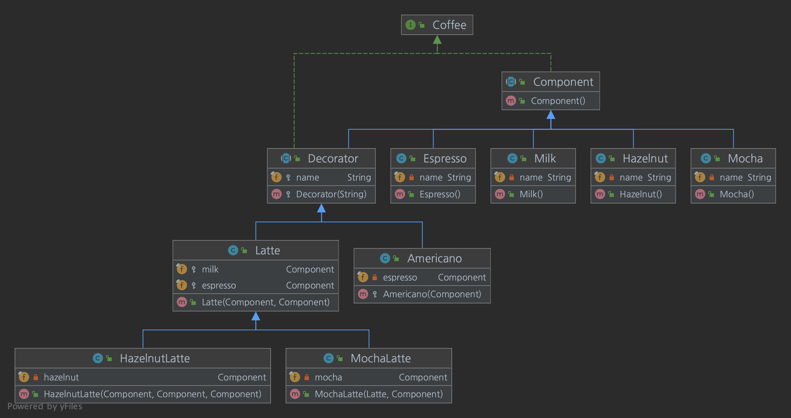

# Decorator Pattern

## Intro

- 객체에 동적으로 추가 책임을 연결한다.
- 데코레이터는 기능 확장을 위해 서브 클래싱에 대한 유연한 대안을 제공한다.

## 문제 상황

- 런타임에 개별 개체에 동작 또는 상태를 추가하려는 경우
- 상속은 정적이고 전체 클래스에 적용되기 때문에 실현가능하지 않다.

## 구현 방법

- 기존 클래스를 래핑하고 클래스 메서드 시그니처를 그대로 유지하는 추가 기능을 제공하는 데코레이터 클래스를 작성한다.

- 해결책
	- 추상 래퍼 인터페이스안에 원래 객체를 캡슐화 한다.
	- 데코레이터 객체와 핵심 객체는 모두 추상 인터페이스에서 상속된다.
	- 인터페이스는 재귀적 구성을 사용하여 데코레이터 레이어를 무제한으로 각 코어 객체에 추가할 수 있다.
	- 이 패턴을 사용하면 개체 인터페이스에 대한 메서드가 아닌 개체에 책임을 추가할 수 있다.
	- 클라이언트에 제공되는 인터페이스는 연속된 레이어에 지정될 때 일정하게 유지되어야 한다.

## 데코레이터 패턴의 구성 규칙

- `Adapter`는 주제에 대해 다른 인터페이스를 제공한다. `Proxy`는 동일한 인터페이스를 제공한다. Decorator는 향상된 인터페이스를 제공한다.
- `Adapter`는 객체의 인터페이스를 변경하고 `Decorator`는 객체의 책임을 강화한다.
	- 따라서 `Decorator`는 클라이언트에게 더 투명하다.
	- 결과적으로 `Decorator`는 순수 `Adapter`로는 불가능한 재귀적 구성을 지원한다.

- `Composite`와 `Decorator`는 유사한 구조 다이어그램을 가지고 있는데, 이는 둘 다 개방형 개체를 구성하기 위해 재귀적 구성에 의존한다.
- `Decorator`는 서브 클래싱없이 객체에 책임을 추가 할 수 있도록 설계되어 있다.
	- `Composite`의 초점은 꾸밈이 아니라 표현하는 것에 있다.
	- 이는 상호 보완적으로 `Composite`와 `Decorator`를 함께 사용되기도 한다.

- `Composite`는 책임의 사슬을 사용하여 구성 요소가 부모를 통해 전역 속성에 액세스 할 수 있도록 할 수 있다.
	- `Decorator`를 사용하여 컴포지션의 일부에서 이러한 속성을 재정의 할 수 있습니다.

- `Decorator`와 `Proxy`는 용도는 다르지만 구조는 비슷하다.
	- 둘 다 다른 객체에 대한 간접 수준을 제공하는 방법을 설명하고 구현은 요청을 전달하는 객체에 대한 참조를 유지한다.

## 데코레이션 패턴을 사용할 수 있는 상황

- 객체의 타입과 호출 가능한 메서드를 그대로 유지하면서 객체에 새로운 책임을 추가하려는 경우
- 상속을 통한 서브 클래스를 계속 만드는 것이 비효율적인 경우

## 데코레이터 패턴 적용 시 고려 사항

- `Component`는 `Decorator`을 추가할 베이스가 되는 역할이므로 작게 정의되어야 한다.
	- `component`는 가급적 인터페이스만을 정의한다.
	- `component`는 변수를 가급적 사용하지 않는다.
	- 변수가 필요한 경우 서브 클래스를 이용한다.

- 상속 구조를 통해 `Decorator` 와 `Component`가 같은 인터페이스를 갖도록 한다.
	- `Decorator` 로 계속해서 감싸도 `Component` 메서드는 계속해서 사용할 수 있다.

- 구현하려는 내용이 객체의 겉은 변경하려는 것인지 속을 변경하려는 것인지 판단한다.
	- 속을 변경하려는 것이라면 Strategy Pattern 을 선택하여 구현한다.

- Decorator 의 구현체가 또 다른 Decorator 에 대해 알아야 할 필요가 있다면 해당 패턴에 적절한지 생각해 봐야 한다.

## 라이브러리의 사례

- 스프링 프레임워크 트랜잭션 처리를 위해 데코레이터 패턴을 사용
