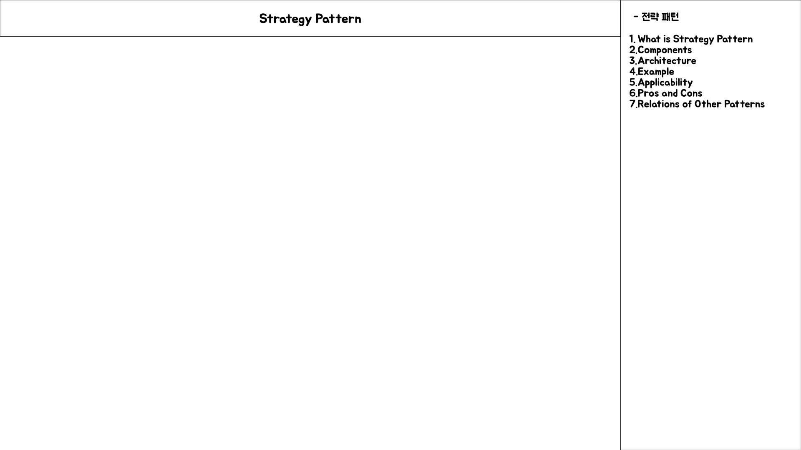
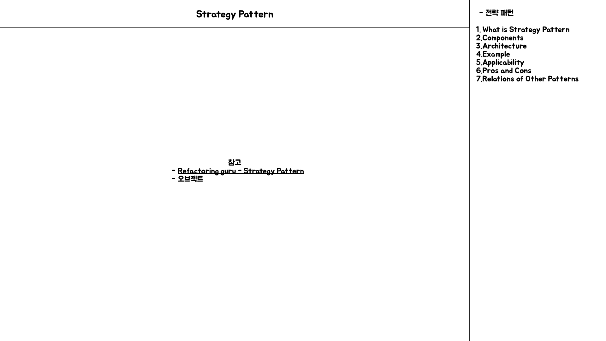
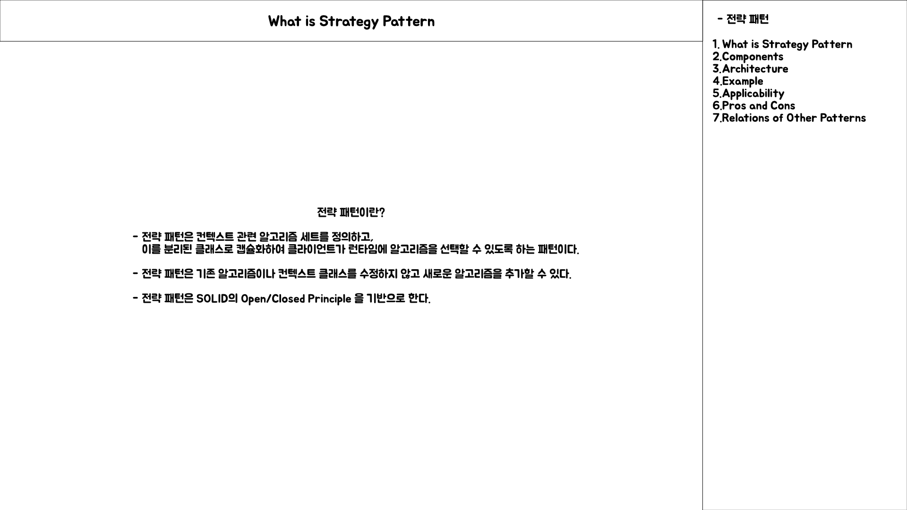
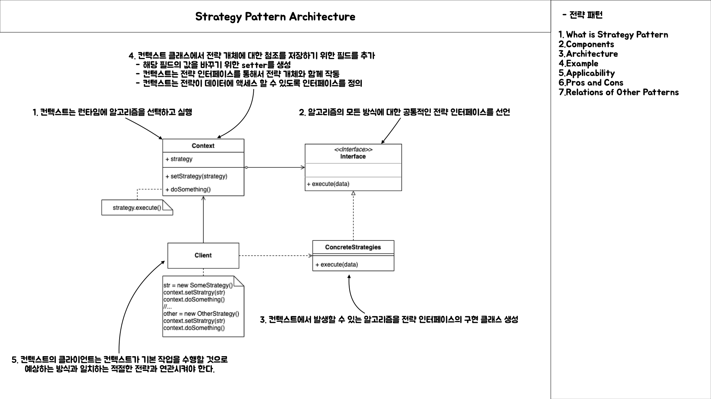
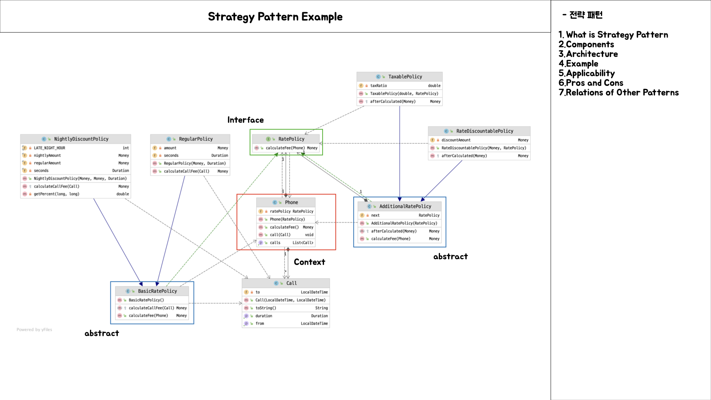
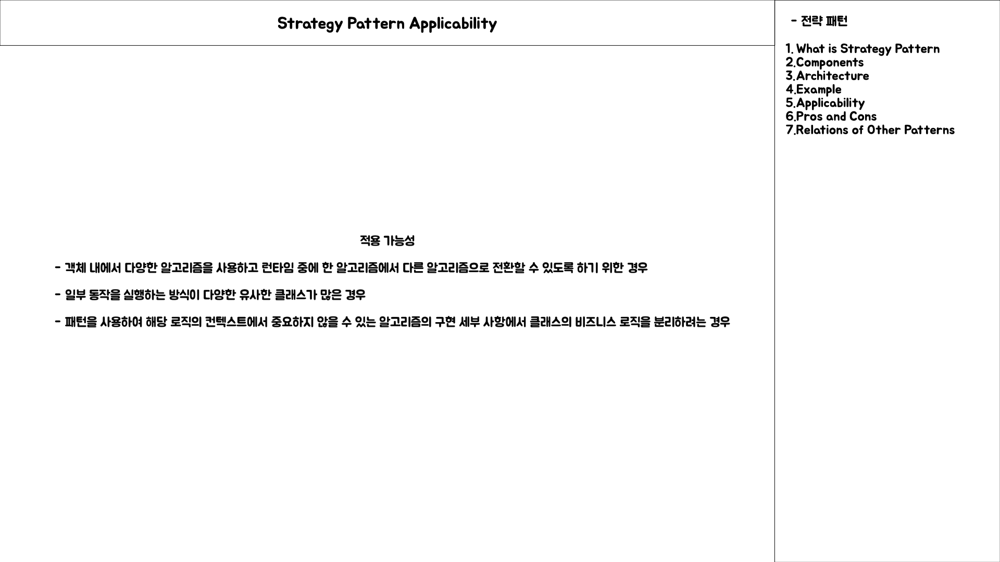
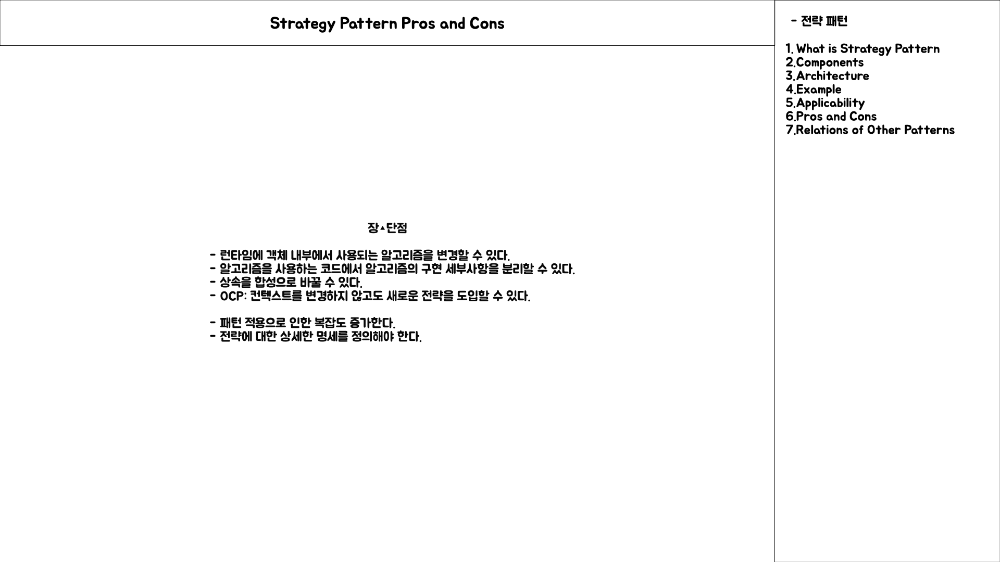
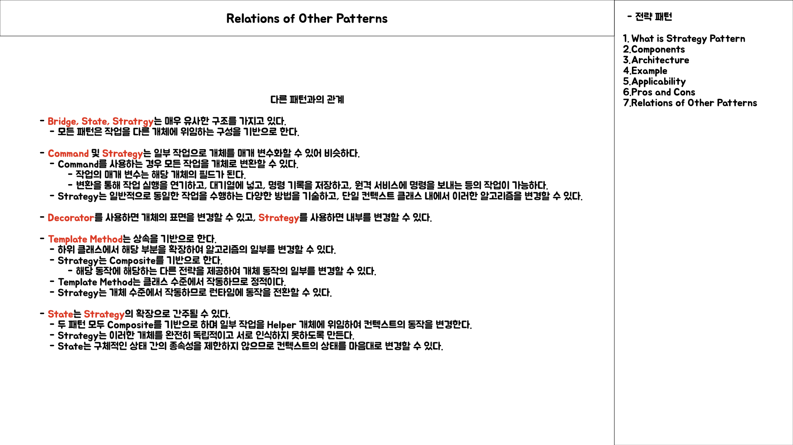

# Strategy Pattern

## Intro

## Strategy 패턴이란?

- 전략 패턴은 컨텍스트 관련 알고리즘 세트를 정의하고, 이를 분리된 클래스로 캡슐화하여 클라이언트가 런타임에 알고리즘을 선택할 수 있도록 하는 패턴이다.
- 전략 패턴은 기존 알고리즘이나 컨텍스트 클래스를 수정하지 않고 새로운 알고리즘을 추가할 수 있다.
- 전략 패턴은 SOLID 원칙의 Open-closed Principle 을 기반으로 한다.

## Strategy 패턴의 아키텍처

- Context
	- 전략 패턴을 이용하는 역할을 수행

- Strategy
	- 인터페이스나 추상클래스로 외부에서 동일한 방식으로 알고리즘을 호출하는 방법을 명시한다.

- ConcreteStrategy
	- 전략 패턴에서 명시한 알고리즘을 실제로 구현할 클래스

## Strategy 패턴의 예시

## 적용 가능한 상황

## 장 단점

## 다른 디자인 패턴과의 관계

