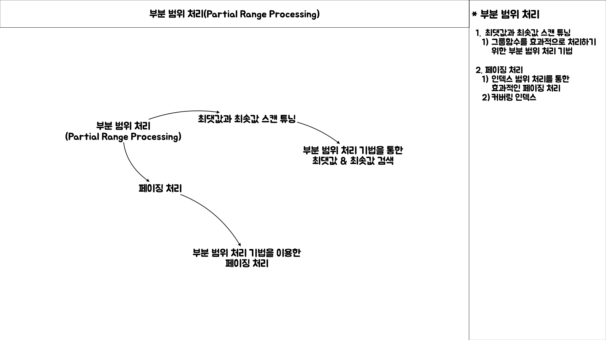
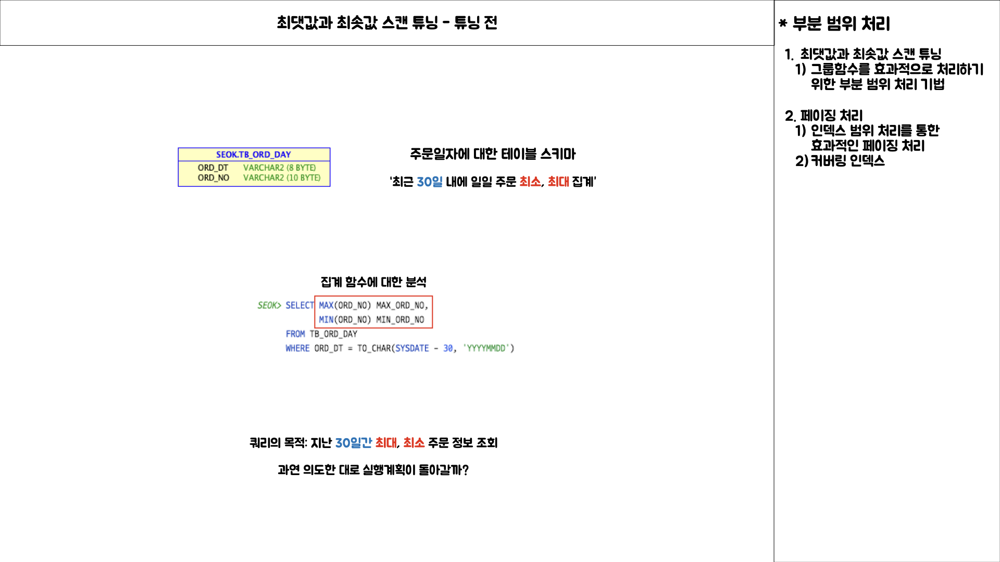
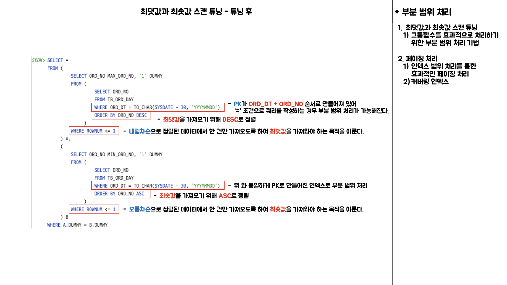
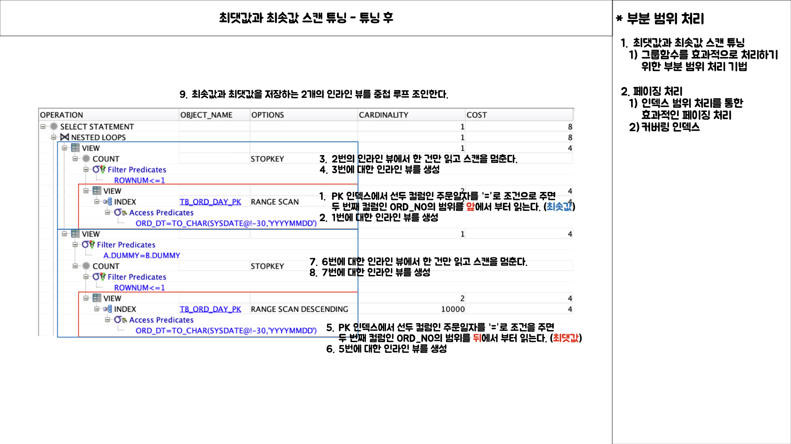
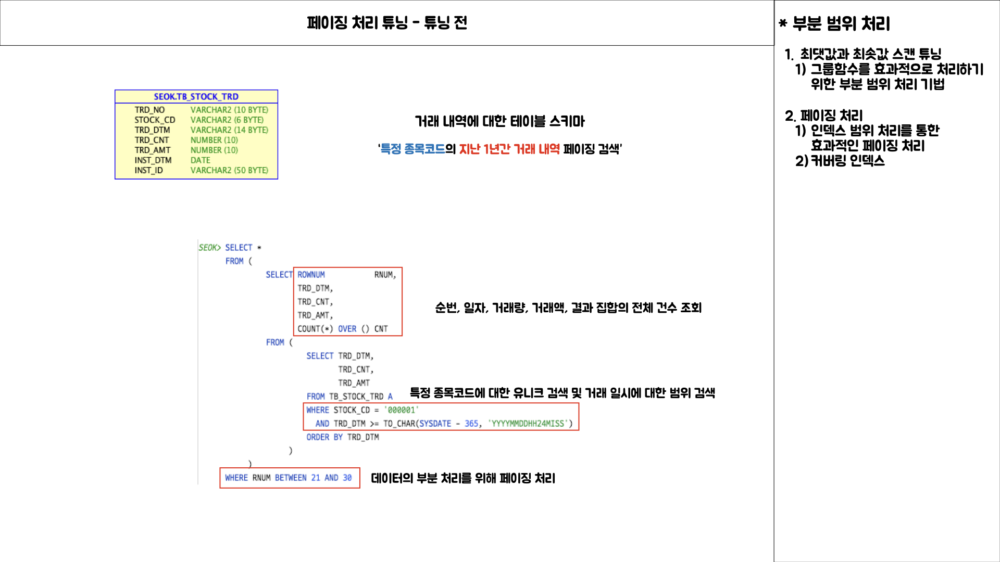
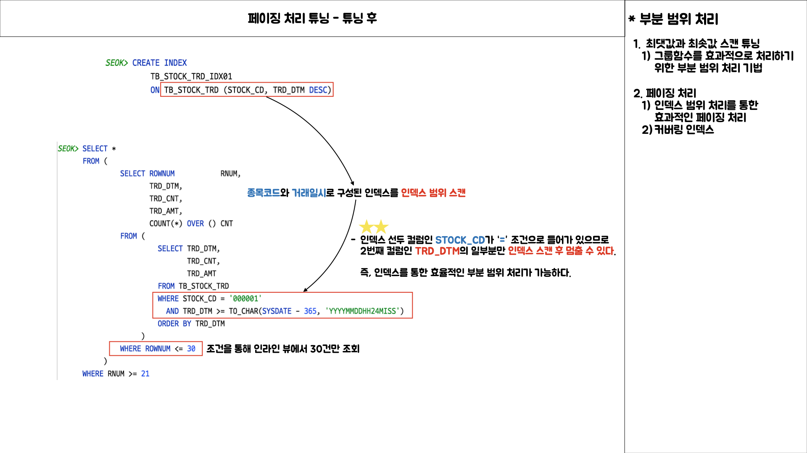
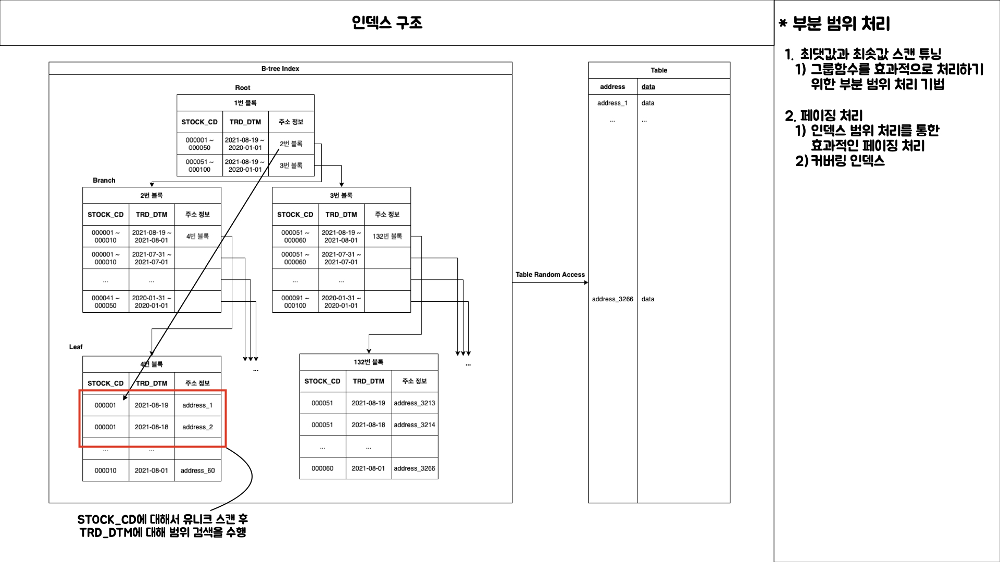
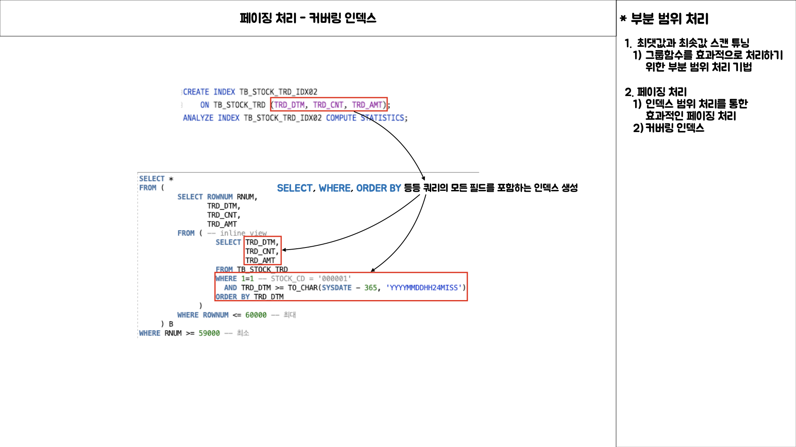

# Partial Range Processing Tune


## Intro



## 부분 범위 처리(Partial Range Processing)

---

- 데이터를 보여줄 때 모든 데이터를 한 화면에 보여줄 수 없는 경우가 빈번하다.
- 모든 데이터를 스캔하는 경우 DBMS에 많은 부하를 주기 때문에 **부분 범위 처리**를 통해 조건에 만족하는 데이터 중 특정 건수의 데이터만을 스캔하여 처리하여 부하를 줄이는 방식을 사용한다.
- 여기서는 부분 처리 기법(Partial Range Processing)을 이용하여 최솟값과 최댓값을 찾는 튜닝 기법과 페이징 처리를 하는 튜닝 기법에 대해서 살펴보도록한다.

> **부분 처리 기법(Partial Range Processing)**

- 대용량 테이블을 스캔할 때 가장 먼저 나오는 한 건 또는 한 건 이상의 행만 가져오는 처리 기법이다.

> **부분 범위 처리의 기초**

- 오라클에서 사용하는 부분 범위 처리 방식은 WHERE 절에 ROWNUM 조건으로 원하는 건수를 조회한다.

> **주의사항**

- EMPNO라는 값을 기준으로 오름차순 정렬된 데이터 3건을 조회하기 위해서 아래와 같은 쿼리를 작성하는 경우 의도한 바와 다른 결과값을 확인할 수 있다.
- 실제 아래의 쿼리는 EMP 테이블을 읽다가 3건을 모두 읽으면 테이블 스캔을 멈추고 그 후 조회된 3건의 정렬을 하게 된다.
- ORDER BY 연산이 마지막에 진행되어 의도하지 않은 결과를 나타낸다.

```sql
SELECT *
FROM EMP
WHERE ROWNUM <= 3
ORDER BY EMPNO;
```

- 위 쿼리를 의도한 대로 조회하기 위해서는 아래의 쿼리로 수정해야 한다.

```sql
SELECT *
FROM (
         SELECT *
         FROM EMP
         ORDER BY EMPNO
     )
WHERE ROWNUM <= 3;
```

- 개선된 쿼리는 인라인 뷰와 WHERE 절에 ROWNUM 조건을 결합하여 의도한 대로 EMPNO기준으로 오름차순 정렬한 뒤 3건을 가져오게 된다.
- 쿼리는 인덱스의 구성 여부에 따라 부분 범위 처리를 하기도 하고, 전체 범위 처리를 하기도 한다.
- 여기서 부분 범위 처리가 되도록 하기 위해서는 EMPNO를 선두 컬럼으로 갖는 인덱스가 존재해야 한다.
- 그래야 인덱스의 앞에서부터 3건만 읽고 스캔을 종료할 수 있다.
- 이는 인덱스가 정렬된 상태를 항상 유지한다는 특성을 이용한 것이다.

## 부분 범위 처리를 이용한 최댓값과 최솟값 스캔

---

> **최댓값 / 최솟값 스캔 튜닝**

- 인덱스의 주요 특징은 데이터가 정렬된 상태로 저장되어 있다는 것이다.
- 인덱스의 특징과 부분 범위 처리의 원리가 결합되면 최댓값과 최솟값을 가져올 때 극적인 성능 향상을 이루어 낼 수 있다.

### 테이블 설계 및 최댓값 / 최솟값 스캔 튜닝 전

> **ERD 및 튜닝 전 쿼리**



> **최댓값과 최솟값 스캔 튜닝 전 실행 계획**


- **SQL 문제점**
	- 인덱스 범위 스캔을 하지 않고 인덱스 양 끝의 최댓값과 최솟값만 스캔하면 의도한 대로 결과를 도출할 수 있다.
	- 해당 SQL문은 TB_ORD_DAY_PK 인덱스를 인덱스 범위 스캔하게 된다.

### 최댓값 / 최솟값 스캔 튜닝 후

> **최댓값과 최솟값 스캔 튜닝 후 쿼리**



> **최댓값과 최솟값 스캔 튜닝 후 실행 계획**



## 부분 범위 처리를 이용한 페이징 처리

---

> **페이징 처리**

- 일반적인 데이터 조회 시, 모든 데이터를 조회하는 경우는 흔치 않다.
- 모든 데이터를 보여줄 화면도 없을 뿐더러 그래야 하는 경우가 많지 않기 때문이다.

> **페이징 처리 튜닝**

- **페이징 처리 튜닝(Paging Processing Tuning)** 이란 보여주고 싶은 범위의 데이터를 인덱스 범위 스캔하여 가져오는 일련의 모든 활동을 의미한다.
- 인덱스를 이용하여 해당 범위의 시작으로 간 후(`인덱스 수직 탐색`) 원하는 데이터만 가져오는 기법(**인덱스 범위 스캔**)이다.
- 부분 범위 처리를 이용한 페이징 처리가 되지 않고 모든 범위를 스캔한 후 특정 데이터만 가져오게 된다면 시스템은 걷잡을 수 없이 큰 부하를 일으키게 된다.

### 페이징 처리 튜닝 전

> **ERD 및 튜닝 전 쿼리**



> **페이징 처리 튜닝 전 쿼리의 실행 계획**


- **SQL의 문제점**
	- `STOCK_CD`의 `TRD_DTM` 기준 최근의 데이터 중에서 21번째부터 30번째의 데이터만 가져오는 SQL
	- 30건 중 10건의 데이터만 가져오는데도 불구하고 적절한 인덱스가 존재하지 않아서 테이블 전체를 테이블 풀스캔하고 정렬 작업까지 수행한 후에야 그 중에서 10건만을 가져오게 된다.
	- 즉, 전체 범위 처리를 하고 페이징 처리한 매우 비효율적인 SQL이다.
	- 이러한 SQL문이 OLTP 환경에서 빈번하게 수행되는 경우 DBMS 전체 성능에 매우 큰 지장을 주게 된다.

### 페이징 처리 튜닝 후 쿼리

> **페이징 처리 튜닝 후 쿼리**





- **"인덱스를 통한 효율적인 부분 범위 처리가 가능하다"** 라는 말의 뜻?
	- B-tree 인덱스의 구조를 보면 인덱스의 첫 번째 컬럼인 **STOCK_CD 컬럼**을 우선으로 인덱스 유니크 스캔
	- 그리고 인덱스의 두 번째 컬럼인 **TRD_DTM 컬럼**에 대해서 범위 검색으로 필요한 부분만 검색 후 테이블 랜덤 액세스로 데이터를 가져온다.

> **페이징 처리 튜닝 후 실행 계획**


## 페이징 처리 커버링 인덱스 튜닝

> **페이징 처리 - 커버링 인덱스 생성**



- 조회 쿼리에 포함된 컬럼이 모두 포함되어 있는 인덱스를 생성
	- 인덱스의 순서와 컬럼의 정렬에 대한 설정도 중요

> **페이징 처리 - 커버링 인덱스 실행 계획**


- SELECT, WHERE, ORDER BY, GROUP BY 등등 쿼리에 속한 컬럼이 모두 포함된 인덱스로 쿼리를 조회하는 경우 실행계획에 테이블에 접근하는 내용이 사라진다.
- 결국 데이터 파일에 접근하는 비용이 감소되어 효율적인 조회가 가능하다.
