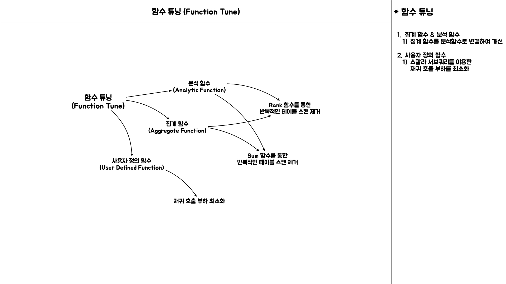
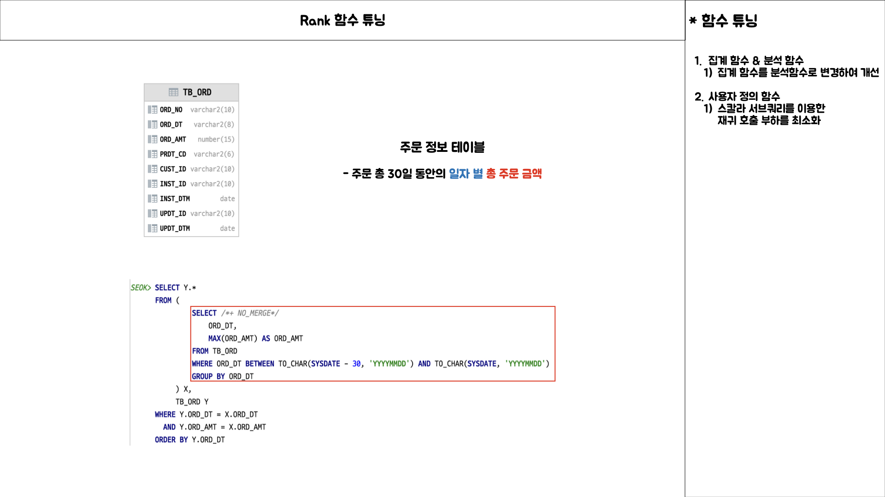
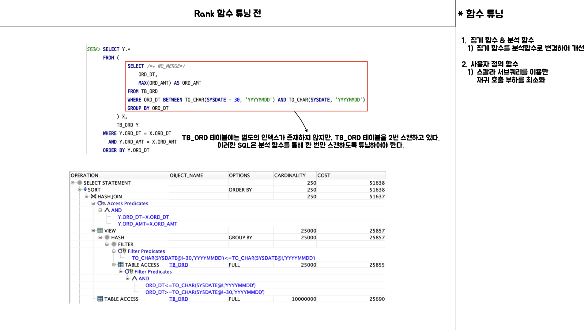
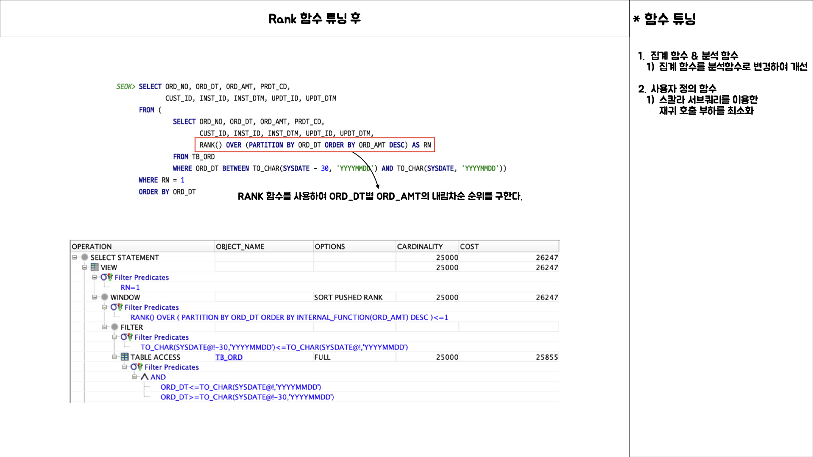
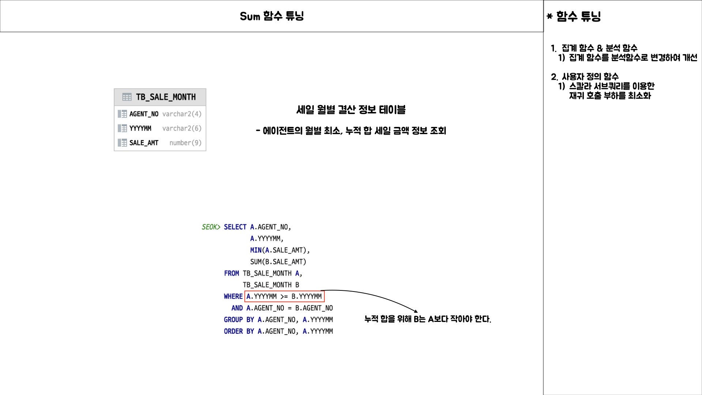
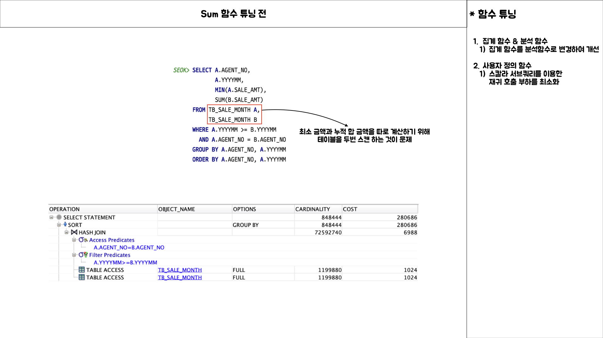
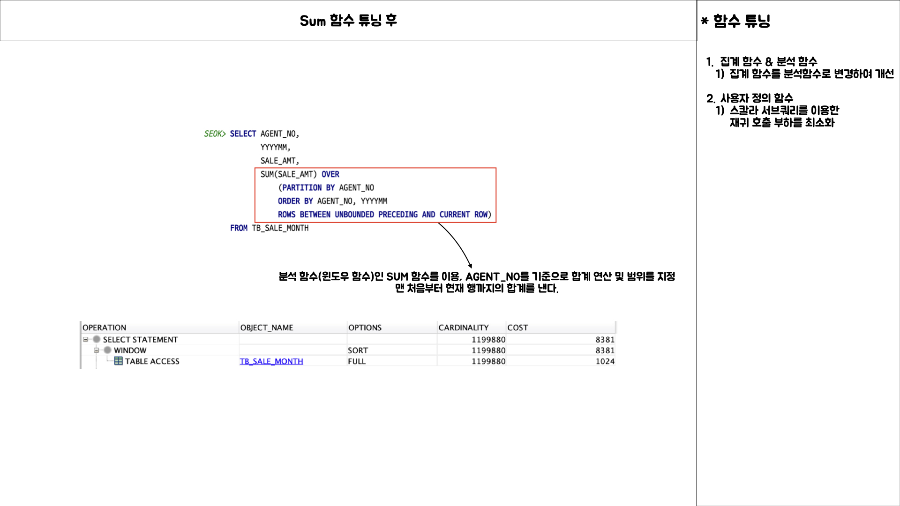
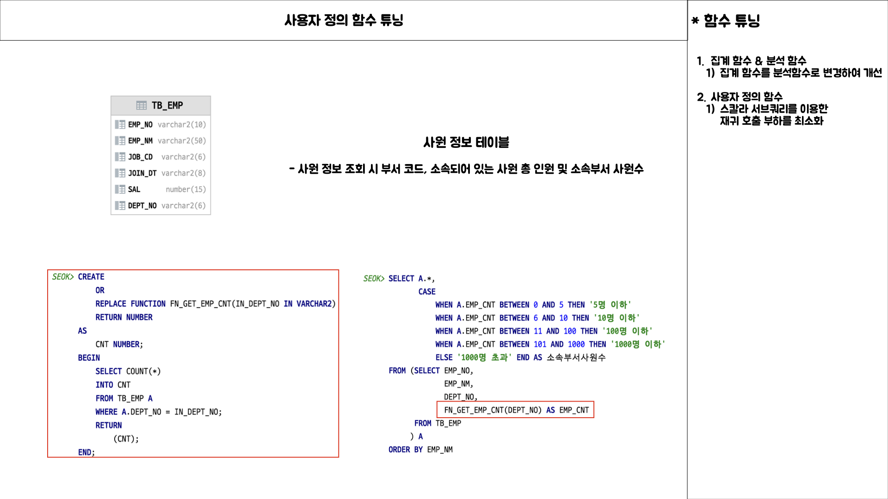
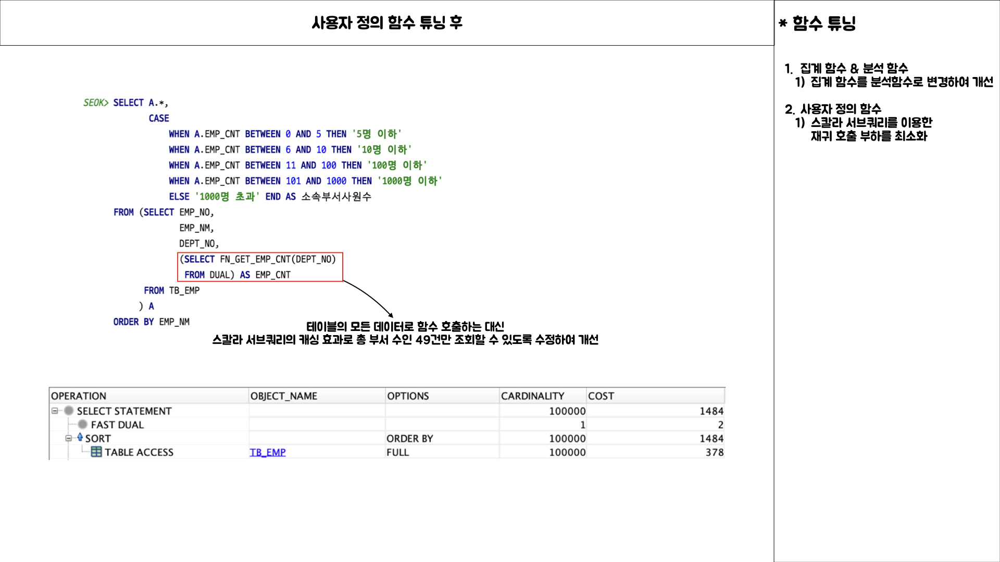

# 함수 튜닝

> [개발자를 위한 오라클 SQL 튜닝](https://www.hanbit.co.kr/store/books/look.php?p_code=E9267570814) 내용에서 참고한 내용입니다.

## Intro

- SQL도 프로그래밍과 마찬가지로 반복적으로 수행되는 연산을 함수로 구현하여 사용한다.
- 강력한 기능을 가지고 있지만 널리 사용되지 못하는 `분석 함수`를 이용한 튜닝 기법과 많은 SQL 문에서 사용되지만 적절한 사용법을 적용하지 않아 DBMS 부하의 주 원인이 되는 사용자 정의 함수의 튜닝 기법을
  정리해본다.

## 분석 함수 튜닝

---

> **집계 함수의 특징**

- **집계 함수(Aggregate Function)** 는 SQL 문에서 나온 결과 행들의 건수를 보장하지 않는다.
- [Aggregate Functions](https://docs.oracle.com/database/121/SQLRF/functions003.htm#SQLRF20035)

> **분석 함수**

- **분석 함수(Analytic Function)** 는 WHERE 절을 통해 나온 행들을 대상으로 다양한 집계나 통계를 구할 때 사용하는 함수이다.
- 동일 테이블의 반복 스캔 또는 조인을 생략하여 성능상 이점을 볼 수 있다.
- [Analytic Functions](https://docs.oracle.com/cd/E11882_01/server.112/e41084/functions004.htm#SQLRF06174)

> **집계함수와 분석함수의 차이점**

- `집계함수`는 그룹별 최대, 최소, 합계, 평균에 대한 `결과 집합`을 구할 때 사용하여 **그룹 별 1개의 행**을 반환
- `분석함수`는 그룹 단위로 값을 계산한다는 점에서 집계함수와 유사하지만, 그룹 마다가 아니라 `결과 집합의 각 행마다` **집계결과**를 보여준다.

### RANK 함수 튜닝

### RANK 함수 튜닝 전

- **SQL의 문제점**
    - TB_ORD 테이블에는 별도의 인덱스가 존재하지 않지만, 이 SQL은 TB_ORD 테이블을 2번 스캔하고 있다.
    - 이러한 SQL 분석 함수를 이용하여 한 번만 스캔하도록 튜닝해야 한다.

### RANK 함수 튜닝 후

- **SQL 분석**
    - RANK 함수를 사용하여 ORD_DT 별 ORD_AMT의 내림차순 순위를 구한다.
    - RANK 함수로 구한 순위 중 1위인 것만 추출한다.

## SUM 함수 튜닝

---

### SUM 함수 튜닝 전

- **SQL 분석**
    - 월별 누적 합을 구하기 위해 B는 A보다 작아야 한다.
    - AGENT_NO 컬럼을 기준으로 조인 조건을 걸어, AGENT_NO 별 합계를 구할 수 있다.

- **SQL 문제점**
    - TB_SALE_MONTH 테이블 2번 스캔하고 있다.
    - SUM 분석 함수를 사용한다면 해당 테이블을 단 한 번만 스캔하여 결과를 도출할 수 있다.

### SUM 함수 튜닝 후

- **SQL 분석**
    - 분석 함수인 SUM 함수를 이용한다.
    - AGENT_NO 컬럼을 기준으로 합계 연산의 범위를 지정한다.
    - 맨 처음부터 현재 행까지의 함계를 낸다.

## 사용자 정의 함수 튜닝

---

> **사용자 정의 함수의 재귀 호출 부하**

- 오라클에는 내장 함수(Built-in Function)와 사용자 정의 함수(User Defined Function)가 있다.
- 내장 함수는 DBMS 엔진 내에 네이티브 코드로, 컴파일된 상태로 존재하므로 빠른 속도를 보장한다.
- 사용자 정의 함수는 오라클 내에 존재하는 PL/SQL 가상 머신 내에서 구동되어 내장 함수보다 컨텍스트 스위칭 부하가 발생한다.
- 이러한 부하를 오라클에서는 재귀 호출 부하라고 한다.

> **사용자 정의 함수 튜닝의 목적**

- 사용자 정의 함수를 사용하여 발생하는 재귀 호출 부하를 최소화하는 것을 목표로 한다.

- **사용자 정의 함수 생성**
    - 특정 부서의 사원수를 리턴하는 사용자 정의 함수

### 사용자 정의 함수 튜닝 전

- **SQL 분석**
    - FN_GET_EMP_CNT 함수로 부서별 사원수를 구한다.
- **SQL 문제점**
    - TB_EMP 테이블에는 10만 건의 데이터가 존재하므로 FN_GET_EMP_CNT 함수는 총 10만 번 호출된다.
    - 이러한 경우 재귀 호출 부하가 발생하게 되어 DBMS를 장애 상황으로 몰고 갈 수 있다.

### 사용자 정의 함수 튜닝 후

- **SQL 분석**
    - DEPT_NO의 유일한 값은 49개라 가정할 때, 스칼라 서브쿼리의 캐싱 효과로 인해 10만 번의 재귀 호출이 49번으로 줄어들게 된다.
    - 즉, 유일 값이 적은 컬럼이 사용자 정의 함수에 입력 값으로 들어가면 재귀 호출을 획기적으로 줄일 수 있다.

