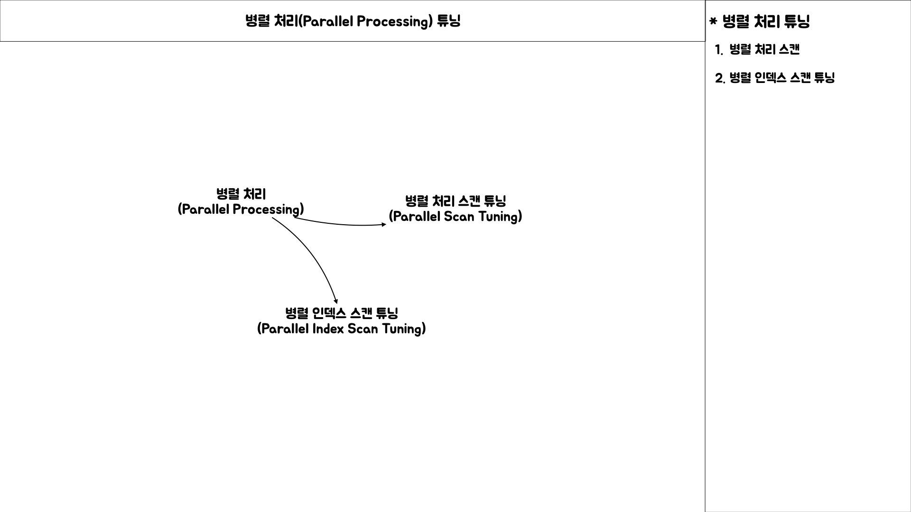

# Partial Range Processing

## 병렬 처리

- 오라클은 다중 스레드 방식을 통한 병렬 처리를 지원한다.
- 즉, 대용량 테이블에 대한 대량의 연산 작업을 여러 개의 스레드가 동시에 처리하여 연산 시간을 최소화할 수 있다.
- 단발성 또는 통계성 쿼리를 작성하는 경우 병렬 처리가 유용하게 사용될 수 있다.

> **병렬과 병렬 처리**

- 한 개의 작업을 처리하는 데 여러 개의 스레드가 실행되어 작업을 동시에 처리하는 것을 병렬작업이라 한다.
- 대용량의 테이블을 스캔하는 경우 여러 개의 스레드를 실행하는 것이 좋다.
- 각각의 스레드가 해당 연산(Operation) 내에서 자신들이 맡은 부분을 처리하며 QC(Query Coordinator)라는 프로세스가 각각의 스레드를 호출한다.
- 각각의 스레드가 처리한 부분 집합을 QC가 다시 취합하여 최종 결과를 도출해낸다.

- 실시간 조회 쿼리로는 적합하지 않고 배치 프로그램이나 통계성 쿼리에서 사용하는 경우 큰 효과를 볼 수 있다.

> **병렬 스캔 튜닝의 목적**

- 대용량의 큰 테이블을 검색할 떄 병렬 처리 기법을 사용하여 성능을 향상시키는 것을 목표로 한다.

### 대용량의 테이블을 병렬 스캔으로 검색

### 대용량의 테이블을 병렬 스캔으로 검색 튜닝 전

- **SQL 분석**
    - TRD_DT에 범위 조건을 준다.
    - CUST_ID에 '=' 조건을 준다.

- **SQL 문제점**
    - TB_TRD 테이블에 조건절에 대한 인덱스가 존재하지 않으며 향후 인덱스를 생성할 계획도 없다.
    - 그로 인해 대용량 테이블을 테이블 풀 스캔해야 하는 부하가 존재한다.

### 대용량의 테이블을 병렬 스캔으로 검색 튜닝 후

- **SQL 분석**
    - PARALLEL 힌트를 사용하여 TB_TRD 테이블을 병렬도 16으로 병렬 처리

## 병렬 인덱스 스캔

---

> **병렬 인덱스 스캔**

- 대용량의 파티셔닝 테이블에 `파티션 인덱스`를 생성하여 `병렬 스캔`하는 상황을 **병렬 인덱스 스캔(Parallel Index Scan)** 이라 한다.
- 해당 파티션 인덱스를 읽을 때 여러 개의 스레드가 실행 되어 병렬 처리로 스캔할 수 있는데, 이때의 `병렬도`는 **파티션의 개수를 넘을 수 없다.**

- 주의사항
    - 파티션 테이블을 병렬 처리 스캔 시 병렬도는 테이블의 파티션 개수를 넘을 수 없다.
    - 파티션 인덱스를 병렬 처리 스캔 시 병렬도는 인덱스의 파티션 개수를 넘을 수 없다.

> **병렬 인덱스 스캔의 목적**

- 파티션 인덱스를 병렬 처리로 스캔하여 인덱스를 읽는 시간을 단축하는 것이 목표

## 병렬 인덱스 스캔 튜닝 전

- **SQL 분석**
    - TRD_DT에 범위 조건을 준다.
    - CUST_ID에 '=' 조건을 준다.

- **SQL의 문제점**
    - TB_TRD 테이블에 인덱스가 존재하지 않습니다.
    - 이로 인해 대용량 테이블을 테이블 풀 스캔해야 하는 부하가 존재한다.

## 병렬 인덱스 스캔 튜닝 후

> **파티션 인덱스 구성**

- 파티션 테이블의 파티션 컬럼을 인덱스 선두에 두지 않는 **로컬 논 프리픽스 파티션 인덱스** 를 생성

- **SQL 분석**
  - PARALLEL_INDEX 힌트를 이용하여 TB_TRD_IDX01 인덱스를 병렬 인덱스 스캔하도록 한다.
  - 인덱스 스캔을 병렬로 함으로써 성능이 향상된다.