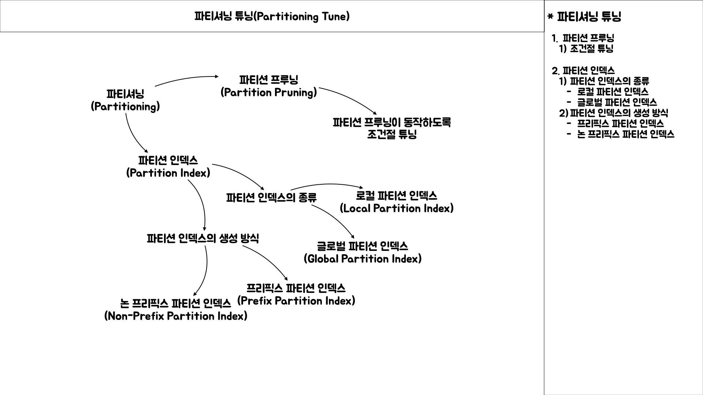

# Partitioning

## Intro

- 파티셔닝은 대용량의 큰 테이블을 여러 단위로 나누어 사용하고 관리하는 기법을 말한다.
- 대용량의 데이터를 하나의 테이블로만 관리하는 경우 해당 테이블이 사용불능 상태가 되거나 가용불능상태가 되는 경우 전체 데이터 모두를 사용하지 못하는 사태가 발생할 수 있다.
- 대용량 테이블에 대한 관리 용이성과 성능 향상을 위해 파티션이라는 기능을 사용할 수 있다.

> **파티셔닝의 장점**

- 분할된 단위 영역별로 관리할 수 있으므로 백업과 복구가 쉽다.
- 테이블 내에 특정 파티션에서 문제가 발생했을 때 다른 파티션에 영향을 주지 않는다.
- 테이블 액세스 시 스캔 범위를 줄여 성능 향상을 가져올 수 있다.

> **오라클의 경우 파티션은 XE 버전은 사용불가하고 EE 버전에서만 사용이 가능하다.**

## 파티션 프루닝(Partition Pruning) 튜닝

---

> **파티션 프루닝(Partition Pruning)**

- **파티션 프루닝**이란 파티셔닝 컬럼이 조건절이 조건으로 들어왔을 때 해당 파티션만 읽고 대상이 아닌 파티션을 스캔하지 않는 기법을 말한다.

- 예시
    - `거래일자` 기준으로 파티셔닝된 대용량 테이블이 구성되어 있는 상황
    - 조건절에 거래일자가 `없거나` `묵시적 형 변환`이 발생하면 테이블 내에 모든 파티션을 스캔해야 한다. **(PARTITION RANGE ALL)**
    - 조건절에 거래일자가 `있으면` 해당 파티션만 읽고 스캔을 멈추게 된다.**(PARTITION RANGE ITERATOR)**
        - 이 같은 상황을 파티션 프루닝이 동작되었다고 말할 수 있다.

### 파티션 프루닝 튜닝 전

- **SQL 분석**
    - 현 시점으로부터 180일 전 ~ 120일 전 까지의 YYYYMMDD를 TO_DATE 함수를 통해 DATE 타입으로 형 변환하여 조건을 생성

- **SQL의 문제점**
    - TRD_DT 컬럼의 데이터 타입은 VARCHAR2인데, TO_DATE 함수를 사용함으로써 **VARCHAR2**와 **DATE**의 비교 연산이 되었다.
    - 오라클은 이럴 경우 DATE 타입에 우선권을 주게 되므로 TRD_DT 컬럼을 DATE 타입으로 `묵시적 형 변환`을 하게 된다.
    - `묵시적 형 변환`으로 인해 파티션 프루닝이 되지 않고, 불필요한 파티션까지 모두 스캔하게 되므로 성능이 안 좋은 SQL이다.

### 파티션 프루닝 튜닝 후

- **SQL 분석**
    - TRD_DT 컬럼의 데이터 타입은 VARCHAR2이므로 문자열 상수로 범위 조건을 준다.
    - 같은 데이터 타입 간의 비교 연산이 이루어지므로 묵시적 형 변환이 이루어지지 않게 되었으며 파티션 프루닝이 가능해졌다.

## 파티션 인덱스(Partition Index) 튜닝

---

> **파티션 인덱스의 정의와 종류**

- **파티셔닝 테이블(Partition Table)** 은 대용량의 테이블을 파티션으로 분리한 것을 뜻한다.
- 파티셔닝 테이블에 인덱스가 생성하면 이를 **파티션 인덱스(Partition Index)** 라 부른다.

> **파티션 인덱스의 종류**

- **로컬 파티션 인덱스**
    - 테이블에 3개의 파티션이 존재하는 경우 각 파티션당 인덱스를 생성하는 경우, 즉 테이블 파티션과 1:1로 매칭되는 인덱스를 **로컬 파티션 인덱스(Local Partition Index)** 라 부른다.

- **글로벌 파티션 인덱스**
    - 테이블에 3개의 파티션이 존재하는 경우, 해당 테이블에 인덱스를 생성할 때 1:N 관계를 가질 수 있도록 생성하여 1:1을 제외한 모든 관계를 갖는 인덱스를 **글로벌 파티션 인덱스(Global
      Partition Index)** 라 한다.

> **파티션 인덱스 생성 방식**

- **프리픽스 파티션 인덱스(Prefix Partition Index)**
    - **프리픽스 파티션 인덱스** 는 파티셔닝 테이블의 파티션 키 컬럼이 파티션 인덱스 컬럼 구성에서 인덱스 선두 컬럼으로 오는 것을 뜻한다.

- **논 프리픽스 파티션 인덱스(Non-Prefix Partition Index)**
    - **논 프리픽스 파티션 인덱스** 는 파티셔닝 테이블의 파티션 키 컬럼이 파티션 인덱스 컬럼 구성에서 선두에 오지 않는 것을 뜻한다.

> **파티션 인덱스의 유형 정리**

- 파티션 인덱스의 종류와 생성 방식에 따라 4가지 유형으로 정리가 가능하다.

|**유형**|**파티션 키**|**인덱스 구성(예시)**|**오라클 지원**|
|:---:|:---:|:---:|:---:|
|**글로벌 프리픽스 파티션 인덱스**|거래일자|거래일자 + 고객번호|지원|
|**글로벌 논 프리픽스 파티션 인덱스**|거래일자|고객번호 + 거래일자|불가|
|**로컬 프리픽스 파티션 인덱스**|거래일자|거래일자 + 고객번호|지원|
|**로컬 논 프리픽스 파티션 인덱스**|거래일자|고객번호 + 거래일자|지원|

> **파티션 인덱스 튜닝의 주 목적**

- 파티셔닝된 테이블에 파티션 인덱스를 생성하여 검색 속도를 극적으로 단축시키는 것을 **파티션 인덱스 튜닝(Partition Index Tuning)** 이라 한다.

### 파티션 인덱스 튜닝 전

- **SQL 분석**
    - 특정 CUST_ID 컬럼 값의 퇴근 1년간의 거래 내역을 추출하는 조건을 준다.

- **SQL 문제점**
    - 1000만건의 테이블을 스캔하면서 **테이블 풀 스캔**을 하고 있다.
    - TRD_DT 컬럼이 조건절에 들어가서 **파티션 프루닝**은 정상적으로 작동되지만, 해당 파티션을 **테이블 풀 스캔**해야 하는 부하가 존재하게 된다.
    - 해당 파티션을 테이블 풀 스캔해야 하는 부하가 존재하게 된다.
    - 이러한 쿼리가 OLTP 환경에서 빈번하게 실행된다면 전체 시스템을 장애 상황으로 몰고 갈 수 있다.

### 파티션 인덱스 튜닝 후

> **파티션 인덱스 생성**

- **파티션 인덱스**를 구성
    - CUST_ID + TRD_DT 컬럼으로 구성된 로컬 파티션 인덱스를 생성한다.
    - TB_TRD 테이블은 TRD_DT 컬럼을 기준으로 파티셔닝된 테이블이다.
    - 파티셔닝 기준 컬럼이 인덱스의 선두 컬럼이 아니므로 해당 인덱스는 **로컬 논 프리픽스 파티션 인덱스**이다.

- **SQL 분석**
    - 특정 CUST_ID 컬럼 값의 최근 1년간의 거래 내역을 추출하는 조건을 준다.
    - TB_TRD_IDX01 인덱스를 인덱스 범위 스캔하게 된다.