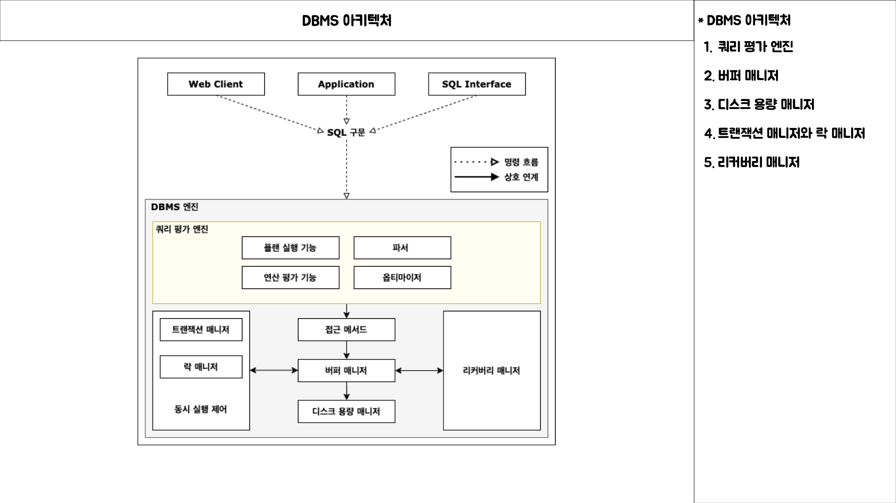

# 1강 DBMS 아키텍처 개요

> [SQL 레벨업 - DB 성능 최적화를 위한 SQL 실전 가이드](http://www.kyobobook.co.kr/product/detailViewKor.laf?mallGb=KOR&ejkGb=KOR&barcode=9788968482519) 내용을 정리한 내용입니다.

## Intro

- RDB(Relational Database) 제폼은 매우 다양한 종류가 있다.
- RDB로써 기능을 제공한다는 목적은 모두 동일하기 때문에, 이런 공통적인 구조를 이해한다면 각각의 DBMS가 가지는 특징도 쉽게 이해할 수 있다.

## DBMS Architecture

> **1. 쿼리 평가 엔진**

- 사용자로부터 입력받은 SQL 구문을 분석, 어떤 순서로 기억장치의 데이터에 접근할지를 결정
	- 이를 **`실행 계획(Explain Plan)`**이라 한다.
- 실행 계획에 기반을 둬서 데이터에 접근하는 방법을 `접근 메서드(access method)`라 한다.
- 쿼리 평가 엔진은 계획을 세우고 실행하는 DBMS의 핵심 기능을 담당하는 모듈이다.

> **2. 버퍼 매니저**

- DBMS는 버퍼라는 특별한 용도로 사용하는 **메모리 영역**을 확보해둔다.
	- 이를 **버퍼 매니저**라 한다.
- **버퍼 매니저**는 `디스크를 관리하는 디스크 용량 매니저와 함께 연동되어 작동한다.`
	- 이는 성능과 중요한 관련이 있다.

> **3. 디스크 용량 매니저**

- 데이터베이스는 **영구적**으로 데이터를 저장해야 한다.
- **디스크 용량 매니저**는 어디에 어떻게 데이터를 `저장할지를 관리`, 데이터의 `읽고 쓰기를 제어`한다.

> **4. 트랜잭션 매니저와 락 매니저**

- 사용자의 요청에 따라 DBMS 내부에서는 **트랜잭션**이라는 단위로 관리한다.
- 트랜잭션의 `정합성`을 유지하면서 실행시키고, 필요한 경우 데이터에 **락**을 걸어 다른 사람의 요청을 대기시키는 것이 **트랜잭션 매니저**와 **락 매니저**의 역할이다.

> **5. 리커버리 매니저**

- **리커버리 매니저**는 시스템의 장애로 인한 데이터 유실에 대해서 정기적으로 **백업**하고, 문제 발생 시 **복구**하는 역할을 한다.
