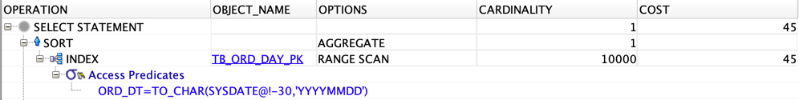
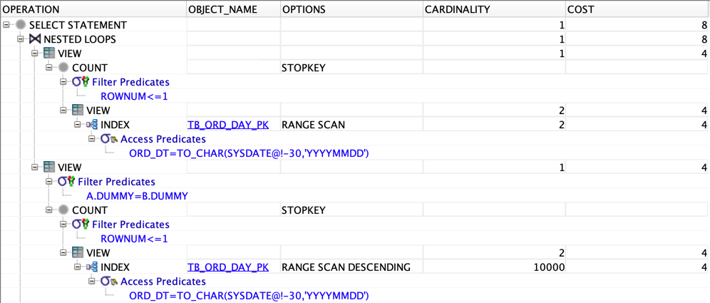
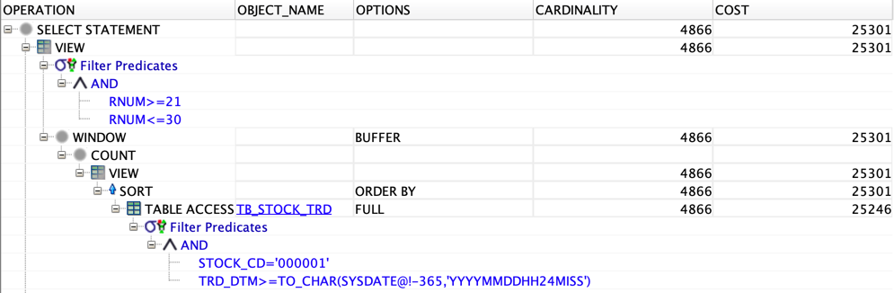
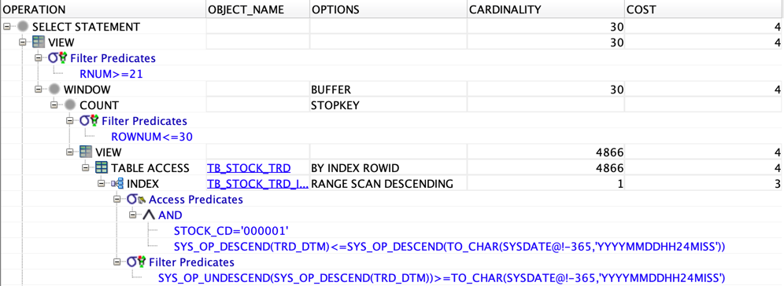

# 이론

> [개발자를 위한 오라클 SQL 튜닝](https://www.hanbit.co.kr/store/books/look.php?p_code=E9267570814) 내용에서 참고한 내용입니다.

## Intro

- 조건에 만족하는 모든 데이터를 한 화면에 보여줄 수 없는 경우가 빈번하다.
- 그렇기 때문에 모든 데이터를 스캔하게 되면 DBMS에 많은 부하를 주게 된다.
- 부분 범위 처리(Partial Range Processing)를 통해 조건에 만족하는 데이터 중 특정 건수의 데이터만을 스캔하여 처리하면 부하를 줄일 수 있다.
- 부분 범위 처리 기법을 이용하여 최소값/최대값을 찾는 튜닝 기법과 페이징 처리를 하는 튜닝 기법에 대해 알아보기

## 부분 범위 처리(Partial Range Processing)

- 대용량 테이블을 스캔할 때 가장 먼저 나오는 한 건 또는 한 건이상(N개)의 행만 가져오는 처리 기법이다.
- 대용량의 테이블을 스캔한다고 해도 부분 범위만 가져온다면 성능은 극단적으로 빨라지게 된다.

> **부분 범위 처리의 기초**

- WHERE 절에 ROWNUM 조건으로 원하는 건수를 조회한다.
- 테이블 전체를 스캔하지 않고 원하는 범위의 데이터를 읽으면 곧바로 결과를 출력할 수 있다.

```sql
SELECT *
FROM EMP
WHERE ROWNUM <= 3
ORDER BY EMPNO;
```

- 위 쿼리는 EMP 테이블을 읽다가 3건을 모두 읽으면 테이블 스캔을 멈추고 그 후 조회된 3건으로 정렬을 하게 된다.
- ORDER BY 연산이 마지막에 진행되기 때문이다.
- 사용자의 의도가 테이블 전체 데이터를 EMPNO 기준으로 정렬한 상태에서 3건의 데이터를 뽑는 것이었다면 데이터 정합성이 틀린 SQL문이 된다.

- 이런 문제를 해결하기 위해서 아래 쿼리로 수정한다.

```sql
-- 부분 범위 처리 + 소트 연산 + ROWNUM 조건
SELECT *
FROM (
         SELECT *
         FROM EMP
         ORDER BY EMPNO
     )
WHERE ROWNUM <= 3;
```

- 위 쿼리는 인라인 뷰와 WHERE 절에 ROWNUM 조건을 결합하면 EMP 테이블을 EMPNO 기준으로 오름차순 정렬한 값 중에서 3건을 가져오게 된다.
- SQL문은 인덱스 구성 여부에 따라 부분 범위 처리를 하기도 하고 전체 범위 처리를 하기도 한다.
- 부분 범위 처리가 되기 위해서는 EMPNO를 선두 컬럼으로 갖는 인덱스가 존재해야 하고, 해당 인덱스의 앞에서부터 3건만 읽고 스캔을 종료할 수 있다.
- 이는 인덱스가 정렬된 상태를 항상 유지한다는 특성을 이용한 것이다.

> **부분 범위 처리의 구현**

```sql
CREATE TABLE TB_CUST
(
    CUST_ID VARCHAR2(10), -- 고객 아이디
    IN_DTM  DATE,         -- 가입일자
    CONSTRAINT TB_CUST_PK PRIMARY KEY (CUST_ID)
)
```

```sql
SELECT LPAD(TO_CHAR(ROWNUM), 10, '0'),
       SYSDATE - (TRUNC(DBMS_RANDOM.VALUE(1, 999999)) / 24 / 60 / 60)
FROM DUAL
CONNECT BY LEVEL <= 100000;
```

- 15년 10월 01 이후 데이터 중 가장 최근에 들어간 100건을 출력하는 SQL
- TB_CUST 테이블을 풀 스캔한 후 IN_DTM을 기준으로 내림차순 정렬한 값 중에서 100건을 출력하는 쿼리
- 결과 집합은 사용자가 의도한 대로 나오지만 IN_DTM으로 구성된 인덱스가 없다면 전체 범위 처리를 하게 된다.

```sql
CREATE INDEX TB_CUST_IDX01 ON TB_CUST (IN_DTM);
```

- IN_DTM으로 구성된 인덱스를 생성
- 인덱스 생성으로 인해 SQL은 부분 범위 처리를 하게 된다.
- 즉, 부분 범위 처리가 작동하는 데 가장 필수적인 요소는 인덱스 존재 여부이므로 인덱스 구성에 따라 극적인 성능을 가져올 수 있다.

## 최댓값/최솟값 스캔 튜닝

> **최댓값/최솟값 스캔 튜닝**

- 인덱스의 주요 특징은 바로 데이터가 정렬된 상태로 저장되어 있다라는 것이다.
- 인덱스의 특징과 부분 범위 처리의 원리가 결합되면 최댓값과 최솟값을 가져올 때 극적인 성능 향상을 이루어 낼 수 있다.
- 이처럼 인덱스와 부분 범위 처리 원리를 결합시켜 최댓값과 최솟값을 가장 빠르게 가져오는 것을 최댓값/최솟값 스캔 튜닝이라 한다.

### 부분 범위 처리 기법을 이용하여 최댓값/최솟값 검색하기

```sql
CREATE TABLE TB_ORD_DAY
(
    ORD_DT VARCHAR2(8), --주문일자
    ORD_NO VARCHAR2(10) --주문번호
);
```

```sql
ALTER TABLE TB_ORD_DAY
    NOLOGGING;
```

```sql
DECLARE
    TYPE ORD_DT_TABLE IS TABLE OF VARCHAR2(8)
        INDEX BY BINARY_INTEGER;

    ORD_DT_TAB ORD_DT_TABLE;
    i          BINARY_INTEGER := 0;

BEGIN
    FOR ORD_DT_LIST
        IN
        (
        SELECT TO_CHAR(SYSDATE - ROWNUM, 'YYYYMMDD') ORD_DT
        FROM DUAL
        CONNECT BY LEVEL <= 3650
        ORDER BY 1
        )
        LOOP
            i := i + 1;
            ORD_DT_TAB(i) := ORD_DT_LIST.ORD_DT;
            INSERT INTO TB_ORD_DAY
            SELECT ORD_DT_TAB(i),
                   LPAD(TO_CHAR(ROWNUM), 10, '0')
            FROM DUAL
            CONNECT BY LEVEL <= 10000;
            COMMIT;
        END LOOP;
END;
/
-- 36_500_000 건 등록
```

```sql
ALTER TABLE TB_ORD_DAY
    ADD CONSTRAINT TB_ORD_DAY_PK
        PRIMARY KEY (ORD_DT, ORD_NO);

ANALYZE TABLE TB_ORD_DAY COMPUTE STATISTICS
    FOR TABLE FOR ALL INDEXES FOR ALL INDEXED COLUMNS SIZE 254;
```

### 튜닝 전 상황

```sql
SELECT MAX(ORD_NO) MAX_ORD_NO,
       MIN(ORD_NO) MIN_ORD_NO
FROM TB_ORD_DAY
WHERE ORD_DT = TO_CHAR(SYSDATE - 30, 'YYYYMMDD')
```

- **SQL 분석**
	- 현재 일자로부터 30일 전 일자를 기준으로 MAX와 MIN 함수를 이용하여 최댓값과 최솟값 조회

- **SQL 문제점**
	- 인덱스 범위 스캔을 하지 않고 인덱스 양 끝의 최댓값과 최솟값만 스캔하면 의도한 대로 결과를 도출할 수 있다.
	- 해당 SQL문은 TB_ORD_DAY_PK 인덱스를 인덱스 범위 스캔하게 된다.



### 튜닝 후 상황

```sql
SELECT *
FROM (
         SELECT ORD_NO MAX_ORD_NO, '1' DUMMY
         FROM (
                  SELECT ORD_NO
                  FROM TB_ORD_DAY
                  WHERE ORD_DT = TO_CHAR(SYSDATE - 30, 'YYYYMMDD')
                  ORDER BY ORD_NO DESC
              )
         WHERE ROWNUM <= 1
     ) A,
     (
         SELECT ORD_NO MIN_ORD_NO, '1' DUMMY
         FROM (
                  SELECT ORD_NO
                  FROM TB_ORD_DAY
                  WHERE ORD_DT = TO_CHAR(SYSDATE - 30, 'YYYYMMDD')
                  ORDER BY ORD_NO ASC
              )
         WHERE ROWNUM <= 1
     ) B
WHERE A.DUMMY = B.DUMMY;
```

- **SQL 분석**
	- WHERE 절에 ORD_DT 조건을 주어져 있다.
	- PK 구성이 `ORD_DT + ORD_NO` 순으로 되어 있으므로 ORD_DT 조건이 '`=`' 조건으로 들어오는 순간 ORD_NO를 기준으로 부분 범위 처리가 가능해진다.
	- 최댓값을 가져오기 위해 ORD_NO를 DESC로 정렬한다.
	- ROWNUM 조건을 주어 ORD_NO의 최대값 한 건만 가져오게 한다.
	- WHERE 절에 ORD_DT 조건을 주었다.
	- PK 구성이 'ORD_DT + ORD_NO' 순으로 되어 있으므로 ORD_DT 조건이 '=' 조건으로 들어오는 순간 ORD_NO를 기준으로 부분 범위 처리가 가능해진다.
	- 최솟값을 가져오기 위해 ORD_NO를 ASC로 정렬한다.
	- ROWNUM 조건을 주어 ORD_NO의 최솟값 한 건만 가져오도록 한다.



## 페이징 처리 튜닝

> **페이징 처리**

- 일반적인 게시판 또는 정보 조회 화면을 생각해보면 100만건의 데이터가 저장된 테이블이 있다고 가정했을 때, 한 화면 안에서 100만 건의 모든 데이터를 보여줄 수 없고 해당 화면에 나타낼 수 있는 범위만 보여주면 된다.
- 이러한 경우 부분 범위 처리를 이용한 **페이징 처리(Paging Processing)** 를 하게 된다.

> **페이징 처리 튜닝**

- **페이징 처리 튜닝(Paging Processing Tuning)** 이란 해당 페이지에서 보여주고 싶은 범위만 인덱스 범위 스캔하여 특정 데이터만 가져오는 일련의 모든 활동을 의미한다.
- 인덱스를 이용하여 해당 범위의 시작으로 간 후(인덱스 수직 탐색) 원하는 데이터만 가져오는 기법(인덱스 범위 스캔)이다.
- 부분 범위 처리를 이용한 페이징 처리가 되지 않고 모든 범위를 스캔한 후 특정 데이터만 가져오게 된다면 시스템은 걷잡을 수 없이 큰 부하를 일으키게 된다.
- 이러한 이유로 페이징 처리 튜닝은 실무에서 매우 중요하고 빈번하게 쓰이는 튜닝 기법이다.

### 부분 범위 처리 기법을 이용한 페이징 처리

```sql
CREATE TABLE TB_STOCK_TRD
(
    TRD_NO   VARCHAR2(10), --거래번호
    STOCK_CD VARCHAR2(6),  --종목코드
    TRD_DTM  VARCHAR2(14), --거래일시
    TRD_CNT  NUMBER(10),   --거래건수
    TRD_AMT  NUMBER(10),   --거래금액
    INST_DTM DATE,         --입력일시
    INST_ID  VARCHAR2(50)  --입력자
);
```

```sql
ALTER TABLE TB_STOCK_TRD
    NOLOGGING;
```

```sql
INSERT /*+ APPEND */ INTO TB_STOCK_TRD --APPEND 힌트 사용
SELECT LPAD(TO_CHAR(ROWNUM), 10, '0'),
       LPAD(TO_CHAR(RNUM), 6, '0'),
       TRD_DTM,
       TRUNC(DBMS_RANDOM.VALUE(100, 10000)),
       TRUNC(DBMS_RANDOM.VALUE(10000, 100000)),
       SYSDATE,
       'DBMSEXPERT'
FROM (
         SELECT ROWNUM RNUM
         FROM DUAL
         CONNECT BY LEVEL <= 2000
     ),
     (
         SELECT TO_CHAR(SYSDATE - (ROWNUM * 1000000) / 24 / 60 / 60, 'YYYYMMDDHH24MISS') TRD_DTM
         FROM DUAL
         CONNECT BY LEVEL <= 5000
     );

COMMIT;
```

```sql
ALTER TABLE TB_STOCK_TRD
    ADD CONSTRAINT TB_STOCK_TRD_PK
        PRIMARY KEY (TRD_NO);

ANALYZE TABLE TB_STOCK_TRD COMPUTE STATISTICS
    FOR ALL INDEXED COLUMNS SIZE 254;
```

### 부분 범위 처리 기법을 이용한 페이징 처리 - 튜닝 전

```sql
SELECT *
FROM (
         SELECT ROWNUM           RNUM,
                TRD_DTM,
                TRD_CNT,
                TRD_AMT,
                COUNT(*) OVER () CNT
         FROM (
                  SELECT TRD_DTM,
                         TRD_CNT,
                         TRD_AMT
                  FROM TB_STOCK_TRD A
                  WHERE STOCK_CD = '000001'
                    AND TRD_DTM >= TO_CHAR(SYSDATE - 365, 'YYYYMMDDHH24MISS')
                  ORDER BY TRD_DTM
              )
     )
WHERE RNUM BETWEEN 21 AND 30;
```

- **SQL 분석**
	- ROWNUM을 이용하여 데이터의 순번을 매긴다.
	- 분석 함수인 COUNT 함수를 사용하여 결과 집합의 전체 건수를 가져온다.
	- STOCK_CD 조건을 주어 특정 종목의 데이터를 가져온다.
	- 최근 일년간의 거래 내역을 출력하기 위한 조건을 준다.
	- 21 ~ 30 번째 데이터의 결과만을 가져온다.

- **SQL의 문제점**
	- STOCK_CD의 TRD_DTM 기준 최근의 데이터 중에서 21번째부터 30번째의 데이터만 가져오는 SQL
	- 30건 중 10건의 데이터만 가져오는데도 불구하고 적절한 인덱스가 존재하지 않아서 테이블 전체를 테이블 풀스캔하고 정렬 작업까지 수행한 후에야 그 중에서 10건만을 가져오게 된다.
	- 즉, 전체 범위 처리를 하고 페이징 처리한 매우 비효율적인 SQL이다.
	- 이러한 SQL문이 OLTP 환경에서 빈번하게 수행되는 경우 DBMS 전체 성능에 매우 큰 지장을 주게 된다.



### 부분 범위 처리 기법을 이용한 페이징 처리 - 튜닝 후

- 부분 범위 처리를 위한 STOCK_CD와 TRD_DTM으로 구성된 복합 인덱스를 생성

```sql
CREATE INDEX
    TB_STOCK_TRD_IDX01
    ON TB_STOCK_TRD (STOCK_CD, TRD_DTM DESC);

ANALYZE INDEX TB_STOCK_TRD_IDX01 COMPUTE STATISTICS;
```

```sql
SELECT *
FROM (
         SELECT ROWNUM           RNUM,
                TRD_DTM,
                TRD_CNT,
                TRD_AMT,
                COUNT(*) OVER () CNT
         FROM (
                  SELECT TRD_DTM,
                         TRD_CNT,
                         TRD_AMT
                  FROM TB_STOCK_TRD
                  WHERE STOCK_CD = '000001'
                    AND TRD_DTM >= TO_CHAR(SYSDATE - 365, 'YYYYMMDDHH24MISS')
                  ORDER BY TRD_DTM
              )
         WHERE ROWNUM <= 30
     )
WHERE RNUM >= 21
```

- **SQL 분석**
	- STOCK_CD와 TRD_DTM으로 구성된 TB_STOCK_TRD_IDX01 인덱스를 인덱스 범위 스캔한다.
	- 인덱스 선두 컬럼인 STOCK_CD가 '=' 조건으로 들어가 있으므로 2번째 컬럼인 TRD_DTM의 일부분만 인덱스 스캔 후 멈출 수 있다.
	- 즉, 인덱스를 이용한 효율적인 부분 범위 처리가 가능하다.
	- ROWNUM 조건으로 인라인 뷰 내에서 30건만 가져오도록한다. TB_STOCK_TRD의 결과 중 30건만 부분 범위 처리로 가져오게 된다.


