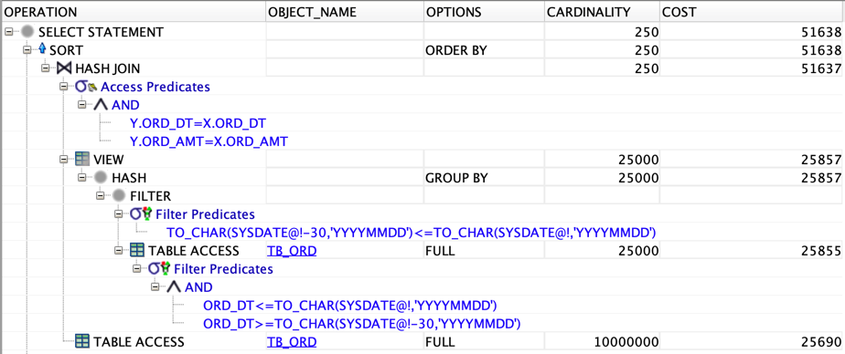
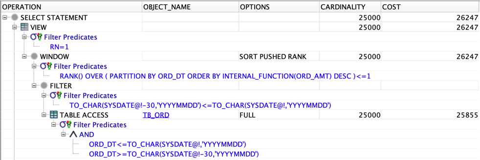
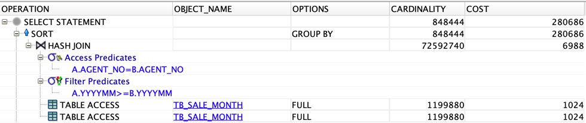
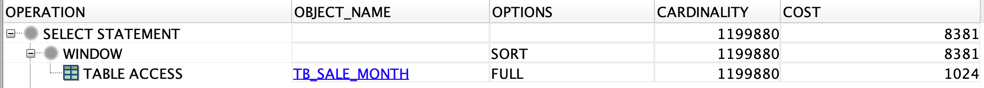
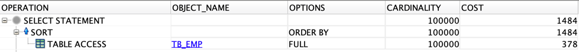
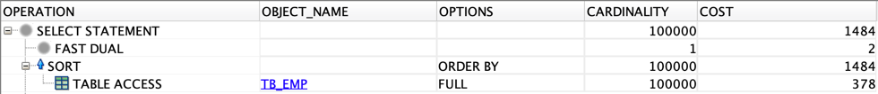

# 이론

> [개발자를 위한 오라클 SQL 튜닝](https://www.hanbit.co.kr/store/books/look.php?p_code=E9267570814) 내용에서 참고한 내용입니다.

## Intro

- SQL도 프로그래밍과 마찬가지로 반복적으로 수행되는 연산을 함수로 구현하여 사용한다.
- 강력한 기능을 가지고 있지만 널리 사용되지 못하는 분석 함수를 이용한 튜닝 기법과 많은 SQL 문에서 사용되지만 적절한 사용법을 적용하지 않아 DBMS 부하의 주 원인이 되는 사용자 정의 함수의 튜닝 기법을
  정리해본다.

## 분석 함수 튜닝

> 집계 함수의 한계

- SUM(), AVG(), COUNT() 같은 집계 함수(Average Function)는 SQL 문에서 나온 결과 행들이 여러 개(N)라면, 집계 함수를 사용함으로써 결과 행의 건수가 N보다 적어지는 한계가
  있다.
- 즉, 집계 함수는 결과 행의 건수를 보장하지 않는다.

```sql
SELECT SUM(SAL),
       RDUND(AVF(SAL), 2),
       COUNT(*)
FROM EMP;
```

- EMP 테이블에 100건의 행이 있더라도 집계 함수를 사용하면 결과 건수가 100건을 보장하지 않는다.
- 연봉합계, 연봉평균, 총 사원수 만을 뽑는 것이 목적이라면 위의 쿼리가 적절하지만 집계 내역을 뽑으면서 사원에 대한 정보도 같이 보려면 **집계 함수**는 적합하지 않다.
- 이 같은 경우 **분석 함수**가 유용하게 사용될 수 있다.

> 분석 함수의 유용성

- 분석 함수(Analytic Function)는 WHERE 절을 통해 나온 행들을 대상으로 다양한 집계나 통계를 구할 때 사용하는 함수이다.

```sql
SELECT EMPNO,
       ENAME,
       JOB,
       SAL,
       DEPTNO,
       SUM(SAL) OVER ()            연봉합계,
       ROUND(AVG(SAL), OVER (), 2) 연봉평균,
       COUNT(*) OVER ()            건수
FROM EMP;
```

- 다양한 정보를 출력하면서 기존에 추출하려고 했던 집계 데이터도 같이 출력할 수 있는 SQL이다.
- 이것이 바로 분석 함수의 핵심 기능이다.
- 즉, 분석 함수를 통해 다양한 통계와 소계를 구할 수 있다.

> 분석 함수 튜닝

- 분석 함수 튜닝이란 분석 함수를 이용하여 SQL문의 성능을 극대화하는 모든 활동을 의미한다.
- 분석 함수를 이용하면 동일 테이블의 반복 스캔 또는 조인을 생략하고 간단하게 원하는 결과를 추출할 수 있다.

> 주요 분석 함수

- RANK
    - SELECT 문의 결과 내에서 특정 조건에 따른 순위를 구하는데, 동일한 값은 동일한 순위가 매겨진다.

```sql
SELECT EMPNO,
       SAL,
       RANK() OVER (ORDER BY SAL) RANK
FROM EMP;
```

- ROW_NUMBER
    - SELECT 문의 결과 내에서 특정 조건에 따른 순위를 구하는데, 동일한 값이라도 다른 순위를 매겨준다.
    - 즉, 시퀀스를 구하는 용도로 자주 사용된다.

```sql
SELECT EMPNO,
       SAL,
       ROW_NUMBER() OVER (ORDER BY SAL) RANK
FROM EMP;
```

- SUM
    - SELECT 문 결과 내에서 특정 값의 합계를 계산하는 함수이다.

```sql
SELECT EMPNO,
       SAL,
       SUM(SAL) OVER (
           ORDER BY SAL 행들 BETWEEN UNBOUNDED PRECEDING AND CURRENT 행
           ) RANK
FROM EMP;
```

- MAX
    - SELECT문의 결과 내에서 특정 조건에 따른 최대을 구하는 함수이다.

```sql
SELECT EMPNO,
       SAL,
       DEPTNO,
       MAX(SAL) OVER (PARTITION BY DEPTNO)
FROM EMP;
```

- AVG
    - SELECT문의 결과 내에서 특정 조건에 따른 평균 값을 구하는 함수이다.

```sql
SELECT EMPNO,
       SAL,
       DEPTNO,
       AVG(SAL) OVER (PARTITION BY DEPTNO)
FROM EMP;
```

### RANK 함수를 이용하여 반복적인 테이블 스캔 제거하기

- 테이블 생성

```sql
CREATE TABLE TB_ORD
(
    ORD_NO VARCHAR2 (10),  -- 주문번호
    ORD_DT VARCHAR2 (8),   -- 주문일자
    ORD_AMT NUMBER (15),   -- 주문금액
    PRDT_CD VARCHAR2 (6),  -- 제품코드
    CUST_ID VARCHAR2 (10), -- 고객ID
    INST_ID VARCHAR2 (10), -- 입력자
    INST_DTM DATE,         -- 입력일시
    UPDT_ID VARCHAR2 (10), -- 수정자
    UPDT_DTM DATE          -- 수정일시
);

CREATE TABLE DUAL_100
(
    DUMMY VARCHAR2 (1)
);
```

- 더미 데이터 입력

```sql
INSERT INTO DUAL_100
SELECT DUMMY
FROM DUAL CONNECT BY LEVEL <= 100;

COMMIT;

ALTER TABLE TB_ORD NOLOGGING;

INSERT /*+ APPEND */ INTO TB_ORD --APPEND 힌트 사용
SELECT LPAD(TO_CHAR(ROWNUM), 10, '0'),
       TO_CHAR(SYSDATE - TRUNC(DBMS_RANDOM.VALUE(1, 3650)), 'YYYYMMDD'),
       TRUNC(DBMS_RANDOM.VALUE(100, 1000000)),
       LPAD(TO_CHAR(TRUNC(DBMS_RANDOM.VALUE(1, 999999))), 6, '0'),
       LPAD(TO_CHAR(TRUNC(DBMS_RANDOM.VALUE(1, 999999))), 10, '0'),
       'DBMSEXPERT',
       SYSDATE,
       NULL,
       NULL
FROM DUAL_100,
     (SELECT LEVEL LV FROM DUAL CONNECT BY LEVEL <= 100000);

COMMIT;
```

- 제약 조건 추가

```sql
ALTER TABLE TB_ORD
    ADD CONSTRAINT TB_ORD_PK
        PRIMARY KEY (ORD_NO);
```

- 통걔정보 생성

```sql
ANALYZE TABLE TB_ORD COMPUTE STATISTICS
FOR TABLE FOR ALL INDEXES FOR ALL INDEXED COLUMNS SIZE 254;
```

### RANK 함수를 이용하여 반복적인 테이블 스캔 제거 튜닝 전

```sql
SELECT Y.*
FROM (
         SELECT /*+ NO_MERGE*/
             ORD_DT,
             MAX(ORD_AMT) AS ORD_AMT
         FROM TB_ORD
         WHERE ORD_DT BETWEEN TO_CHAR(SYSDATE - 30, 'YYYYMMDD') AND TO_CHAR(SYSDATE, 'YYYYMMDD')
         GROUP BY ORD_DT
     ) X,
     TB_ORD Y
WHERE Y.ORD_DT = X.ORD_DT
  AND Y.ORD_AMT = X.ORD_AMT
ORDER BY Y.ORD_DT;
```

- SQL 분석
    - NO_MERGE 힌트를 사용함으로써 인라인 뷰가 View Merging되어 메인쿼리인 TB_ORD Y와 같은 레벨에서 수행되는 것을 방지해준다.
    - 즉, 인라인 뷰 X 내의 SQL은 해당 인라인 뷰 내에서 처리하게 한다.

- SQL의 문제점
    - TB_ORD 테이블에는 별도의 인덱스가 존재하지 않지만, 이 SQL은 TB_ORD 테이블을 2번 스캔하고 있다.
    - 이러한 SQL 분석 함수를 이용하여 한 번만 스캔하도록 튜닝해야 한다.



### RANK 함수를 이용하여 반복적인 테이블 스캔 제거 튜닝 후

```sql
SELECT ORD_NO,
       ORD_DT,
       ORD_AMT,
       PRDT_CD,
       CUST_ID,
       INST_ID,
       INST_DTM,
       UPDT_ID,
       UPDT_DTM
FROM (
         SELECT ORD_NO,
                ORD_DT,
                ORD_AMT,
                PRDT_CD,
                CUST_ID,
                INST_ID,
                INST_DTM,
                UPDT_ID,
                UPDT_DTM,
                RANK() OVER (PARTITION BY ORD_DT ORDER BY ORD_AMT DESC) AS RN
         FROM TB_ORD
         WHERE ORD_DT BETWEEN TO_CHAR(SYSDATE - 30, 'YYYYMMDD') AND TO_CHAR(SYSDATE, 'YYYYMMDD'))
WHERE RN = 1
ORDER BY ORD_DT;
```

- SQL 분석
    - RANK 함수를 사용하여 ORD_DT 별 ORD_AMT의 내림차순 순위를 구한다.
    - RANK 함수로 구한 순위 중 1위인 건만 추출한다.



### SUM 함수를 이용하여 반복적인 테이블 스캔 제거하기

- 테이블 생성

```sql
CREATE TABLE TB_SALE_MONTH
(
    AGENT_NO VARCHAR2 (4),
    YYYYMM VARCHAR2 (6),
    SALE_AMT NUMBER (9)
);
```

- 더미 데이터 생성

```sql
ALTER TABLE TB_SALE_MONTH NOLOGGING;

INSERT /*+ APPEND */ INTO TB_SALE_MONTH -- APPEND 힌트 사용
SELECT LPAD(TO_CHAR(B.LV), 4, '0'),
       A.YYYYMM,
       TRUNC(DBMS_RANDOM.VALUE(100000, 10000000), -3)
FROM (
         SELECT TO_CHAR(ADD_MONTHS(SYSDATE, -ROWNUM + 1), 'YYYYMM') YYYYMM
         FROM DUAL CONNECT BY LEVEL <= 120
     ) A,
     (SELECT LEVEL LV FROM DUAL CONNECT BY LEVEL <= 9999) B;

COMMIT;
```

- 제약조건 생성

```sql
ALTER TABLE TB_SALE_MONTH
    ADD CONSTRAINT TB_SALE_MONTH_PK
        PRIMARY KEY (AGENT_NO, YYYYMM);
```

- 통계정보 생성

```sql
ANALYZE TABLE TB_SALE_MONTH COMPUTE STATISTICS 
FOR TABLE FOR ALL INDEXES FOR ALL INDEXED COLUMNS SIZE 254;
```

### SUM 함수를 이용하여 반복적인 테이블 스캔 제거 튜닝 전

```sql
SELECT A.AGENT_NO,
       A.YYYYMM,
       MIN(A.SALE_AMT),
       SUM(B.SALE_AMT)
FROM TB_SALE_MONTH A,
     TB_SALE_MONTH B
WHERE A.YYYYMM >= B.YYYYMM
  AND A.AGENT_NO = B.AGENT_NO
GROUP BY A.AGENT_NO, A.YYYYMM
ORDER BY A.AGENT_NO, A.YYYYMM;
```

- SQL 분석
    - 월별 누적 합을 구하기 위해 B는 A보다 작아야 한다.
    - AGENT_NO 컬럼을 기준으로 조인 조건을 걸어준다.
    - 이러면 AGENT_NO 별 합계를 구할 수 있다.

- SQL 문제점
    - TB_SALE_MONTH 테이블 2번 스캔하고 있다.
    - SUM 분석 함수를 사용한다면 해당 테이블을 단 한 번만 스캔하여 결과를 도출할 수 있다.



### SUM 함수를 이용하여 반복적인 테이블 스캔 제거 튜닝 후

```sql
SELECT AGENT_NO,
       YYYYMM,
       SALE_AMT,
       SUM(SALE_AMT) OVER
           (PARTITION BY AGENT_NO
           ORDER BY AGENT_NO, YYYYMM
           ROWS BETWEEN UNBOUNDED PRECEDING AND CURRENT ROW)
FROM TB_SALE_MONTH;
```

- SQL 분석
    - 분석 함수인 SUM 함수를 이용한다.
    - AGENT_NO 컬럼을 기준으로 잡는다.
    - AGENT_NO과 YYYYMM 컬럼을 기준으로 정렬을 수행한다.
    - 합계 연산의 범위를 지정한다.
    - 맨 처음부터 현재 행까지의 합계를 낸다.



## 사용자 정의 함수 튜닝

> 사용자 정의 함수

- 사용자 정의 함수는 특정 업무 프로세스를 사용자가 정의해놓고 필요할 때마다 호출하여 사용하는 함수를 의미한다.
    - 특정 사원번호의 급여를 10% 인상한 후 인상된 급여를 리턴하는 사용자 쩡의 함수

```sql
CREATE
OR
REPLACE FUNCTION FC_UPDATE_SAL(V_EMPNO IN NUMBER)
    RETURN NUMBER
    IS
    V_SAL EMP.SAL%TYPE;
BEGIN
UPDATE EMP
SET SAL = SAL * 1.1
WHERE EMPNO = V_EMPNO;
COMMIT;

SELECT SAL
INTO V_SAL
FROM EMP
WHERE EMPNO = V_EMPNO;

RETURN V_SAL;
END;
/

SELECT FC_UPDATE_SAL(7269)
FROM DUAL;
```

> 사용자 정의 함수의 재귀 호출 부하

- 오라클에는 내장 함수(Built-in Function)와 사용자 정의 함수(User Defined Function)가 있습니다.
- 내장 함수는 우리가 일반적으로 알고 있는 NVL, DECODE 등을 의미한다.
- 내장 함수는 DBMS 엔진 내에 네이티브 코드로, 컴파일된 상태로 존재하므로 빠른 속도를 보장한다.
- 사용자 정의 함수는 오라클 내에 존재하는 PL/SQL 가상 머신 내에서 구동되어 내장 함수보다 컨텍스트 스위칭 부하가 발생한다.
- 이러한 부하를 오라클에서는 재귀 호출 부하라고 한다.

> 사용자 정의 함수 튜닝

- 기본으로는 사용자 정의 함수를 사용하지 않는 편이 좋지만, 반드시 사용해야 하는 상황이라면 성능을 고려하여 SQL 튜닝을 진행하여야 한다.
- 사용자 정의 함수 튜닝이란 사용자 정의 함수를 사용하여 발생하는 재귀 호출 부하를 최소화하는 일련의 모든 활동을 의미한다.

### 재귀 호출 부하 최소화하기

- 테이블 생성

```sql
CREATE TABLE TB_EMP
(
    EMP_NO VARCHAR2 (10), -- 사원번호
    EMP_NM VARCHAR2 (50), -- 사원명
    JOB_CD VARCHAR2 (6),  -- 직업코드
    JOIN_DT VARCHAR2 (8), -- 입사일자
    SAL NUMBER (15),      -- 급여
    DEPT_NO VARCHAR2 (6)  -- 부서번호
);
```

- 더미 데이터 생성

```sql
INSERT INTO TB_EMP
SELECT LPAD(TO_CHAR(ROWNUM), 10, '0'),
       DBMS_RANDOM.STRING('U', 50),
       LPAD(TO_CHAR(TRUNC(DBMS_RANDOM.VALUE(1, 100))), 6, '0'),
       TO_CHAR(SYSDATE - TRUNC(DBMS_RANDOM.VALUE(1, 3650)), 'YYYYMMDD'),
       TRUNC(DBMS_RANDOM.VALUE(1200, 12000)),
       LPAD(TO_CHAR(TRUNC(DBMS_RANDOM.VALUE(1, 50))), 6, '0')
FROM DUAL CONNECT BY LEVEL <= 100000;

COMMIT;
```

- 제약조건 추가

```sql
ALTER TABLE TB_EMP
    ADD CONSTRAINT TB_EMP_PK
        PRIMARY KEY (EMP_NO);
```

- 인덱스 생성 및 통계 정보 생성

```sql
CREATE INDEX TB_EMP_IDX01 ON TB_EMP (DEPT_NO);

ANALYZE TABLE TB_EMP COMPUTE STATISTICS
FOR TABLE FOR ALL INDEXES FOR ALL INDEXED COLUMNS SIZE 254;
```

- 사용자 정의 함수 생성
    - 특정 부서의 사원수를 리턴하는 사용자 정의 함수

```sql
CREATE
OR
REPLACE FUNCTION FN_GET_EMP_CNT(IN_DEPT_NO IN VARCHAR2)
    RETURN NUMBER
    AS
    CNT NUMBER;
BEGIN
SELECT COUNT(*)
INTO CNT
FROM TB_EMP A
WHERE A.DEPT_NO = IN_DEPT_NO;
RETURN
    (CNT);
END;
/
```

### 재귀 호출 부하 최소화 튜닝 전

```sql
SELECT A.*,
       CASE
           WHEN A.EMP_CNT BETWEEN 0 AND 5 THEN '5명 이하'
           WHEN A.EMP_CNT BETWEEN 6 AND 10 THEN '10명 이하'
           WHEN A.EMP_CNT BETWEEN 11 AND 100 THEN '100명 이하'
           WHEN A.EMP_CNT BETWEEN 101 AND 1000 THEN '1000명 이하'
           ELSE '1000명 초과' END AS 소속부서사원수
FROM (SELECT EMP_NO,
             EMP_NM,
             DEPT_NO,
             FN_GET_EMP_CNT(DEPT_NO) AS EMP_CNT
      FROM TB_EMP
     ) A
ORDER BY EMP_NM;
```

- SQL 분석
    - FN_GET_EMP_CNT 함수로 부서별 사원수를 구한다.
- SQL 문제점
    - TB_EMP 테이블에는 10만 건의 데이터가 존재하므로 FN_GET_EMP_CNT 함수는 총 10만 번 호출된다.
    - 이러한 경우 재귀 호출 부하가 발생하게 되어 DBMS를 장애 상황으로 몰고 갈 수 있다.



### 재귀 호출 부하 최소화 튜닝 후

```sql
SELECT A.*,
       CASE
           WHEN A.EMP_CNT BETWEEN 0 AND 5 THEN '5명 이하'
           WHEN A.EMP_CNT BETWEEN 6 AND 10 THEN '10명 이하'
           WHEN A.EMP_CNT BETWEEN 11 AND 100 THEN '100명 이하'
           WHEN A.EMP_CNT BETWEEN 101 AND 1000 THEN '1000명 이하'
           ELSE '1000명 초과' END AS 소속부서사원수
FROM (SELECT EMP_NO,
             EMP_NM,
             DEPT_NO,
             (SELECT FN_GET_EMP_CNT(DEPT_NO)
              FROM DUAL) AS EMP_CNT
      FROM TB_EMP
     ) A
ORDER BY EMP_NM;
```

- SQL 분석
    - 사용자 정의 함수 호출 부분을 DUAL 테이블을 이용하여 스칼라 서브쿼리로 구성한다.
    - 이 방식은 스칼라 서브쿼리의 캐싱 효과로 인하여 극적인 성능 향상을 이루게 된다.

```sql
SELECT COUNT(DISTINCT DEPT_NO)
FROM TB_EMP;
```

- 위 쿼리의 분석
    - DEPT_NO의 유일한 값은 49개라 가정할 때, 스칼라 서브쿼리의 캐싱 효과로 인해 10만 번의 재귀 호출이 49번으로 줄어들게 된다.
    - 즉, 유일 값이 적은 컬럼이 사용자 정의 함수에 입력 값으로 들어가면 재귀 호출을 획기적으로 줄일 수 있다.

