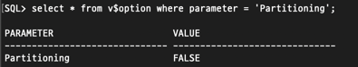

# 이론

> [개발자를 위한 오라클 SQL 튜닝](https://www.hanbit.co.kr/store/books/look.php?p_code=E9267570814) 내용에서 참고한 내용입니다.

## Intro

- 대용량 테이블에 대한 관리 용이성과 성능 향상을 위해서 오라클은 '파티셔닝'이라는 기능을 제공한다.
- 파티셔닝 기술의 등장으로 테이블의 관리와 유지보수가 쉬워졌으며 파티션 단위의 검색을 통해 검색 성능의 극적인 향상이 이루어졌다.
- 여기서는 파티셔닝 기술과 파티셔닝을 통한 SQL문의 튜닝을 정리한다.

### 파티셔닝

- 파티셔닝은 대용량의 큰 테이블을 여러 단위로 나누어 사용하고 관리하는 기법을 말한다.
- 대용량의 데이터를 하나의 테이블로만 관리할 경우 해당 테이블이 사용불능 상태가 되거나 가용 불능 상태가 될 경우 전체 데이터 모두 사용하지 못하는 사태가 발생할 수 있다.
- 대용량 테이블에 파티셔닝 기법을 적용한다면 이러한 사태를 막을 수 있다.

> **파티셔닝의 장점**

- 분할된 단위 영역별로 관리할 수 있으므로 백업과 복구가 쉽다.
- 테이블 내에 특정 파티션에서 문제가 발생했을 때 다른 파티션에 영향을 주지 않는다.
- 테이블 액세스 시 스캔 범위를 줄여 성능 향상을 가져온다.

- [파티션 프루닝 튜닝](_16_1.md)
- [파티션 인덱스 튜닝](_16_2.md)

## 테이블 파티션

- 오라클은 Enterprise 버전만 테이블 파티션 구성이 가능하다.

