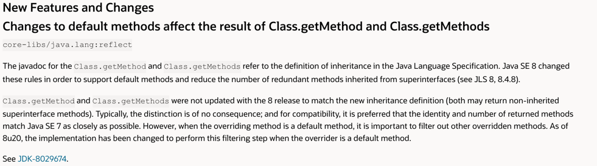

# 자바 8 이상 버전의 인터페이스와 추상클래스

## Intro

- 이펙티브 자바 발표를 하면서 **"추상 클래스를 인터페이스로 대체 할 수 있지 않을까?"** 라는 질문을 받아 정리해본다.

## 자바 8 새로운 기능 및 변경 사항 중

## 추상클래스 vs 인터페이스

- 공통점
	- 추상클래스와 인터페이스는 인스턴스화 하는 것이 불가능하다.
	- 구현부가 있는 메서드와 없는 메서드 모두 가질 수 있다는 점에서 유사하다.

- 차이점
	- 인터페이스의 모든 변수는 기본적으로 `public static final`이며, 모든 메서드는 `public abstract`이다.
	- 추상클래스는 `static 이나 final이 아닌 필드`를 지정할 수 있고, `public, protected, private 메서드`를 가질 수 있다.

	- 인터페이스를 구현하는 클래스는 다른 여러 개의 인터페이스를 함께 구현할 수 있다.
	- 추상클래스를 상속하는 클래스는 다른 클래스를 상속받을 수 없다.

## 추상클래스와 인터페이스의 사용 가능한 상황

- **추상클래스**
	- 관련성이 높은 클래스 간에 코드를 공유하고 싶은 경우
	- 추상 클래스를 상속받은 클래스들이 공통으로 갖는 메서드와 필드가 많거나, public 외에 접근제한자(protected, private)의 사용히 필요한 경우
	- non-static, non-final 필드 선언이 필요한 경우

- **인터페이스**
	- 서로 관련성이 없는 클래스들이 인터페이스를 구현하게 되는 경우
		- `Comparable`, `Cloneable`를 구현하는 클래스들은 서로 관련성이 없어도 상관 없다.
	- 특정 데이터 타입의 행동을 명시하고 싶은데, 어디서 그 행동이 구현되는지 신경쓰지 않는 경우
	- 다중 상속을 허용하고 싶은 경우

- **사용하는 목적**
	- 추상 클래스는 기본적으로 클래스이며 이를 상속, 확장하여 사용하기 위한 것이다.
	- 인터페이스는 해당 인터페이스를 구현한 객체들에 대한 동일한 사용방법과 동작을 보장하기 위한 것이다.

## JDK에서 추상클래스와 인터페이스의 사용 예시

- JDK에서 추상클래스의 대표적인 예시는 Collections 의 AbstractMap이다.
	- HashMap, TreeMap, ConcurrentHashMap의 경우 AbstractMap에 정의되어 있는 get, put, isEmpty, containsKey, containsValue 등의 메서드를 공유한다.

- JDK에서 여러 인터페이스를 구현하는 예시는 HashMap이 있다.
	- Serializable, Cloneable, Map<K, V>를 구현한 클래스이다.
	- 위 인터페이스를 통해 HashMap의 인스턴스는 복제 가능하며, 직렬화가 가능하며, Map의 역할도 할 수 있다.

## 추상클래스를 이용한 템플릿 메서드 디자인 패턴

- 템플릿 메서드 패턴은 슈퍼 클래스에서 알고리즘의 골격을 정의하지만 하위 클래스가 구조를 변경하지 않고 알고리즘의 특정 단계를 재정의 할 수 있도록 구성하는 행동 디자인 패턴이다.
