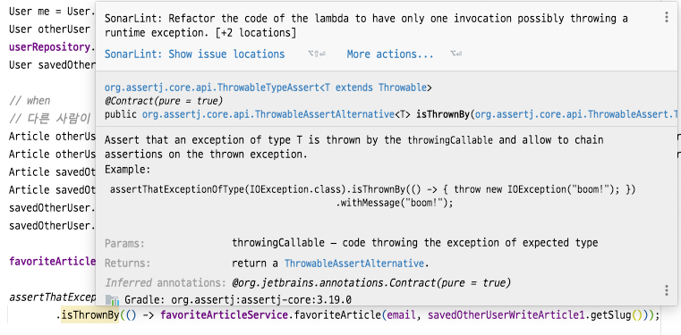

# JUnit SonarLint 

- assertThatExceptionOfType() 메서드를 호출할 때 isThrownBy() 메서드에 예외가 발생할 가능성이 있는 메서드를 작성해 놓으면 원하는 테스트를 할 수 있다.


> **문제 상황**



- 이러한 Warning 표시는 SonarLint 플러그 인에서 해당 코드에 오류가 나진 않지만 코드에 대한 수정을 필요로 하기 때문에 수정하기 위해서 살펴본다.

```java
class FavoriteArticleBusinessServiceTest {
    @DisplayName("사용자의 글 좋아요 중복 예외 테스트")
    @Test
    void when_duplicateFavoriteArticle_expect_fail_exception() {
        assertThatExceptionOfType(DuplicateFavoriteArticleException.class)
                .isThrownBy(() ->
                        // 예외가 발생할 가능성이 있는 메서드        
                        favoriteArticleService.favoriteArticle(email, savedOtherUserWriteArticle1.getSlug()));    
    }
}
```

> **Warning Code Refactoring**

- sonarLint가 해당 코드에서 문제를 제기하는 코드는 `savedOtherUserWriteArticle1.getSlug()`라는 메서드이다.
- isThrownBy() 메서드는 예외가 발생할 만한 코드를 작성하는 것이기 때문에 2개 이상 메서드가 포함되는 경우 `SonarLint`가 테스트 코드가 명확하지 않다라고 판단하는 것이다.
- 그러므로 `savedOtherUserWriteArticle1.getSlug()` 메서드를 위에서 변수를 정의하는 방식으로 리펙토링 하면 **주의(Warning)** 가 사라진다.

```java
class FavoriteArticleBusinessServiceTest {
    void when_duplicateFavoriteArticle_expect_fail_exception() {
        // ...
        assertThatExceptionOfType(DuplicateFavoriteArticleException.class)
                .isThrownBy(() -> favoriteArticleService.favoriteArticle(email,
                        // sonarLint가 주의를 요하는 메서드
                        savedOtherUserWriteArticle1.getSlug()));
    }
}
```

> **수정된 코드**

- 이제 예외가 발생할 만한 메서드는 `favoriteArticleService.favoriteArticle()` 메서드만 남게 된다.

```java
class FavoriteArticleBusinessServiceTest {
    void when_duplicateFavoriteArticle_expect_fail_exception() {
        // 해결된 코드
        String slug = savedOtherUserWriteArticle1.getSlug();
        assertThatExceptionOfType(DuplicateFavoriteArticleException.class)
                .isThrownBy(() -> favoriteArticleService.favoriteArticle(email, slug));
    }
}
```