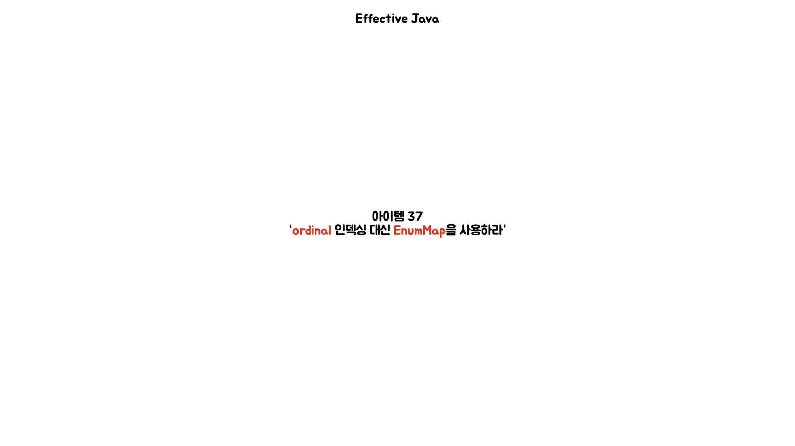
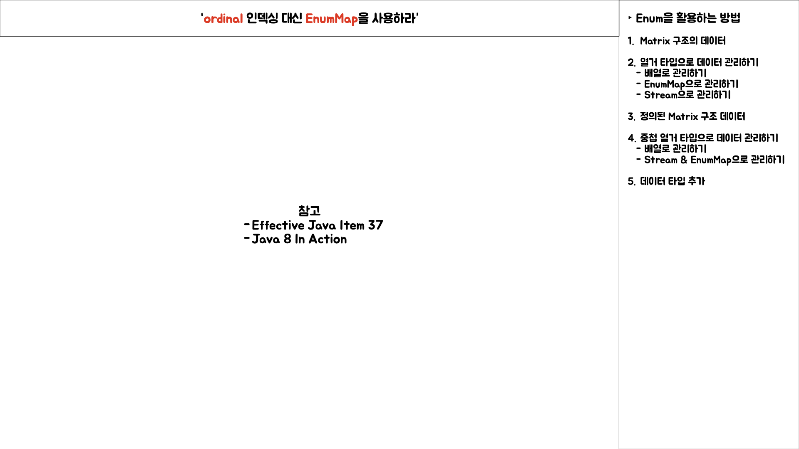
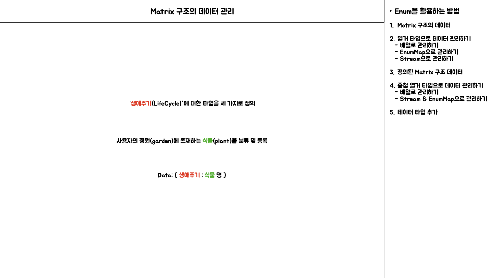
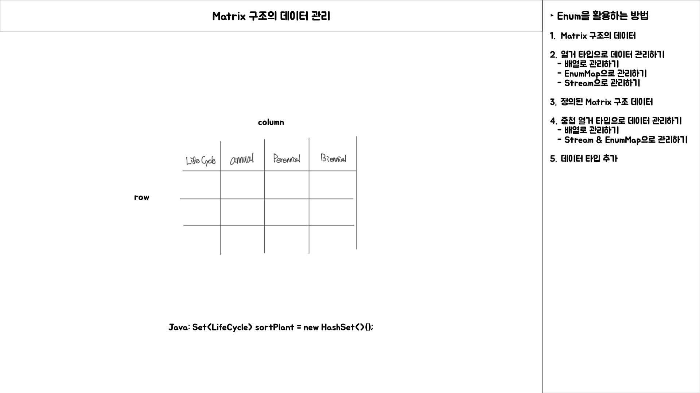
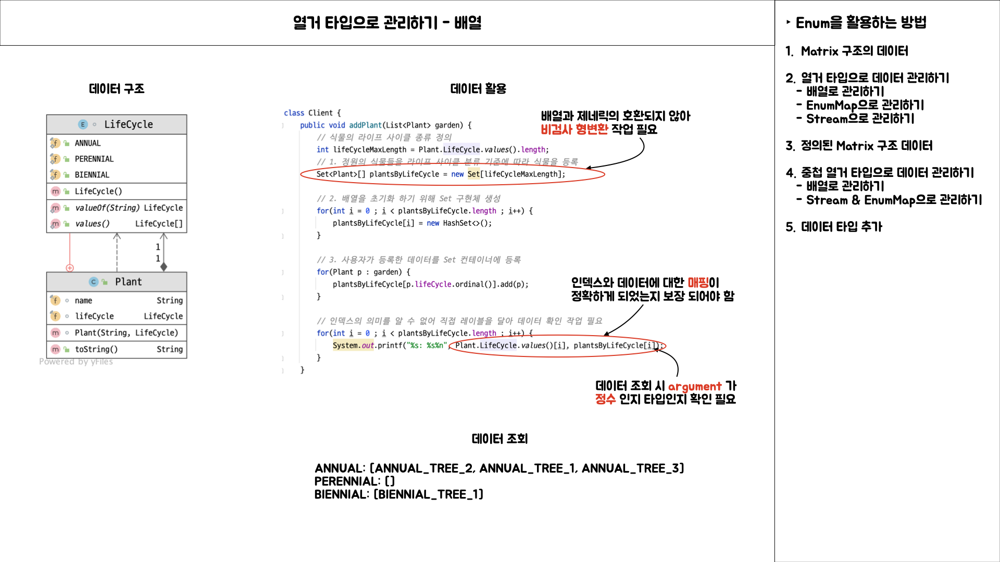
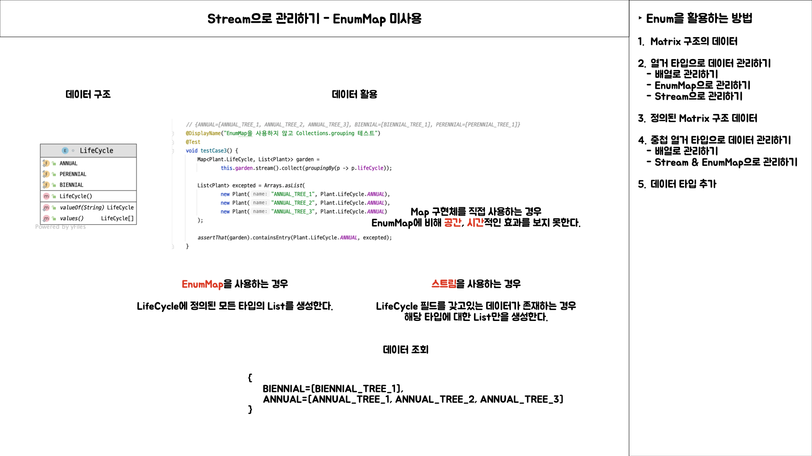
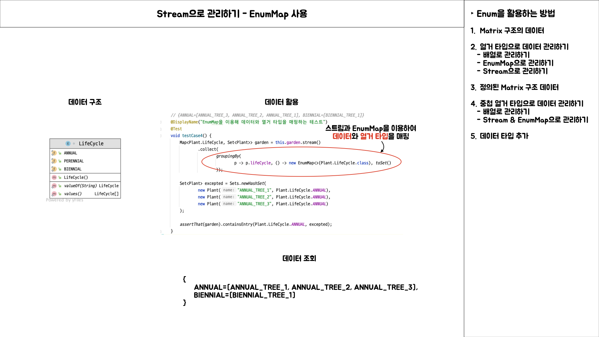
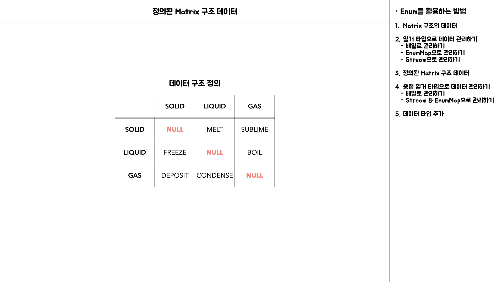

# Item 37 발표 내용

## Intro

## Matrix 구조의 데이터 정의

### 열거 타입으로 관리하기 - 배열

### 열거 타입으로 관리하기 - EnumMap

### Stream으로 관리하기 - EnumMap 미사용

### Stream으로 관리하기 - EnumMap 사용

## 정의된 Matrix 구조 데이터

### 중첩 열거 타입으로 데이터 관리하기 - 배열

### 중첩 열거 타입으로 데이터 관리하기 - Stream & EnumMap

> Stream.groupingBy 조금만 더 상세히

### 중첩 열거 타입에 데이터 추가 시

> 배열 기반

> "이전" "이후" 쌍으로 연결한 타입 기반

## 추가적인 방법

