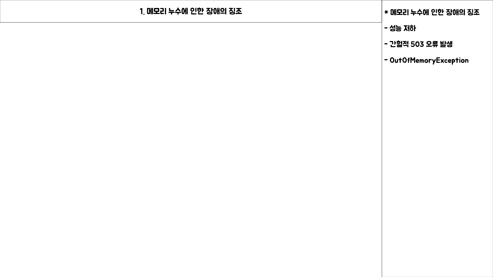
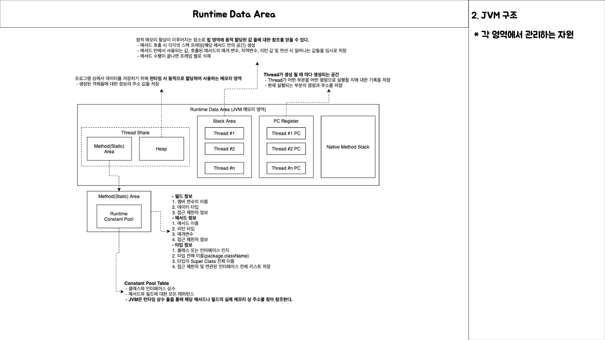
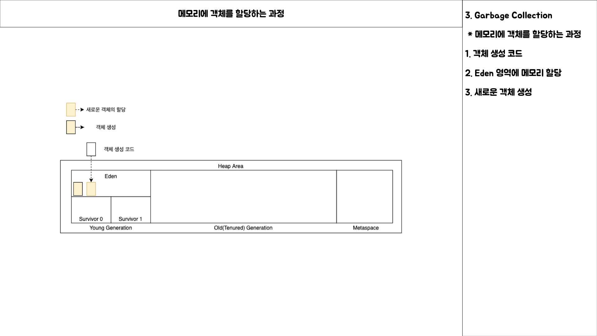
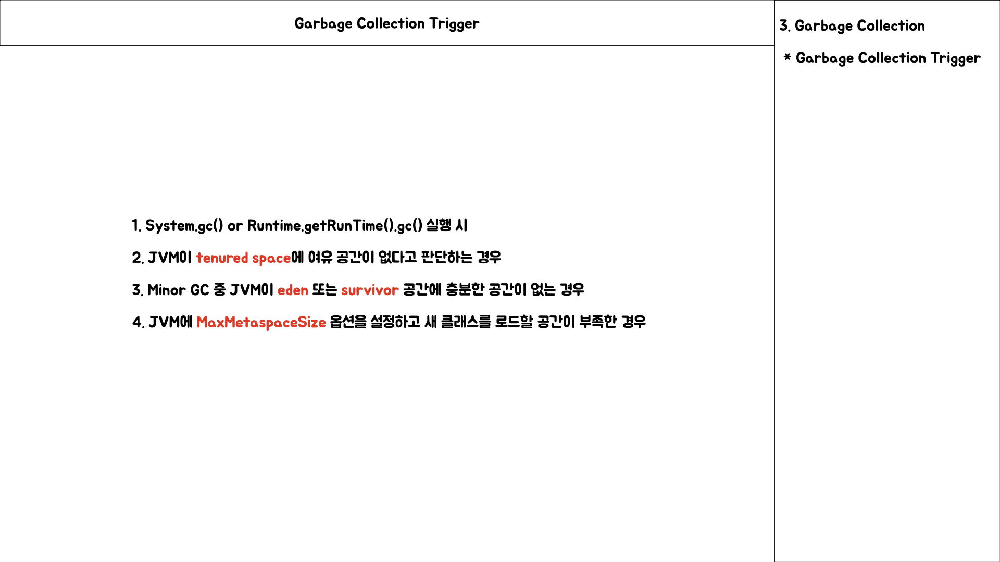
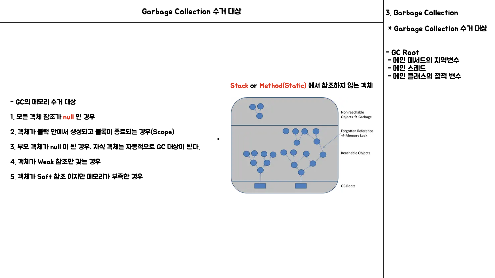
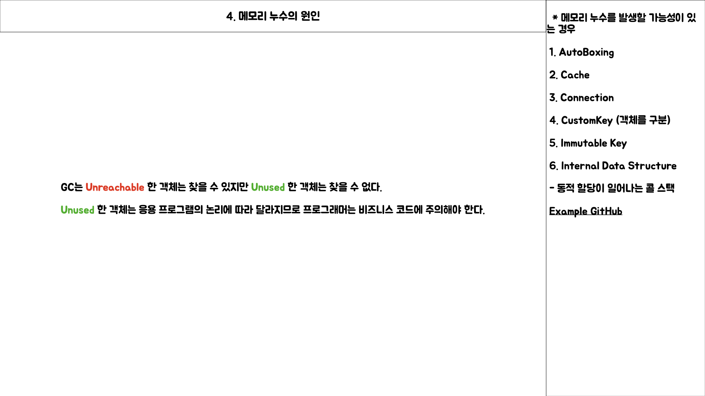
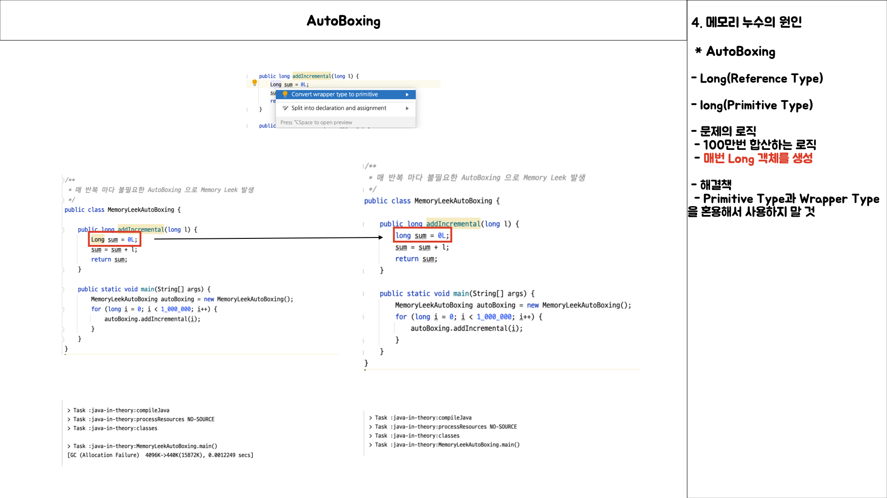
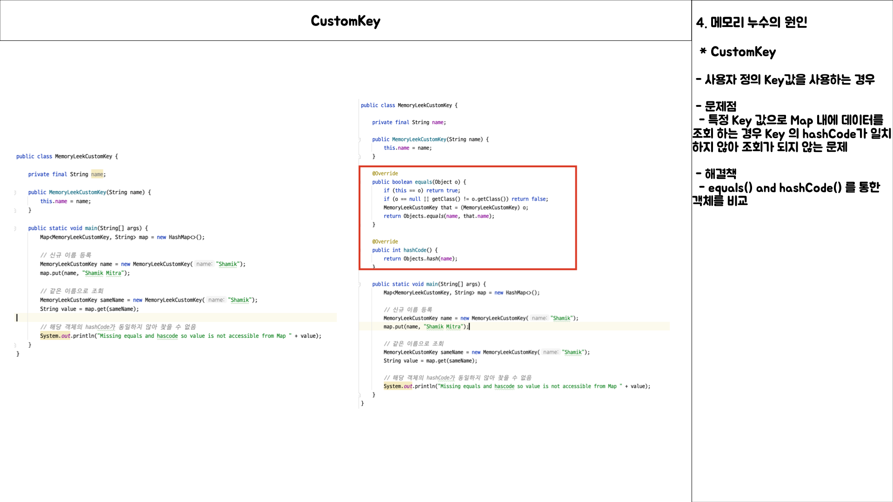
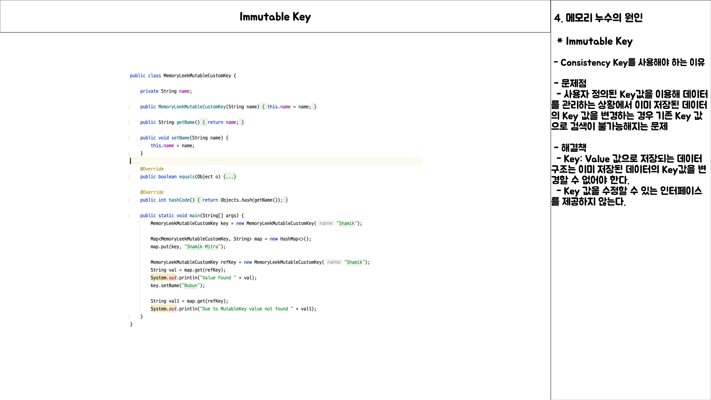
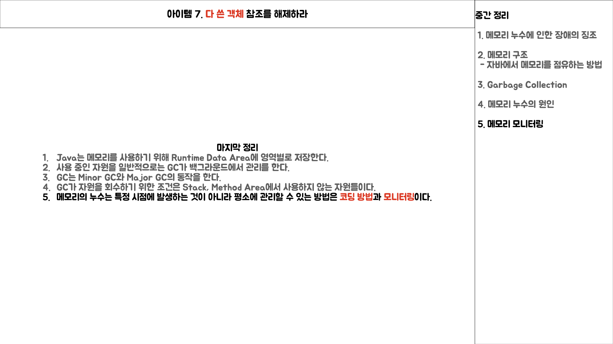

# Item 7 발표 내용

## Intro

* 프로그래밍을 하는 동안 메모리를 할당하고 사용하게 되는데 이와 관련된 키워드를 학습하기
* 학습 키워드
	* 메모리 누수로 인한 장애의 징조
	* 메모리의 구조
	* Garbage Collection
	* 메모리 누수의 원인
	* 메모리 모니터링
	
## 참고 내용

## 메모리 누수로 인한 장애의 징조

* 어떤 자료구조를 사용하는 프로그램을 오래 실행하다 보면 점차 가비지 컬렉션 활동과 메모리 사용량이 늘어나 결국 성능이 저하될 것이다.
* 성능 저하되는 것을 넘어서 디스크 페이징이나 OutOfMemoryError\(OOM\)을 일으켜 예기지 않게 종료될 수 있다.

## Java Virtual Machine

1. Java Source
2. Java Compiler
3. Java Byte Code
4. Class Loader
5. **Runtime Data Area**
6. Garbage Collection
7. Execution Engine

### Runtime Data Area

1. **Method\(Static or Class\) Area**
	* Runtime Constant Pool
2. **Heap Area**
	* Young Generation
	* Old Generation
	* MetaSpace
3. **Stack Area**
4. **PC Register**
5. **Native Method Stack Area**

## Garbage Collection

### Minor GC

### MaxTenuringThreshold

### Major GC

### Garbage Collection Trigger

### Garbage Collection 수거 대상

## 중간 정리

## 메모리 누수의 원인

### 1. AutoBoxing

### 2. Cache

### 3. Connection

### 4. CustomKey

### 5. Immutable Key

### 6. Internal Data Structure

## 마지막 정리

## 메모리 모니터링

