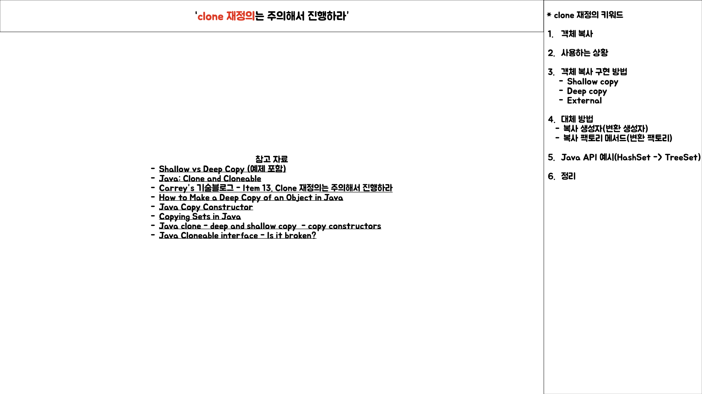
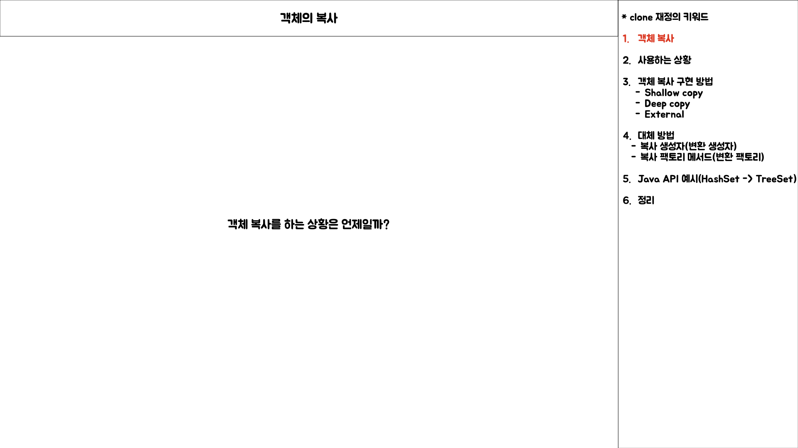
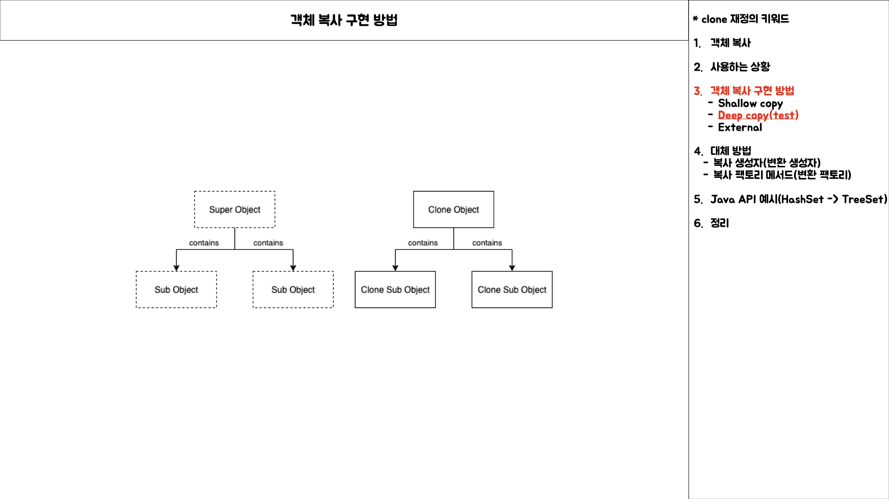
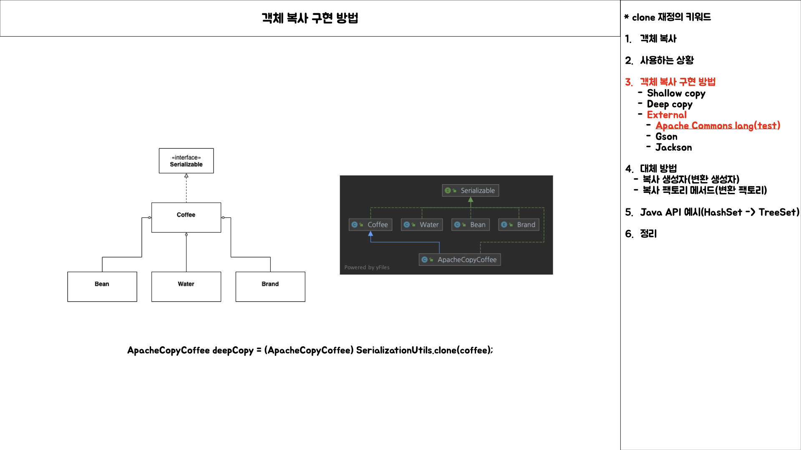
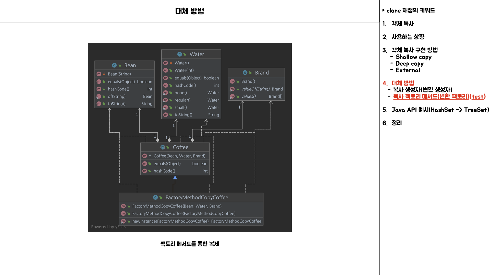
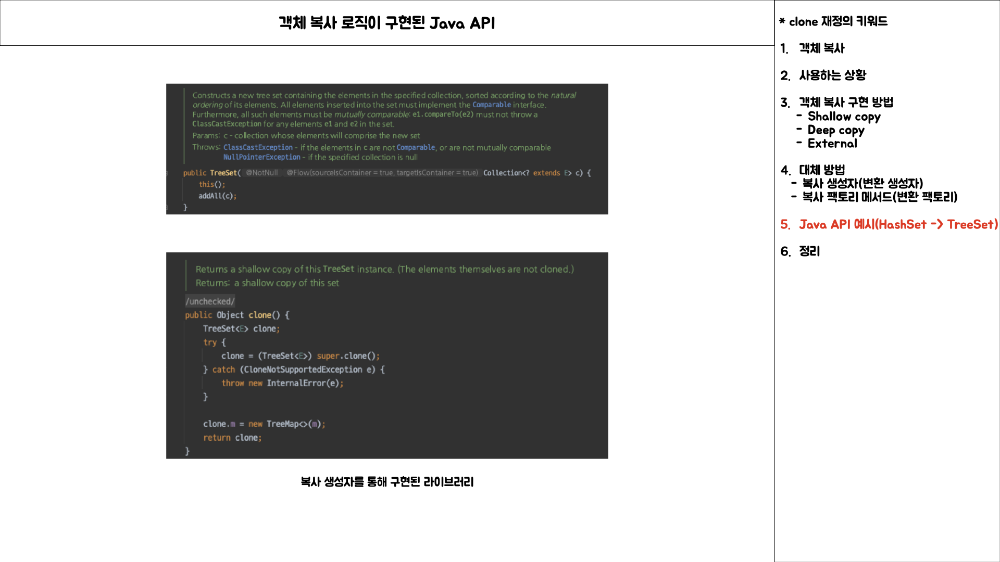
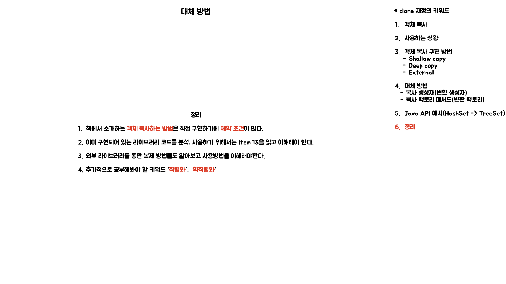

# Item 13 발표 내용

## 객체 복사

## clone 재정의는 주의하여 진행하라

* 참고 자료
	* [Shallow vs Deep Copy \(예제 포함\)](https://programming.guide/shallow-vs-deep-copy.html)
	* [Java: Clone and Cloneable](https://programming.guide/java/clone-and-cloneable.html)
	* [Carrey”s 기술블로그 - Item 13. Clone 재정의는 주의해서 진행하라](https://jaehun2841.github.io/2019/01/13/effective-java-item13/)
	* [How to Make a Deep Copy of an Object in Java](https://www.baeldung.com/java-deep-copy)
	* [Java Copy Constructor](https://www.baeldung.com/java-copy-constructor)
	* [Copying Sets in Java](https://www.baeldung.com/java-copy-sets)
	* [Java clone - deep and shallow copy - copy constructors](https://howtodoinjava.com/java/cloning/a-guide-to-object-cloning-in-java/)
	* [Java Cloneable interface - Is it broken?](https://howtodoinjava.com/java/cloning/cloneable-interface-is-broken-in-java/)

## 객체 복사

* 객체 복사 라는 키워드에 대해서 정확하게 알지 못함

## 객체 복사에 대한 키워드 찾아보기

* Prototype Design Pattern
* 객체 복사 구현 방법
	* Shallow Copy\(얕은 복사\)
		* Immutable Object
		* Mutable Object
	* Deep Copy\(깊은 복사\)
		* External Library\(외부 라이브러리\)
			* Apache Commons Lang
			* Gson
			* Jackson
* clone\(\) 메서드 대체 방법
	* Conversion Constructor
	* Conversion Factory Method

### Shallow Copy

* Immutable Object의 경우
	* [예시 코드](https://github.com/SeokRae/java-in-action/tree/master/java-in-theory/src/main/java/kr/seok/item13/mutable)
	* [테스트 코드](https://github.com/SeokRae/java-in-action/blob/master/java-in-theory/src/test/java/kr/seok/item13/mutable/CoffeeTest.java)
* Mutable Object의 경우
	* Cloneable 인터페이스 구현 후, clone\(\) 메서드 재정의
	* public 접근 제한자 수정
	* 해당 클래스로 반환 타입 수정
	* 검사 예외로 제공되는 것을 비검사 예외로 수정
	* 상위 객체 super.clone\(\)
	* 하위 객체를 상위 객체에 설정
	* [예시 코드](https://github.com/SeokRae/java-in-action/tree/master/java-in-theory/src/main/java/kr/seok/item13/immutable)
	* [테스트 코드](https://github.com/SeokRae/java-in-action/blob/master/java-in-theory/src/test/java/kr/seok/item13/immutable/CoffeeTest.java)

### Deep Copy

* Immutable Object의 경우
	* Shallow Copy의 Immutable Object와 동일
* Mutable Object의 경우
	* Cloneable 인터페이스 구현 후, clone\(\) 메서드 재정의
	* public 접근 제한자 수정
	* 해당 클래스로 반환 타입 수정
	* 검사 예외로 제공되는 것을 비검사 예외로 수정
	* 상위 객체 super.clone\(\)
	* 하위 객체 clone\(\)후 상위 객체에 수정
	* [예시 코드](https://github.com/SeokRae/java-in-action/tree/master/java-in-theory/src/main/java/kr/seok/item13/deep)
	* [테스트 코드](https://github.com/SeokRae/java-in-action/blob/master/java-in-theory/src/test/java/kr/seok/item13/DeepCopyCoffeeTest.java)

> External Library

* Apache Commons Lang
	* 도메인 클래스에 Serializable 인터페이스를 구현이 필수
	* [예시 코드](https://github.com/SeokRae/java-in-action/tree/master/java-in-theory/src/main/java/kr/seok/item13/external/apache)
	* [테스트 코드](https://github.com/SeokRae/java-in-action/blob/master/java-in-theory/src/test/java/kr/seok/item13/external/apache/ApacheCopyCoffeeTest.java)

* Gson
	* 도메인 클래스에 Serializable 인터페이스를 구현할 필요가 없음
	* [예시 코드](https://github.com/SeokRae/java-in-action/tree/master/java-in-theory/src/main/java/kr/seok/item13/external/gson)
	* [테스트 코드](https://github.com/SeokRae/java-in-action/blob/master/java-in-theory/src/test/java/kr/seok/item13/external/gson/GsonCoffeeTest.java)

* Jackson
	* 복제하기 위한 도메인 클래스는 기본 생성자가 필수로 필요
	* 라이브러리가 도메인 클래스의 필드에 접근할 수 있도록 ObjectMapper 설정 필요
	* [예시 코드](https://github.com/SeokRae/java-in-action/tree/master/java-in-theory/src/main/java/kr/seok/item13/external/jackson)
	* [테스트 코드](https://github.com/SeokRae/java-in-action/blob/master/java-in-theory/src/test/java/kr/seok/item13/external/jackson/JacksonCoffeeTest.java)

## 객체 복사 대체 방법

* Conversion Constructor
	* [예시 코드](https://github.com/SeokRae/java-in-action/tree/master/java-in-theory/src/main/java/kr/seok/item13/constructor)
	* [테스트 코드](https://github.com/SeokRae/java-in-action/blob/master/java-in-theory/src/test/java/kr/seok/item13/ConstructorCopyCoffeeTest.java)

* Conversion Factory Method
	* [예시 코드](https://github.com/SeokRae/java-in-action/tree/master/java-in-theory/src/main/java/kr/seok/item13/factory)
	* [테스트 코드](https://github.com/SeokRae/java-in-action/blob/master/java-in-theory/src/test/java/kr/seok/item13/factory/FactoryMethodCopyCoffeeTest.java)

## 객체 복사를 사용하는 Java API

## 정리

