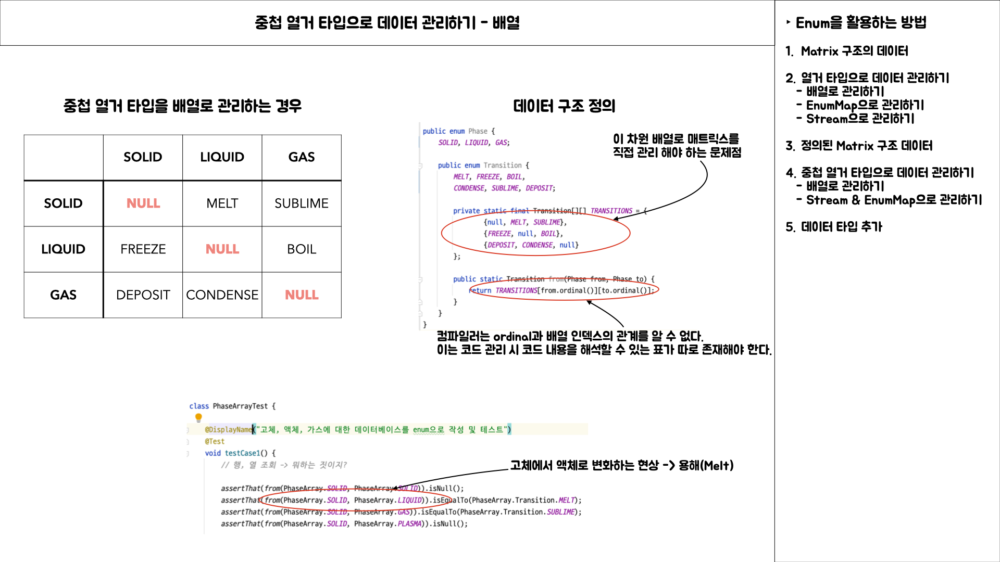
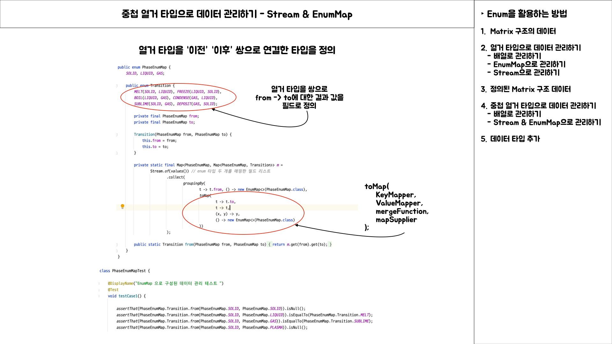
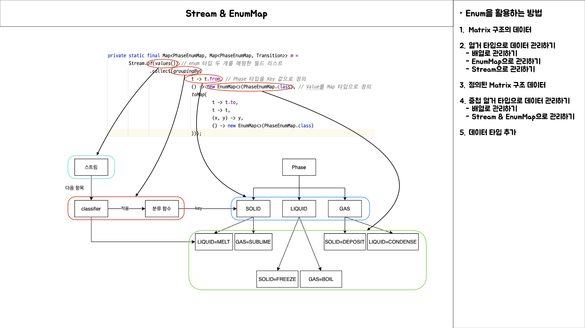
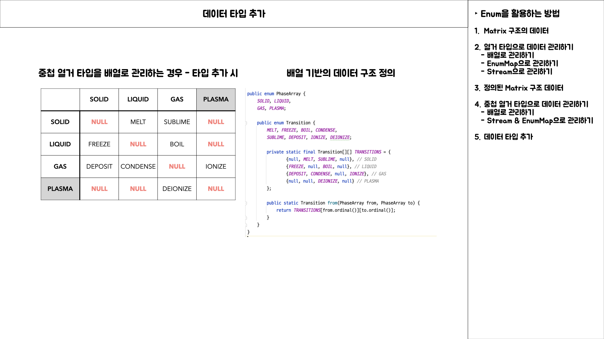
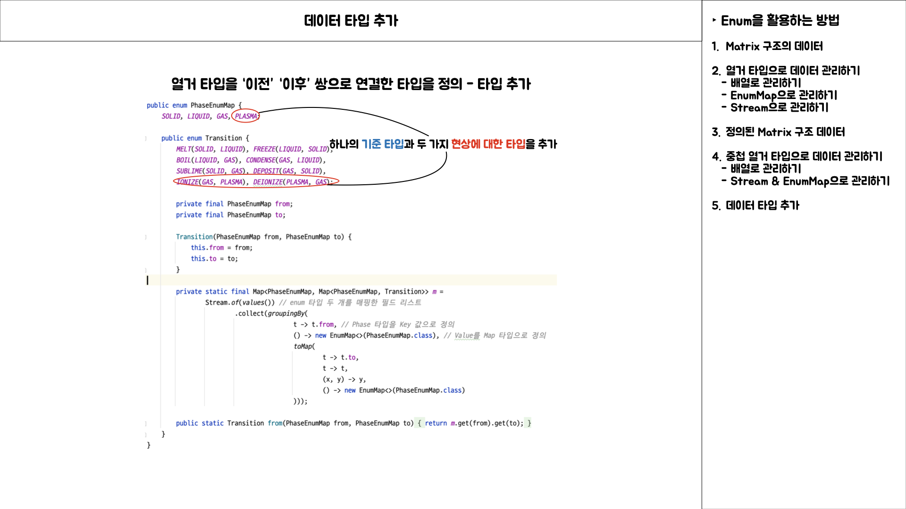
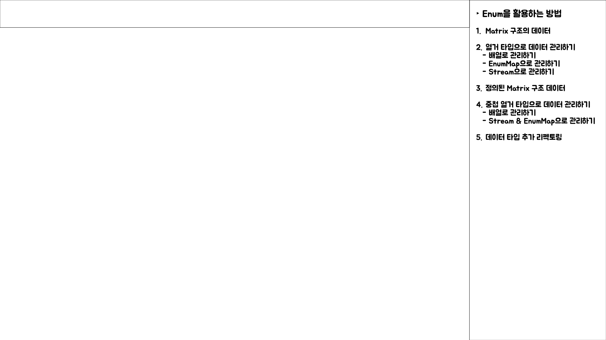

# Item 37 발표 내용

## Intro

## Matrix 구조의 데이터 정의

### 열거 타입으로 관리하기 - 배열

### 열거 타입으로 관리하기 - EnumMap

### Stream으로 관리하기 - EnumMap 미사용

### Stream으로 관리하기 - EnumMap 사용

### 정리

- 배열을 사용하여 enum 데이터를 제공하는 경우
	- 서로 호환되지 않는 배열과 제네릭을 함께 사용하므로써 비검사 형변환 작업이 필요
	- 인덱스로 데이터에 대한 의미를 알 수 없으므로 데이터가 보장되지 않음
	- 데이터 조회 시 인수가 정수 값인지 보장할 수 없음

- EnumMap를 활용하여 enum 데이터를 제공하는 경우
	- 장점
		- 결과 값 조회할 때 인덱스를 계산하는 과정에서 이슈가 발생할 가능성이 없음
		- 데이터의 key 값으로 열거 타입 자체에서 문자열로 제공하여 따로 조회할 필요가 없음
		- Map과 배열로 구현된 EnumMap 생성 시 enum 필드 길이로 생성하므로 시간, 공간적인 성능면에서 효과를 볼 수 있다.

	- 단점
		- Stream를 단일로 사용하는 경우와 비교하면 데이터가 없음에도 정의된 필드에 대한 컬렉션을 모두 생성하게 되는 문제

- Stream을 활용하여 데이터 소스와 enum을 조합하는 경우
	- 단점
		- Map 구현체를 직접 사용하게 되므로써 EnumMap에 비해 공간, 시간적인 성능에서 효율적이지 못하다.

	- 장점
		- 데이터 소스에 enum 필드을 포함하고 있는 데이터가 있는 경우에만 enum 필드를 키 값으로 갖는 컨테이너를 생성한다.

- Stream과 EnumMap을 복합적으로 사용하는 경우
	- Stream과 데이터 소스를 조합하여 존재하는 데이터에 한해서 타입 별 컨테이너를 생성
	- EnumMap을 통해 시간, 공간적인 성능을 보장

## 정의된 Matrix 구조 데이터

### 중첩 열거 타입으로 데이터 관리하기 - 배열

### 중첩 열거 타입으로 데이터 관리하기 - Stream & EnumMap

> Stream.groupingBy 조금만 더 상세히

### 중첩 열거 타입에 데이터 추가 시

> 배열 기반

> "이전" "이후" 쌍으로 연결한 타입 기반

## 추가적인 방법

