# Item 43

## Intro

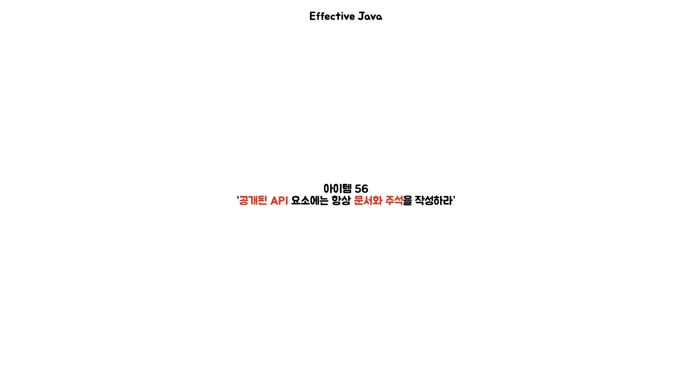

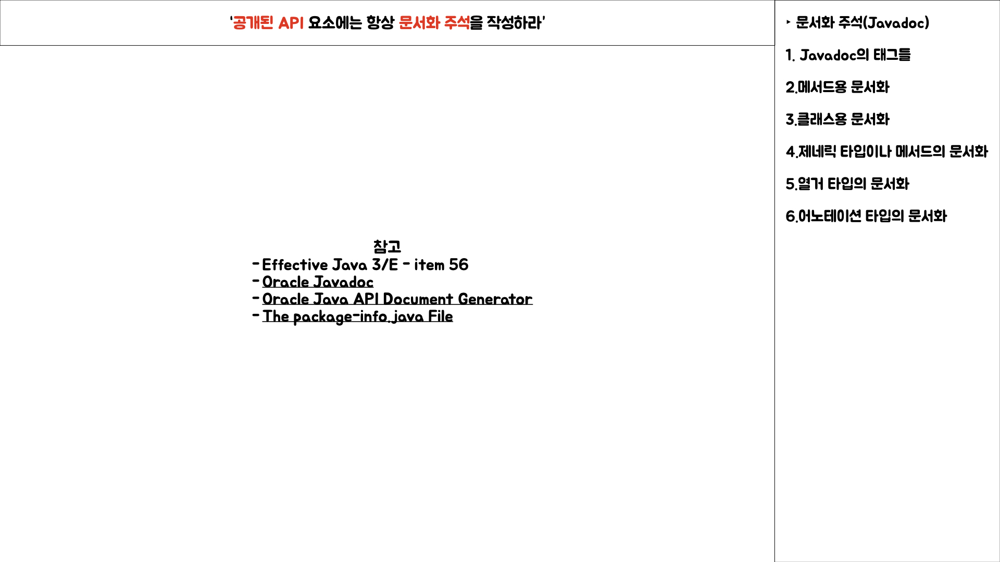

## 키워드 그래프

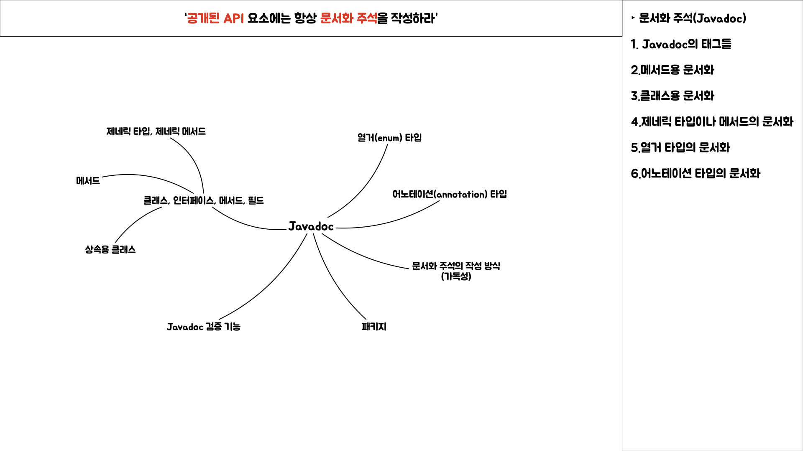

## Javadoc 태그들

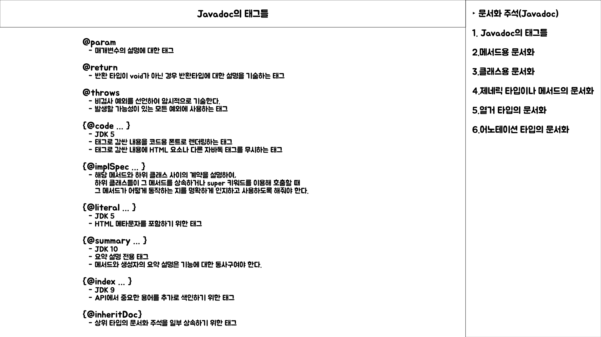

## 클래스, 메서드 Javadoc 작성시 주의사항

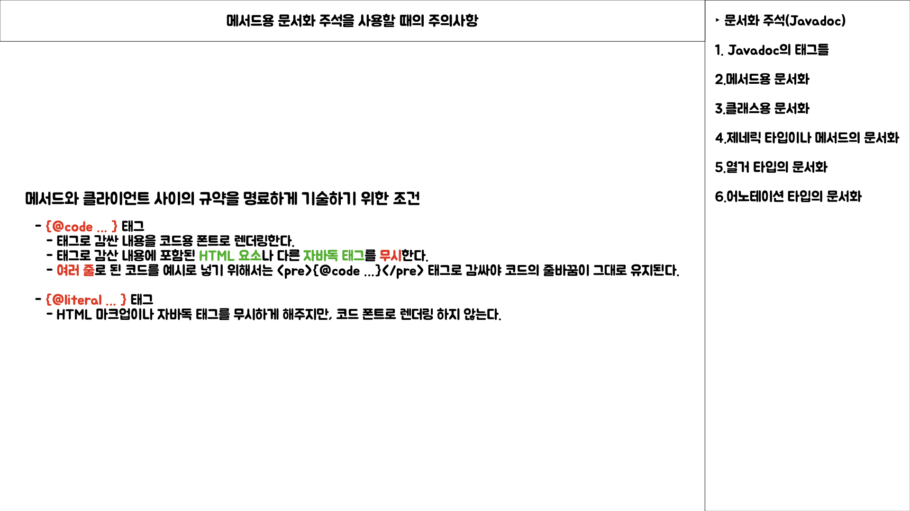

## 상속용 클래스에 Javadoc 작성시 주의사항

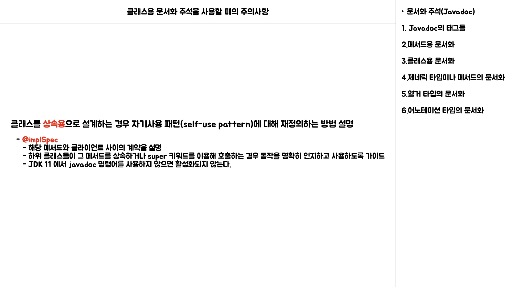

## Javadoc 표준 규격과 가독성

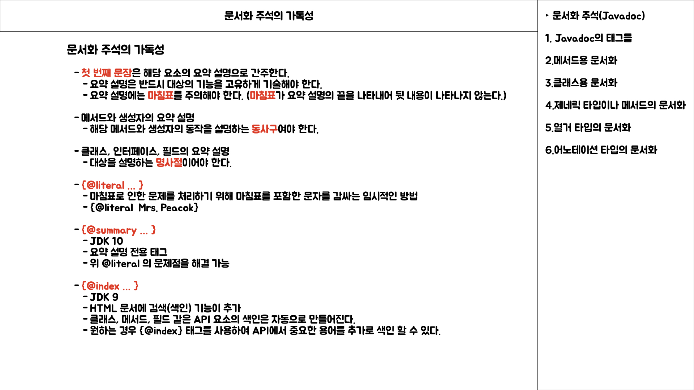

## 제네릭 타입, 제네릭 메서드에 Javadoc 작성 시 주의사항

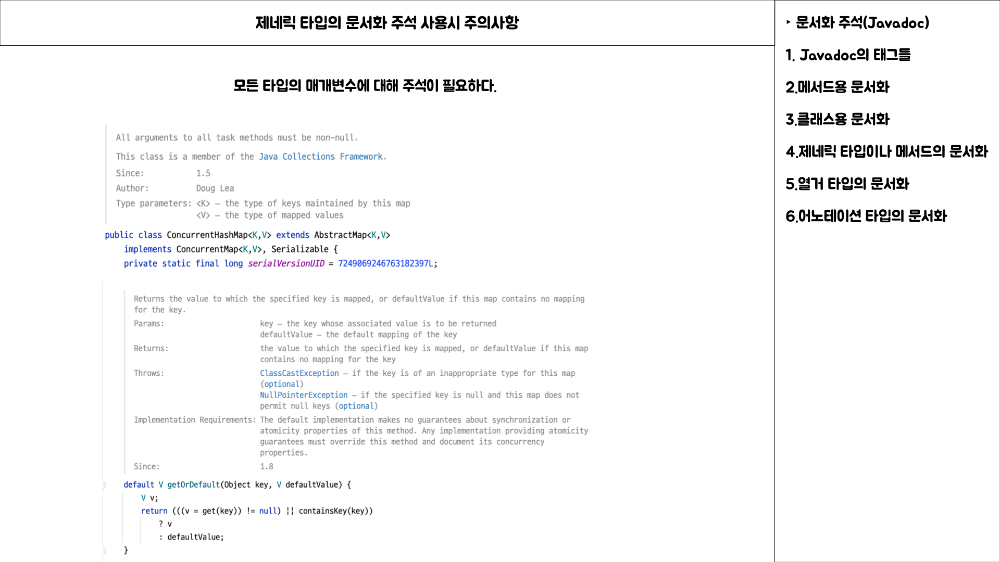

## 열거 타입에 Javadoc 작성 시 주의사항

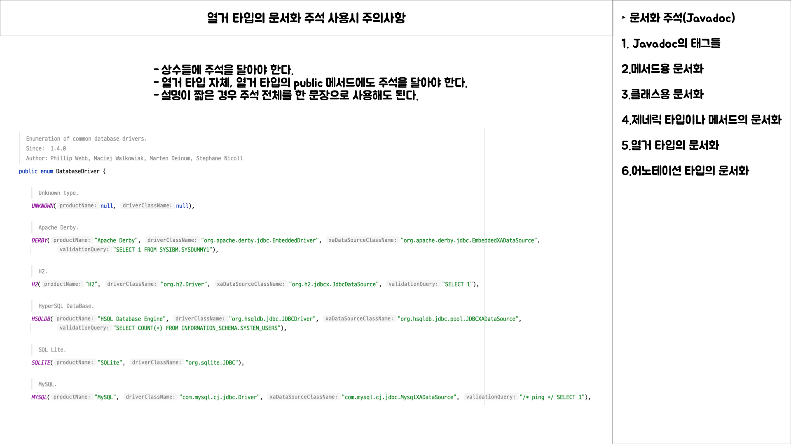

## 어노테이션 타입에 Javadoc 작성 시 주의사항

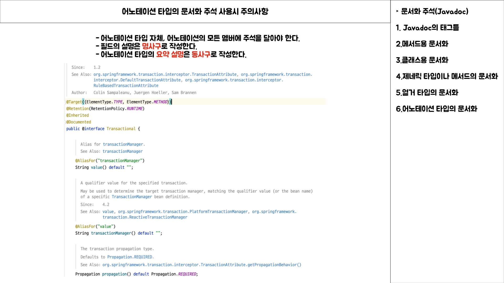

## 그외에 주의사항

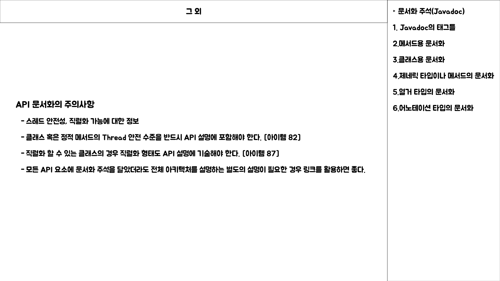

## 정리

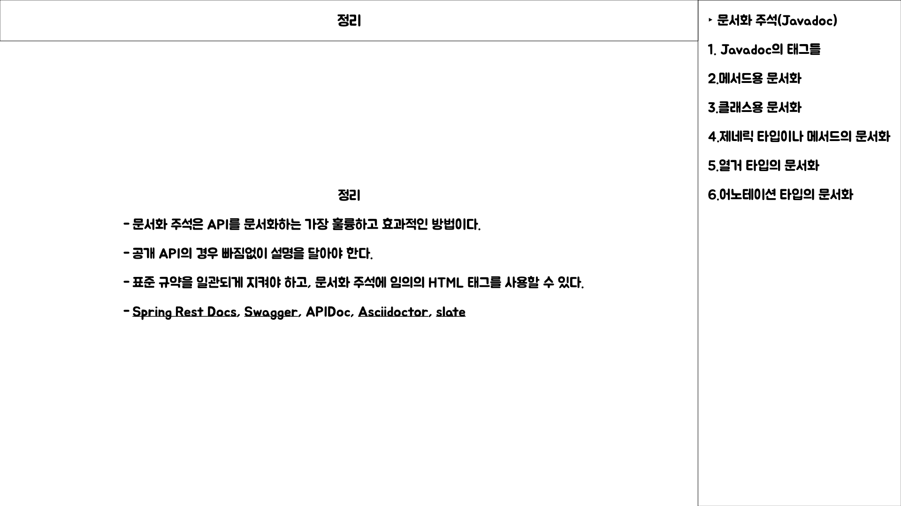
