# Item 62

## Intro

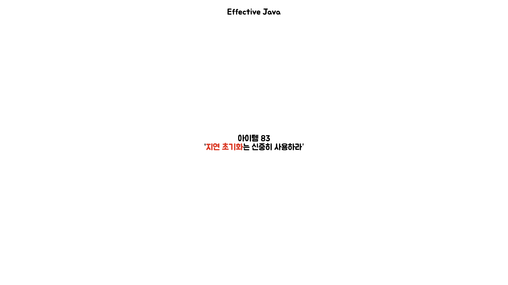

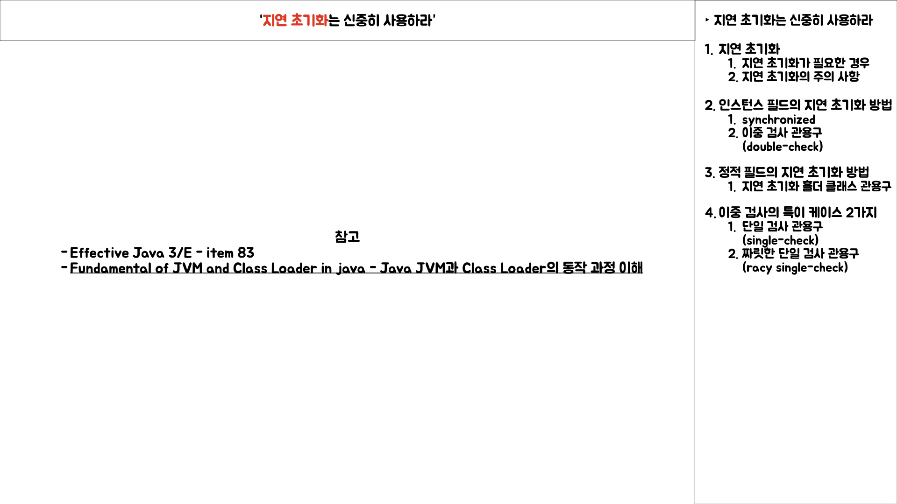

## 목차

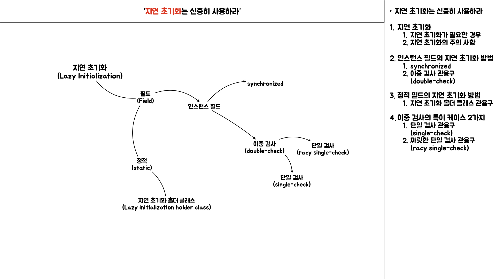

## 1. 지연 초기화

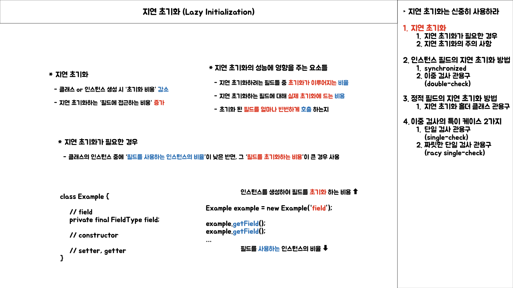

## 2. 인스턴스 필드의 지연 초기화 기법

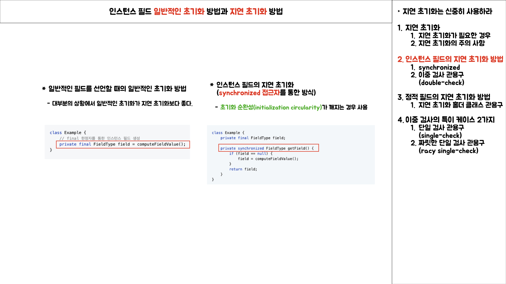

> **이중 검사 관용구(double-check)**

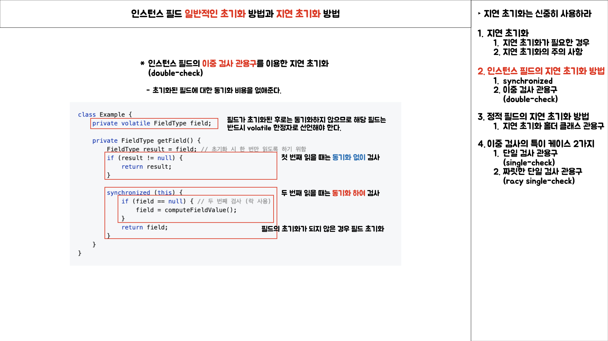

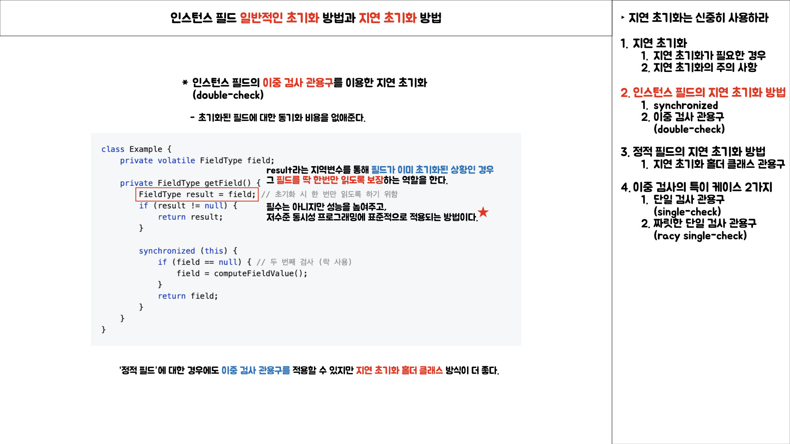

## 3. 정적 필드의 지연 초기화 기법

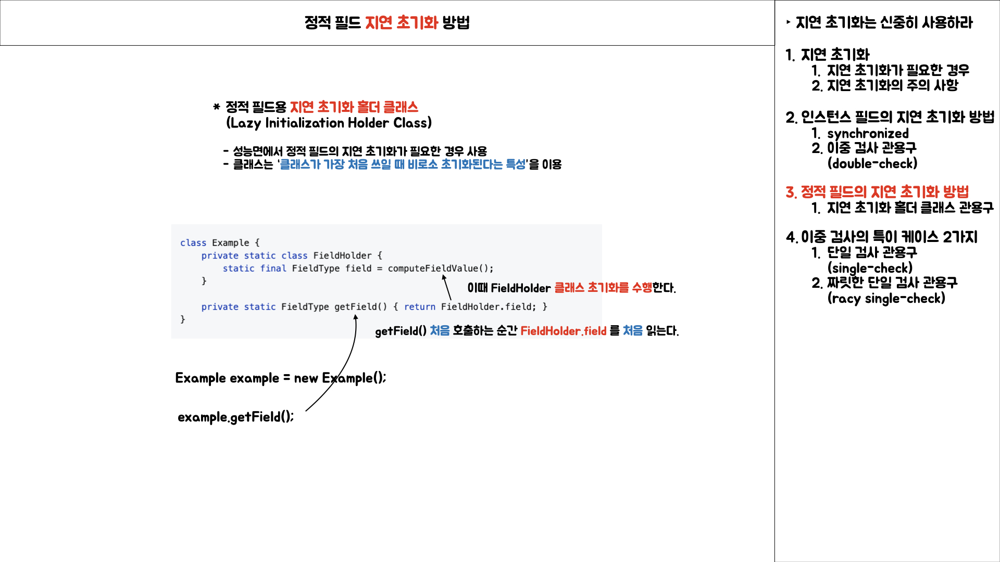

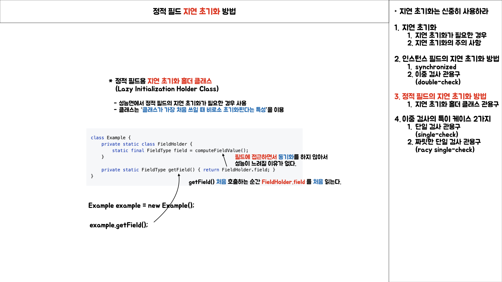

> **성능이 떨어질 이유가 없다의 의미**

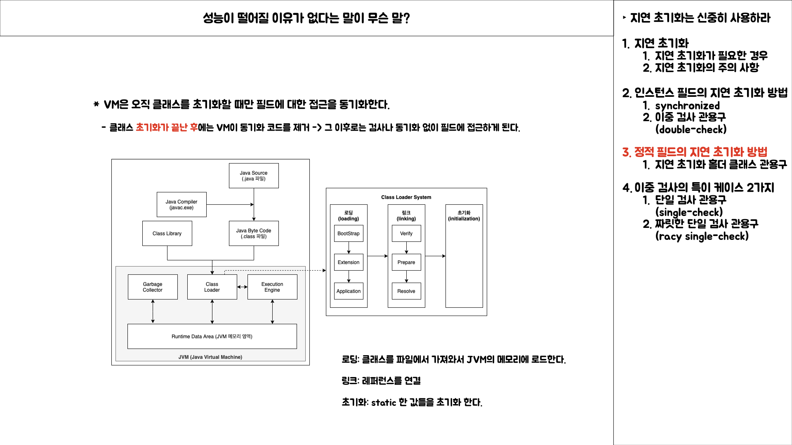

## 4. 이중 검사의 2가지 특이 케이스 

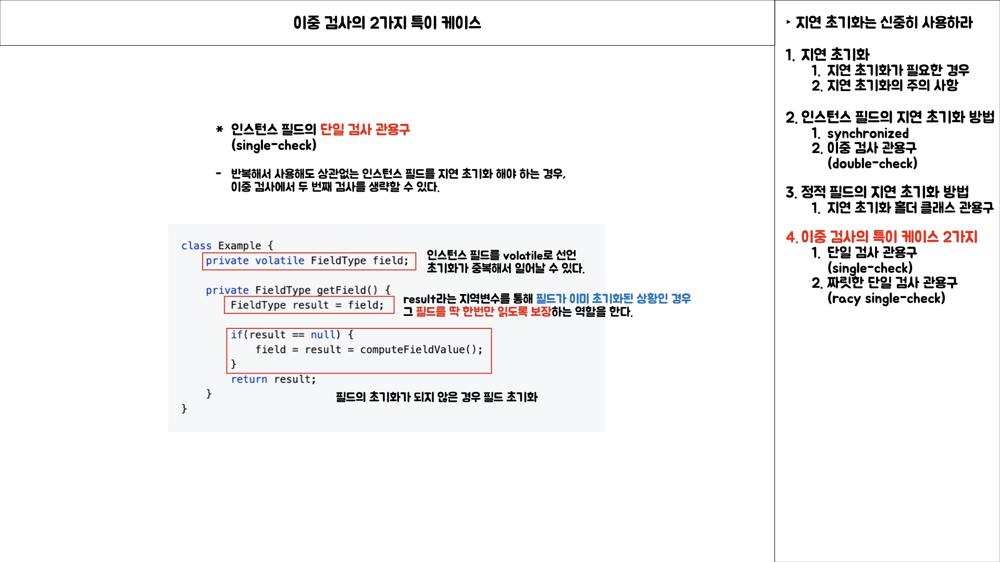

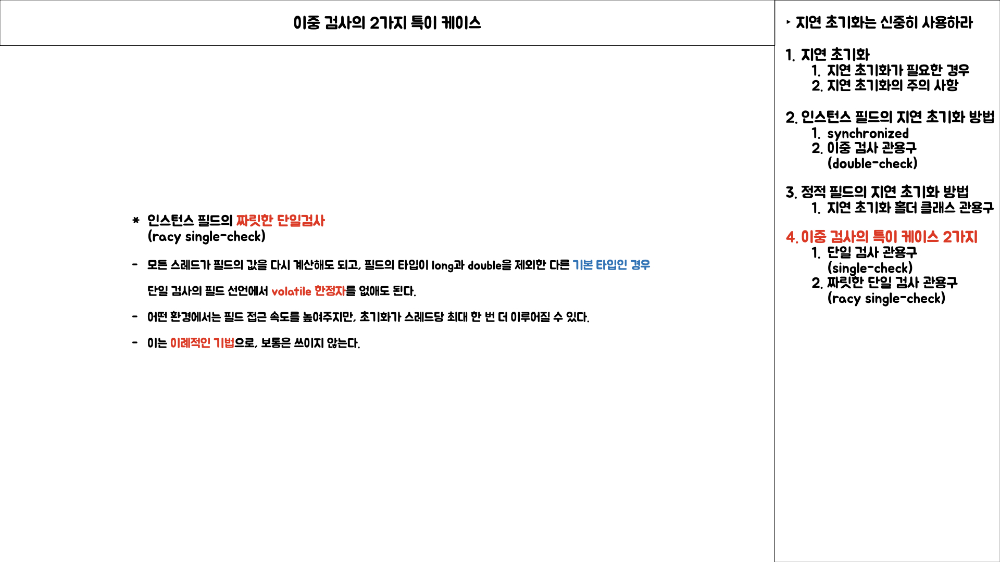

## 정리

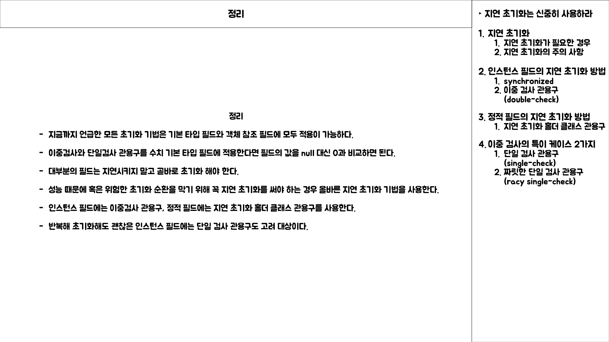
