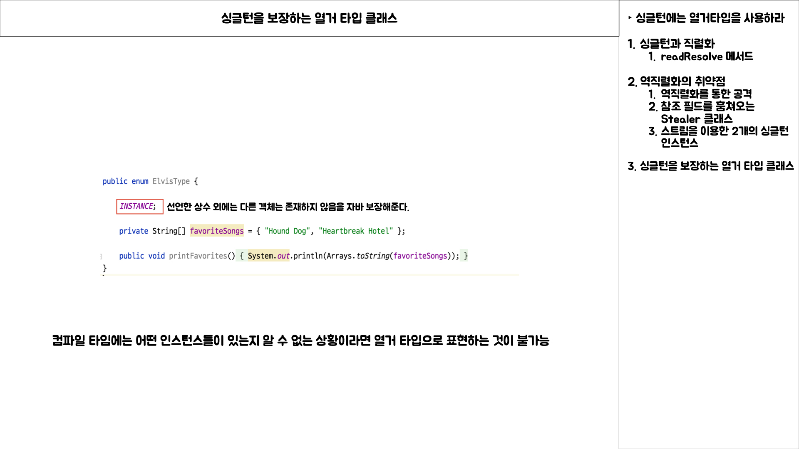

# Item 89

## Intro

## 싱글턴 상기시키기

> **싱글턴**

- 인스턴스를 오직 하나만 생성하도록 하는 방법
- 하나의 인스턴스를 갖기 때문에 상태 값을 갖지 않는 무상태 객체 또는 프로젝트 설계상 유일한 인스턴스로 컴포넌트 역할을 하는 클래스가 적당하다.

> **싱글턴을 만드는 세 가지 방법**

1. 생성자의 `접근 제한자`를 **private**으로 설정하여 외부에서 객체를 생성하지 못하도록 하고, `인스턴스에 접근하는 메서드`를 **public static final**로 제공하는 방법  
2. 위와 동일하게 `생성자의 접근 제한자`를 **private**으로 설정, `외부에서 접근하는 방식`을 **정적 팩토리 메서드**를 public static 멤버로 제공
3. 원소가 하나인 **열거 타입**을 선언

> **싱글턴을 직렬화하는 방법**

- Serializable 구현하는 것만 으로는 **싱글턴 직렬화**를 유지할 수 없다.
- 모든 인스턴스 필드를 일시적(transient)라고 선언 후, readResolve 메서드를 제공해야 한다.

## readResolve() 가 동작하는 방식

### 싱글턴 직렬화

- 객체의 **싱글턴 직렬화** 하기 위해 순차적으로 적용해본다.

> **싱글턴 클래스** 

- 해당 클래스는 데이터를 갖고 있지 않아 직렬화 형태를 제공할 필요가 없다.

> **Serializable 구현한 싱글턴 클래스**

- 해당 클래스는 Serializable 인터페이스를 구현하였지만 의도한 대로 싱글턴 직렬화를 기대할 수 없다.
- `favoriteSongs`라는 데이터를 갖는 필드가 존재하기 때문에 `모든 인스턴스 필드`를 **transient**로 선언해야할 필요가 있다.
- readResolve를 인스턴스 통제 목적으로 사용하는 경우, `객체 참조 타입 인스턴스 필드`는 모두 **transient**를 선언해야 한다. 

> **Serializable 구현 및 readResolve 메서드를 제공하는 싱글턴 클래스**

- `Serializable 인터페이스`를 **구현**하고, `readResolve()` 메서드를 제공하여 **싱글턴 직렬화**를 기대할 수 있다.
- **readResolve()** 는 기존에 인스턴스가 존재하는 경우, 기존의 인스턴스를 반환하고 `역직렬화한 객체`는 **무시**한다.
- 그러나 아직 `favoriteSongs` 필드에 대한 **transient** 처리가 되지 않았기 때문에 **역직렬화 시 공격에는 취약한 상태**이다.

### 역직렬화의 취약점

> 역직렬화를 통한 공격

> Stealer 클래스

### 싱글턴을 보장하는 열거 타입 클래스

## 정리

