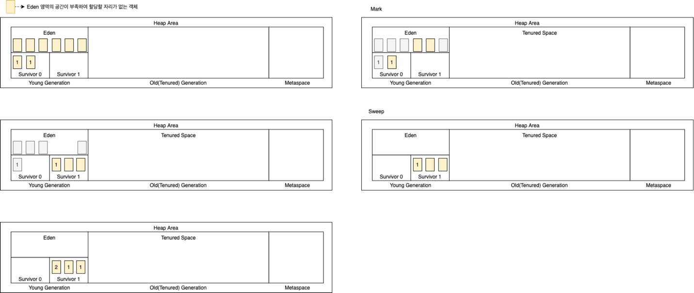
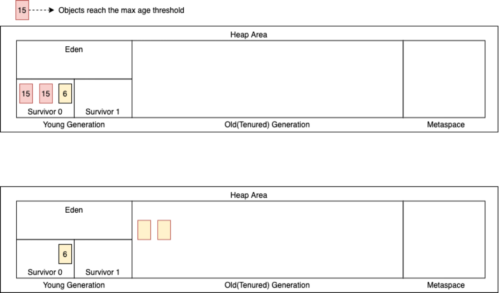
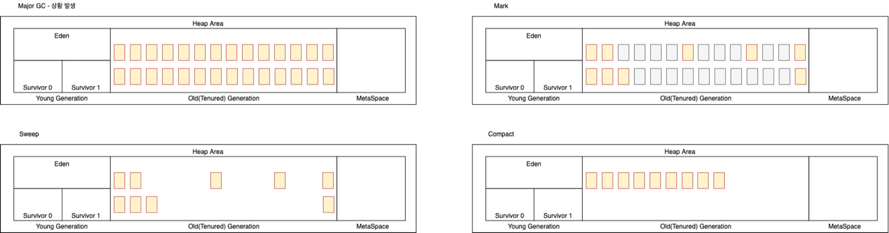

# Item 7

* 객체지향 언어의 메모리 관리에 대한 이야기

## Intro

* 프로그래밍을 하는 동안 메모리를 할당하고 사용하게 되는데 이와 관련된 키워드를 학습하기
* 학습 키워드
	* 메모리 누수로 인한 장애의 징조
	* 메모리의 구조
	* Garbage Collection
	* 메모리 누수의 원인
	* 메모리 모니터링

### 메모리 누수로 인한 장애의 징조

* 어떤 자료구조를 사용하는 프로그램을 오래 실행하다 보면 점차 가비지 컬렉션 활동과 메모리 사용량이 늘어나 결국 성능이 저하될 것이다.
* 성능 저하되는 것을 넘어서 디스크 페이징이나 OutOfMemoryError\(OOM\)을 일으켜 예기지 않게 종료될 수 있다.

### 메모리 구조


1. Java Source
2. Java Compiler
3. Java Byte Code
4. Class Loader
5. **Runtime Data Area**
6. Garbage Collection
7. Execution Engine

### Runtime Data Area


1. **Method\(Static or Class\) Area**
	* Runtime Constant Pool
2. **Heap Area**
	* Young Generation
	* Old Generation
	* MetaSpace
3. **Stack Area**
4. **PC Register**
5. **Native Method Stack Area**

### Garbage Collection

> **1. Minor GC**


* Eden 영역에 메모리 할당


* Minor GC 동작 트리거


* **Mark** 작업
	* **Reachable or Unreachable** 한 상태의 객체를 확인
	* **Reachable** 한 객체를 **Survivor0 영역**으로 이동


* **Unreachable** 객체를 GC를 통해 메모리를 수거
* **Survivor0**에 저장된 메모리 age 증가



* **정리**
* eden 영역 공간 부족
* **mark** 작업을 통해 **Reachable** 한 객체를 선별
* **Unreachable** 한 객체의 메모리를 수거
* 선별된 객체를 **survivor1** 영역으로 이동
* 이동한 객체 메모리의 aging 처리



* Max age threshold에 도달한 메모리는 **`Old Generation`**으로 이동

> **2. Major GC**



1. **Old Generation** 영역의 메모리가 부족한 경우 **Major GC** 발생
2. **Mark**ng 작업을 통한 구분
	* **Reachable or Unreachable**
3. **Sweep** 작업을 통한 Unreachable 한 객체들의 메모리 수거
4. **Compact** 작업을 통한 메모리 조각 모음

> **Garbage Collection Trigger**

1. System.gc\(\) or Runtime.getRunTime\(\).gc\(\) 실행 시
2. JVM이 tenured space에 여유 공간이 없다고 판단하는 경우
3. Minor GC 중 JVM이 eden 또는 survivor 공간에 충분한 공간을 회수할 수 없는 경우
4. JVM에 MaxMetaspaceSize 옵션을 설정하고 새 클래스를 로드할 공간이 부족한 경우

> **Garbage Collection 수거 대상**

* GC의 메모리 수거 대상
* 모든 객체 참조가 null 인 경우
* 객체가 블럭 안에서 생성되고 블록이 종료되는 경우\(Scope\)
* 부모 객체가 null 이 된 경우, 자식 객체는 자동적으로 GC 대상이 된다.
* 객체가 Weak 참조만 갖는 경우
* 객체가 Soft 참조 이지만 메모리가 부족한 경우
* **Stack or Method\(Static\)** 에서 참조하지 않는 객체

### 중간 정리

1. **Java는 메모리를 사용하기 위해 Runtime Data Area에 영역별로 저장한다.**
2. **사용 중인 자원을 일반적으로는 GC가 백그라운드에서 관리를 한다.**
3. **GC는 Minor GC와 Major GC의 동작을 한다.**
4. **GC가 자원을 회수하기 위한 조건은 Stack, Method Area에서 사용하지 않는 자원들이다.**

### 메모리 누수의 원인

> GC는 Unreachable 한 객체는 찾을 수 있지만 Unused 한 객체는 찾을 수 없다. Unused 한 객체는 응용 프로그램의 논리에 따라 달라지므로 프로그래머는 비즈니스 코드에 주의해야 한다.

* 메모리 누수를 발생할 가능성이 있는 경우
* AutoBoxing
* Cache
* Connection
* CustomKey \(객체를 구분\)
* Immutable Key
* Internal Data Structure
* 동적 할당이 일어나는 콜 스택

### 마무리 정리

1. Java는 메모리를 사용하기 위해 Runtime Data Area에 영역별로 저장한다.
2. 사용 중인 자원을 일반적으로는 GC가 백그라운드에서 관리를 한다.
3. GC는 Minor GC와 Major GC의 동작을 한다.
4. GC가 자원을 회수하기 위한 조건은 Stack, Method Area에서 사용하지 않는 자원들이다.
5. **메모리의 누수는 특정 시점에 발생하는 것이 아니라 평소에 관리할 수 있는 방법은 코딩 방법과 모니터링이다.**

### 메모리 모니터링

* jstat

	* jstat 실행 방법

  ```text
  # 실행 프로세스 PID 확인
  ps - ef | grep java

  # Jstat 명령 수행
  jstat -gcutil {PID} 3s
  ```

	* [Oracle jstat Options](https://docs.oracle.com/javase/8/docs/technotes/tools/unix/jstat.html)

  | gcutil 옵션 | 설명 |
                    | :---: | :--- |
  | S0 | Survivor space 0 utilization as a percentage of the space's current capacity. |
  | S1 | Survivor space 1 utilization as a percentage of the space's current capacity. |
  | E | Eden space utilization as a percentage of the space's current capacity. |
  | O | Old space utilization as a percentage of the space's current capacity. |
  | M | Metaspace utilization as a percentage of the space's current capacity. |
  | CCS | Compressed class space utilization as a percentage. |
  | YGC | Number of young generation GC events. |
  | YGCT | Young generation garbage collection time. |
  | FGC | Number of full GC events. |
  | FGCT | Full garbage collection time. |
  | CGC | The number of concurrent GCs. |
  | CGCT | Time spent on concurrent GCs. |
  | GCT | Total garbage collection time. |

	* jstat plot 확인 사이트 [Link](http://nix-on.blogspot.com/2015/01/java-jstat-how-to-visualize-garbage.html)

## 참고

* [정리](https://github.com/SeokRae/TIL/tree/768bdbfead3ed7c6d77a8e8a0f5229093ab187b5/java/contents/effactive/item7/item7.pdf)
* [Baeldung - Java Memory Leaks in Java](https://www.baeldung.com/java-memory-leaks)
* \[Baeldung - Stack Memory and Heap Space in
  Java\]\([https://www.baeldung.com/java-stack-heap\#:~:text=Stack Memory in Java is,%2DOut \(LIFO\) order](https://www.baeldung.com/java-stack-heap#:~:text=Stack%20Memory%20in%20Java%20is,%2DOut%20%28LIFO%29%20order).\)
* [Understanding the Java Memory Model and Garbage Collection](https://dzone.com/articles/understanding-the-java-memory-model-and-the-garbag#:~:text=There%20is%20a%20JVM%20level,%E2%80%9Cstop%20the%20world%E2%80%9D%20process.)
* [마로의 Java\(자바\) 정리 - 8. 자바 메모리 구조](https://hoonmaro.tistory.com/19)
* [JVM\(Java Virtual Machine\)이란](https://honbabzone.com/java/java-jvm/)
* [Memory Leaks and Java Code](https://dzone.com/articles/memory-leak-andjava-code)
* [Demystifying memory management in modern programming languages](https://deepu.tech/memory-management-in-programming/)
* [Visualizing memory management in JVM\(Java, Kotlin, Scala, Groovy, Clojure\)](https://deepu.tech/memory-management-in-jvm/)
* [우아한 형제들 - 도움이 될 수도 있는 JVM memory leak 이야기](https://woowabros.github.io/tools/2019/05/24/jvm_memory_leak.html)
