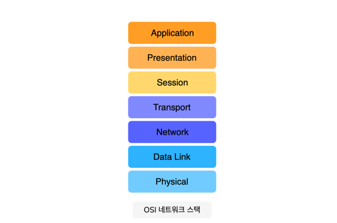

# The Open Systems Interconnection (OSI) Model

## 일반적인 모델

컴퓨터 네트워크가 구성되는 여러 모델이 있다.

- OSI (Open Systems Interconnection) Model
- TCP / IP (Transmission Control Protocol / Internet Protocol) Model

## OSI 모델

OSI Model 은 서로 다른 컴퓨터 시스템이 서로 통신할 수 있는 표준을 제공한다.

## OSI 모델의 계층

OSI 모델은 통신 시스템을 7개의 추상 레이어로 분할되어 겹쳐져있다.

## Application Layer

- 응용 프로그램 또는 프로토콜은 `소프트웨어`로 구현된다.
- `End-Point`는 애플리케이션 계층과 상호 작용한다.
