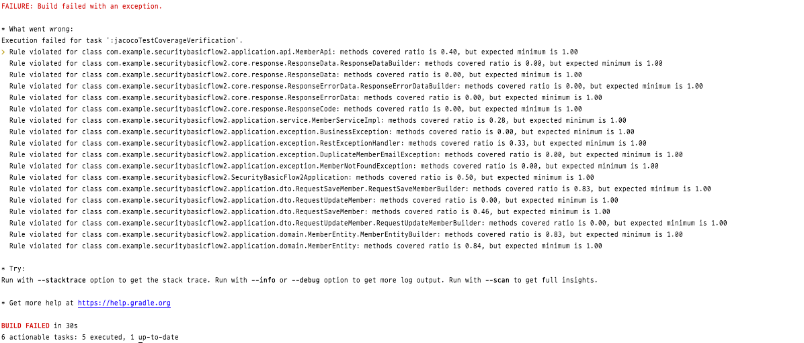

# JaCoCo 설정하기

## Intro

- JaCoCo는 Java 코드의 커버리지를 체크하는 라이브러리이다.
- 테스트 코드를 돌리고 그 커버리지의 결과를 확인할 수 있도록 hml, xml, csv 같은 리포트로 생성할 수 있다.
- 그리고 테스트의 결과를 내가 직접 설정한 커버리지 기준을 만족하는 지 확인할 수 있다.
- 커버리지의 결과를 통해서 개발된 프로젝트를 배포할 지 말지의 기준을 정할 수도 있다.

- 참고 사이트
    - [Gradle 프로젝트에 JaCoCo 설정하기](https://techblog.woowahan.com/2661/)
    - [jacoco-on-gradle-sample](https://github.com/th-deng/jacoco-on-gradle-sample)
    - [Definitive Guide to the JaCoCo Gradle Plugin](https://reflectoring.io/jacoco/)
    - [The JaCoCo Plugin – Gradle docs](https://docs.gradle.org/current/userguide/jacoco_plugin.html)
    - [JacocoPluginExtension](https://docs.gradle.org/current/dsl/org.gradle.testing.jacoco.plugins.JacocoPluginExtension.html)
    - [JacocoReport](https://docs.gradle.org/current/dsl/org.gradle.testing.jacoco.tasks.JacocoReport.html)
    - [JacocoCoverageVerification – Gradle docs](https://docs.gradle.org/current/dsl/org.gradle.testing.jacoco.tasks.JacocoCoverageVerification.html)

## JaCoCo 플러그인 추가

- Gradle 설정에 JaCoCo 플러그인 추가
- 플러그인 설정을 추가할 수도 있다.
    - [관련 링크](https://docs.gradle.org/current/dsl/org.gradle.testing.jacoco.plugins.JacocoPluginExtension.html)

```groovy
plugins {
    id 'jacoco'
}
```

## Gradle task 설정

> 테스트 리포트 저장 및 커버리지 체크

- [jacocoTestReport](https://docs.gradle.org/current/dsl/org.gradle.testing.jacoco.tasks.JacocoReport.html)
    - 바이너리 커버리지 결과를 html 파일로 생성하여 눈으로 확인 가능
    - xml, csv 타입으로 내리는 경우 SonarQube 등과 연동도 가능하다.

- [jacocoTestCoverageVerification](https://docs.gradle.org/current/dsl/org.gradle.testing.jacoco.tasks.JacocoCoverageVerification.html)
    - 커버리지 기준을 만족하는지 확인해 주는 task이다.

```groovy
jacocoTestReport {
    reports {
        html.enabled true // html 타입으로 리포팅
        xml.enabled true // xml 타입으로 리포팅
        csv.enabled true // csv 타입으로 리포팅
    }
    finalizedBy 'jacocoTestCoverageVerification'
}

jacocoTestCoverageVerification {
    violationRules {
        rule {
            // 패키지에 대한 커버리지
            element = 'PACKAGE'

            limit {
                // 클래스 커버리지를 최소한 100% 만족해야 한다.
                counter = 'CLASS'
                value = 'COVEREDRATIO'
                maximum = 1.00
            }
        }
    }
}
```

## 프로젝트에 적용 및 테스트 실행

- Junit5로 작성한 테스트 코드에 대한 커버리지 테스트

```groovy
test {
    useJUnitPlatform()
}
```

- 리포트 생성(`jacocoTestReport`) 및 커버리지 체크(`JacocoTestCoverageVerification`)를 실행
- task 실행을 확인하기 위한 파라미터 추가(`--console verbose`)

```shell
./gradlew --console verbose test jacocoTestReport jacocoTestCoverageVerification
```

- 커버리지 체크 확인


- 커버리지 설정의 기준에 미치지 못해서 경고 표시나는 클래스



- 만들어진 리포트를 확인


- 코드 파일에서 커버가 된 라인은 초록색 놓친 부분은 빨간색으로 표시
    - 단순하게 등록 테스트만 했기 때문에 save() 메서드만 초록색이고 나머지는 빨간색
    - 노란색을 false에 대한 테스트만 이루어졌고 true에 대한 테스트가 이루어지지 않았기 때문이다.


### 여러 Task를 함께 실행하기 위한 방법

- `jacocoTestReport` task와 `jacocoTestCoverageVerification` task를 지정해주기 위한 task 생성
    - testCoverage의 내용은 dependsOn으로 `test`, `jacocoTestReport`, `jacocoTestCoverageVerification를` 실행한다고 설정
    - `mustRunAfter`를 통해서 실행 순서를 정렬한다.
    - 정렬 기준은 `test` 먼저 실행, 그 결과로 리포트를 생성(`jacocoTestReport`), 커버리지가 원하는 기준 도달했는지 체크(`jacocoTestCoverageVerification`)한다.
    - 여기서 test -> jacocoTestReport -> jacocoTestCoverageVerification 의 순서를 지켜서 리포팅된 결과로 커버리지를 체크하지 않고 테스트된 결과를 리포팅되지 않은
      결과를 커버리지 체크하는 문제를 일으키지 않도록 한다.

```groovy
task testCoverage(type: Test) {
    group 'verification'
    description 'Runs the unit tests with coverage'

    dependsOn(':test',
            ':jacocoTestReport',
            ':jacocoTestCoverageVerification')

    tasks['jacocoTestReport'].mustRunAfter(tasks['test'])
    tasks['jacocoTestCoverageVerification'].mustRunAfter(tasks['jacocoTestReport'])
}
```

- tasks 묶인거 확인

```shell
./gradlew tasks
```


### test task 실행 시 JaCoCo task 실행하도록 설정

- testCoverage task를 test task를 실행할 때마다 자동으로 JaCoCo task 들이 실행되도록 finalizedBy로 설정

```groovy
test {
    // ...
    finalizedBy 'jacocoTestReport'
}

jacocoTestReport {
    // ... 
    finalizedBy 'jacocoTestCoverageVerification'
}
```

### 커버리지의 기준을 설정

- 커버리지의 설정은 `jacocoTestCoverageVerification` task의 상세에서 설정한다.
- 이 task는 설정해 둔 커버리지 기준을 만족하는 코드를 짰는지 확인 할 수 있다.
- `violationRules`로 커버리지 기준을 설정하는 `rule`을 정의

```groovy
jacocoTestCoverageVerification {
    violationRules {
        // Total rule 설정해보기 
        rule {
            // element가 없는 경우 프로젝트의 전체 파일을 합친 값을 기준으로 하게 된다.
            // 리포팅에서 Total에 해당하는 부분으로 볼 수 있다.
            limit {
                // counter를 지정하지 않으면 INSTRUCTION 이 기본 값인데 `Java 바이트코드 명령 수`를 뜻한다.
                // value를 지정하지 않으면 COVEREDRATIO 이 기본 값인데 커버된 비율. `0부터 1 사이의 숫자`로, 1이 100% 를 뜻한다.
                minimum = 0.10
            }
        }
        // 여러 rule 설정해보기
        rule {
            // rule을 체크할 단위는 Class
            element = 'CLASS'

            // 브랜치 커버리지를 최소한 90% 만족
            limit {
                // 조건문 등의 분기 수
                counter = 'BRANCH'
                value = 'COVEREDRATIO'
                maximum = 0.90
            }

            // 라인 커버리지를 최소한 80% 만족
            limit {
                counter = 'LINE'
                value = 'COVEREDRATIO'
                minimum = 0.80
            }

            // 빈 줄을 제외한 코드의 라인수를 최대 200라인으로 제한
            limit {
                counter = 'LINE'
                value = 'TOTALCOUNT'
                maximum = 200
            }
        }
    }
}
```

> **커버리지의 체크 기준이 되는** `element`

- [JacocoLimit ‘element’](https://docs.gradle.org/current/javadoc/org/gradle/testing/jacoco/tasks/rules/JacocoViolationRule.html#getElement--)

|element|설명|
|:---:|:---:|
|BUNDLE(default)|패키지 번들|
|PACKAGE|패키지|
|CLASS|클래스|
|SOURCEFILE|소스파일|
|METHOD|메서드|

> **couter 설정**

- [JacocoLimit ‘counter’](https://docs.gradle.org/current/javadoc/org/gradle/testing/jacoco/tasks/rules/JacocoLimit.html#getCounter--)

|counter|설명|
|:---:|:---:|
|LINE|빈 줄을 제외한 실제 코드의 라인 수|
|BRANCH|조건문 등의 분기 수|
|CLASS|클래스 수|
|METHOD|메서드 수|
|INSTRUCTION (default)|Java 바이트코드 명령 수|
|COMPLEXITY|복잡도|

> **value 설정**

- [JacocoLimit ‘value’](https://docs.gradle.org/current/javadoc/org/gradle/testing/jacoco/tasks/rules/JacocoLimit.html#getValue--)

|counter|설명|
|:---:|:---:|
|TOTALCOUNT|전체 개수|
|MISSEDCOUNT|커버되지 않은 개수|
|COVEREDCOUNT|커버된 개수|
|MISSEDRATIO|커버되지 않은 비율. 0부터 1 사이의 숫자로, 1이 100%|
|COVEREDRATIO (default)|커버된 비율. 0부터 1 사이의 숫자로, 1이 100%|
