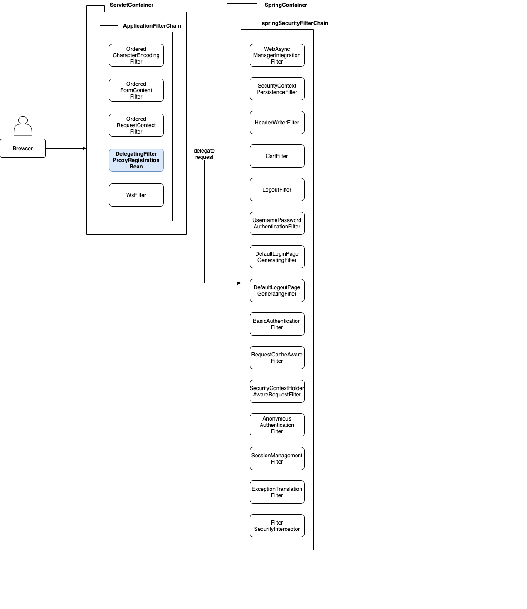

# 무지성 Security 분석기

## Intro

- 스프링 시큐리티에 대한 플로우 찍먹하기 (feat. JWT)

## 시큐리티의 시작

```java

@EnableWebSecurity
public class SecurityConfig extends WebSecurityConfigurerAdapter {
    @Override
    protected void configure(HttpSecurity http) throws Exception {
        super.configure(http); // breakpoint
    }
}
```


