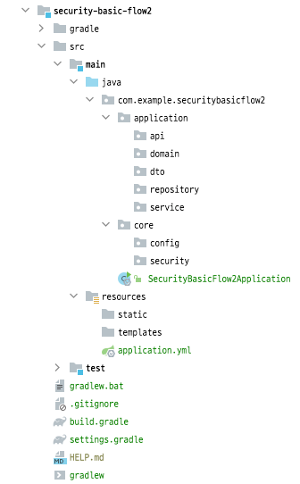
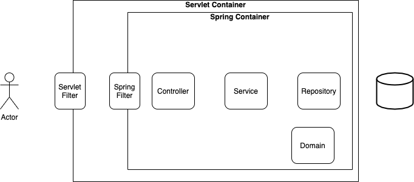
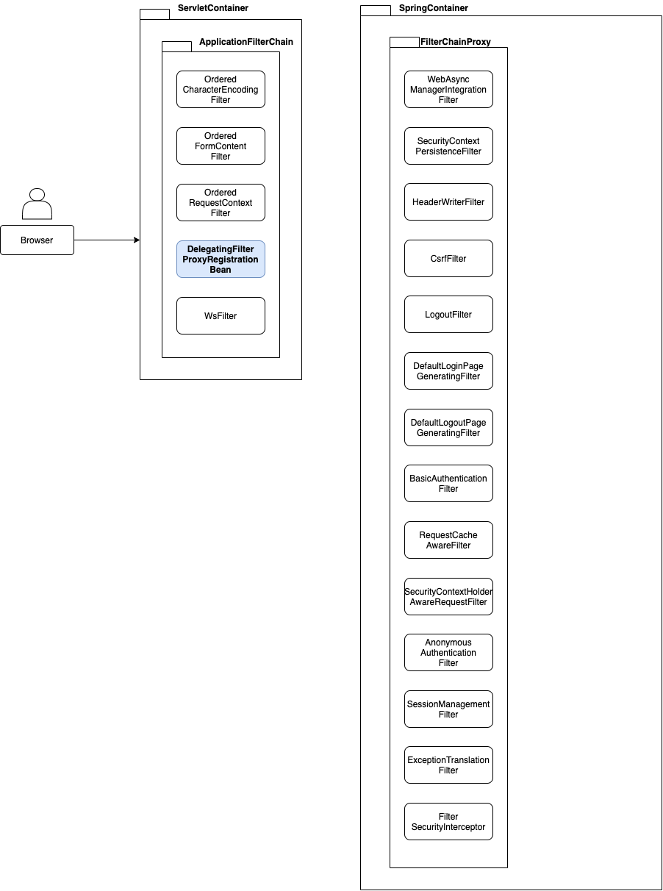

# Spring Security + JWT

## Intro

- 미니 프로젝트를 진행하게 되면서 MSA기반의 구성을 생각하게 되었고, 세션에 대한 대채제로 JWT를 통한 인증을 생각하게 되었다.
- 여기서는 스프링 시큐리티를 사용하여 인증 및 인가 작업을 AOP를 이용하여 Controller에 도달하기 전에 처리할 수 있도록 학습하기 위한 정리이다.

## Spring Security

- 코딩하면서 정리하기 위한 프로젝트 [Github](https://github.com/spring-org/spring-security/tree/master/security-basic-flow2)
- 디테일한 부분은 우선 키워드로 남기고 구현을 통해 먼저 시큐리티의 플로우를 학습하도록 한다.

## 프로젝트 생성

- build.gradle
    - JDK는 11을 사용
    - Spring Boot 버전은 2.4.10

```groovy
dependencies {
    implementation 'org.springframework.boot:spring-boot-starter-web'
    implementation 'org.springframework.boot:spring-boot-starter-data-jpa'
    implementation 'org.springframework.boot:spring-boot-starter-validation'

    compileOnly 'org.projectlombok:lombok'
    developmentOnly 'org.springframework.boot:spring-boot-devtools'
    runtimeOnly 'com.h2database:h2'
    annotationProcessor 'org.projectlombok:lombok'
    testImplementation 'org.springframework.boot:spring-boot-starter-test'
}
```

## 패키지 구성



## 기본 도메인 설계

### Member에 대한 CRUD 생성

- 기본적인 회원관리에 대한 MVC 설계



### Member CRUD 기능에 대한 테스트 코드

- 테스트 코드 작성에 대한 내용은 코드 커버리지를 통해 확인한다.

## 스프링 시큐리티 적용하기

### Gradle에 시큐리티 추가

```groovy
dependencies {
    implementation 'org.springframework.boot:spring-boot-starter-security'
    testImplementation 'org.springframework.security:spring-security-test'
}
```

### 시큐리티의 의존성을 추가하면 적용되는 SpringSecurityFilterChain 확인하기

- 기본적으로 등록되는 springSecurityFilterChain 으로 등록되는 Bean 확인하기

```java

@SpringBootTest
class SecurityBasicFlow2ApplicationTests {

    @DisplayName("기본 스프링 시큐리티 필터 체인 확인하기")
    @Test
    void testCase1() {
        AnnotationConfigApplicationContext context = new AnnotationConfigApplicationContext(SecurityConfig.class);

        FilterChainProxy bean = (FilterChainProxy) context.getBean("springSecurityFilterChain");
        List<SecurityFilterChain> filterChains = bean.getFilterChains();
        filterChains.get(0).getFilters().forEach(
                filter -> System.out.println("filter = " + filter)
        );
        assertThat(filterChains.size()).isOne();
    }
}
```



- 시큐리티 필터는 `Servlet Container` 영역의 `ApplicationFilterChain`의 `DelegateFilterProxy`를 통해 `Spring Container`
  영역의 `FilterChainProxy`에 위임된다.
- FilterChainProxy의 Bean 이름은 springSecurityFilterChain으로 생성되어 위의 필터들이 자동으로 등록된다.
- 해당 필터 리스트는 설정에 따라 순서와 종류가 바뀔 수 있다.

